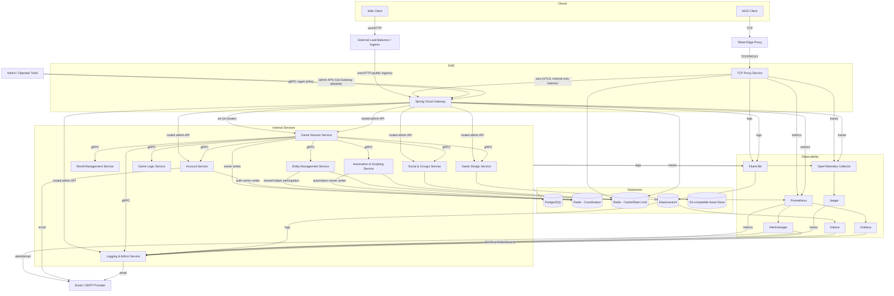

# FireMUD System Architecture: Diagram

The Web client is built with React and Material‑UI. For component layout and state management details see [Frontend Architecture](./system-architecture-frontend.md).

All services run as Docker containers inside a shared Kubernetes cluster. They reuse a [common shared library](./system-architecture-shared-libraries.md) for DTO definitions, logging interceptors, and metrics helpers. See [Deployment Environments](./infrastructure/deployment-environments.md) for how the cluster is configured.

Note on gateway listener surfaces: the gateway has a public ingress surface (typically behind an external load balancer) and an internal-only WebSocket mTLS listener used by the TCP Proxy Service. The diagram shows both flows terminating at the same gateway component; see [Gateway Architecture](./system-architecture-gateway.md) for the surface-level expectations.

Gameplay WebSocket route policy is split: `/ws/game/**` is the canonical token-enforced route in player-facing environments, while `/ws/game-legacy/**` is migration-only compatibility and slated for removal from player-facing environments by December 31, 2026.

Admin and creator API exposure is intentionally allowlisted: external tools call domain admin APIs only through Gateway-routed routes for owning services (for example Logging & Admin, Account, Game Session, Social & Groups, and Game Design). Internal service-to-service gRPC remains direct and does not traverse Gateway.

For Gateway control-plane behavior in production-like environments (including the dynamic-route override dev/test scope), see the canonical [Gateway Management Plane Capability Matrix](./system-architecture-overview.md#gateway-management-plane-capability-matrix-canonical).

## Core Services Shown

The diagram covers every microservice in the repository:

- **[TCP Proxy Service](./microservices/tcp-proxy-service/README.md)** – Bridges Telnet clients into the WebSocket-based backend.
- **[Spring Cloud Gateway](./microservices/spring-cloud-gateway/README.md)** – Routes HTTP and WebSocket traffic to internal services.
- **[Game Session Service](./microservices/game-session-service/README.md)** – Orchestrates sessions, ticks, and runtime configuration.
- **[Account Service](./microservices/account-service/README.md)** – Handles accounts, authentication, and subscriptions.
- **[World Management Service](./microservices/world-management-service/README.md)** – Stores rooms, regions, and world maps plus navigation metadata; pathfinding algorithms and route computation live in the Game Logic Service. World Management does not own live entities, items, or inventories.
- **[Entity Management Service](./microservices/entity-management-service/README.md)** – Manages players, NPCs, items, and all inventories/containment, including player gear, containers, and items on the ground.
- **[Game Logic Service](./microservices/game-logic-service/README.md)** – Resolves commands and core gameplay mechanics.
- **[Game Design Service](./microservices/game-design-service/README.md)** – Provides authoring tools for game data and feature flags with version publishing copy steps and a web-based editor.
- **[Automation & Scripting Service](./microservices/automation-scripting-service/README.md)** – Executes AI behaviors and custom scripts.
- **[Social & Groups Service](./microservices/social-groups-service/README.md)** – Manages chat, guilds, and social networking.
- **[Logging & Admin Service](./microservices/logging-admin-service/README.md)** – Centralizes logging, metrics, and admin tools with dashboards built from Elasticsearch logs, Prometheus metrics, and Jaeger traces to support moderation.

Only the **TCP Proxy Service** and **Spring Cloud Gateway** are reachable from the internet. They operate in the network DMZ while the remaining microservices run on the internal network. Admin and creator tools always connect to **Logging & Admin Service and other domain services via the Gateway**; Logging & Admin is not exposed directly at the edge. See [Security Architecture](./system-architecture-security.md#network-security--boundary-design) and [System Architecture Overview](./system-architecture-overview.md#admin-entry-points-and-control-plane) for details.

All internal communication from the **Game Session Service** to downstream microservices uses **gRPC** for high performance and strict schema enforcement. Stateful domain microservices persist data in PostgreSQL and use Redis for transient state; DMZ components such as the TCP Proxy Service and Spring Cloud Gateway remain stateless with respect to PostgreSQL but use Redis for rate limiting and caches. All services emit metrics to Prometheus and send structured logs to Elasticsearch.

Coordination Redis arrows in this diagram follow ownership boundaries from ADR 0009: Game Session owns gameplay coordination prefixes (for example `session:game:*`, `coord:*`, and `tick:*`), Account owns `session:auth:*`, Automation & Scripting owns `automation:*`, and non-owner services (for example Entity) participate only through approved shared-helper contracts rather than ad hoc key ownership.

## Datastore Layer

Databases and caches shared across all services capture authoritative world state, runtime entities, and observability-ready analytics:

- **PostgreSQL** – Primary persistent store for world topology, entities, characters, items, and transactional metadata (tenant-scoped tables include `tenantId` so data never mixes across games).
- Not every service writes to PostgreSQL: some services are fully stateless with respect to persistence (for example, Game Logic), and others may be read-heavy. The diagram’s DB arrows indicate “uses the shared datastore layer” rather than “owns tables”.
- **Coordination Redis** – Volatile session and tick coordination state; Lua scripts enforce atomic command execution and reconnect recovery while TTLs keep the data transient. In production this runs as a dedicated cluster so cache and rate-limit spikes cannot interfere with gameplay coordination.
- **Cache/Rate-Limit Redis** – Best-effort caches, quotas, and rate limiting; this runs as a separate cluster in production and is safe to evict or scale independently of Coordination Redis.
- **Elasticsearch** – Stores structured logs emitted by every service (via Fluent Bit); the Logging & Admin Service reads directly from it for dashboards and audits.
- **S3-compatible Asset Store** – Stores published game assets and exported content produced by the Game Design Service; other services and clients consume these assets via configured URLs, typically fronted by the gateway or a CDN.

These datastores appear in the diagram as individual nodes (`PostgreSQL`, `Redis - Coordination`, `Redis - Cache/Rate Limit`, `Elasticsearch`, and the asset store) and are wired to service traffic and observability pipelines in the mermaid flowchart above.

All datastores are shared across games. Tenant-scoped tables include a `tenantId` column (or reference a tenant-keyed parent), and Redis keys use a matching prefix, which isolates per-game data while keeping the services stateless. See [Multi-Tenancy](./system-architecture-multi-tenancy.md) for details.

## Observability Components

Fluent Bit, Prometheus, and the OpenTelemetry Collector work together so logs, metrics, and traces share the same `traceId`. This makes it easy to correlate game events across Kibana, Grafana, and Jaeger dashboards.
The Logging & Admin Service queries Elasticsearch, Prometheus, and Jaeger and consumes Alertmanager notifications. It also embeds Kibana and Grafana dashboards via their APIs to power moderation workflows.

The diagram also illustrates the monitoring stack shared by every service:

- **Fluent Bit** – Collects structured logs from each container.
- **Elasticsearch** – Stores logs for search and troubleshooting.
- **Prometheus** – Scrapes metrics and forwards alerts to **Alertmanager**.
- **Alertmanager** – Routes alerts and notifies the Logging & Admin Service.
- **Grafana** – Visualizes dashboards based on Prometheus data and exposes an API that the Logging & Admin Service uses for embedding.
- **OpenTelemetry Collector** – Aggregates distributed traces.
- **Jaeger** – Provides a UI for end‑to‑end trace analysis.
- **Kibana** – Queries and visualizes Elasticsearch logs and exposes an API that the Logging & Admin Service uses for embedding.

See [Logging & Monitoring](./system-architecture-logging-monitoring.md) for deployment details.

## Related Documentation

- [Deployment Environments](./infrastructure/deployment-environments.md)
- [Frontend Architecture](./system-architecture-frontend.md)
- [Gateway Architecture](./system-architecture-gateway.md)
- [Infrastructure Overview](./infrastructure/README.md)
- [Logging & Monitoring](./system-architecture-logging-monitoring.md)
- [Microservices Overview](./microservices/README.md)
- [Multi-Tenancy](./system-architecture-multi-tenancy.md)
- [Service Responsibility Matrix](./service-responsibility-matrix.md)
- [Shared Libraries Overview](./system-architecture-shared-libraries.md)
- [System Context Diagram](./system-context-diagram.md)
