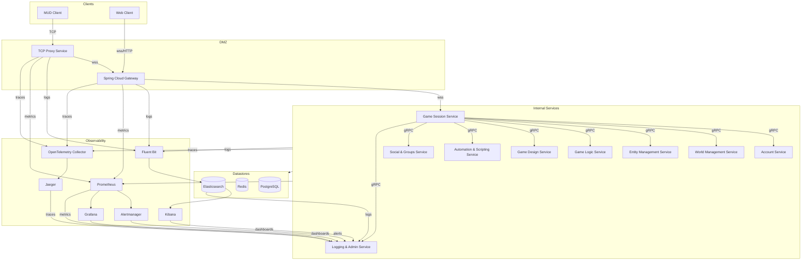

# 📈 FireMUD System Architecture: Diagram

The Web client is built with React and Material‑UI. For component layout and state management details see [Frontend Architecture](./system-architecture-frontend.md).

Fluent Bit, Prometheus, and the OpenTelemetry Collector work together so logs, metrics, and traces share the same `traceId`. This makes it easy to correlate game events across Kibana, Grafana, and Jaeger dashboards.
The Logging & Admin Service queries Elasticsearch, Prometheus, and Jaeger and consumes Alertmanager notifications. It also embeds Kibana and Grafana dashboards via their APIs to power moderation workflows.

Only the **TCP Proxy Service** and **Spring Cloud Gateway** are reachable from the internet. They operate in the network DMZ while the remaining microservices run on the internal network. See [Security Architecture](./system-architecture-security.md#🌐-network-security--boundary-design) for details.

All internal communication from the **Game Session Service** to downstream microservices uses **gRPC** for high performance and strict schema enforcement. All services persist data in PostgreSQL, cache transient state in Redis, emit metrics to Prometheus, and send structured logs to Elasticsearch.

All datastores are shared across games. Tenant-scoped tables include a `tenantId` column (or reference a tenant-keyed parent), and Redis keys use a matching prefix. This isolates per-game data while keeping the services stateless. See [Multi-Tenancy](./system-architecture-multi-tenancy.md) for details.

All services run as Docker containers inside a shared Kubernetes cluster. They reuse a [common shared library](./system-architecture-shared-libraries.md) for DTO definitions, logging interceptors, and metrics helpers. See [Deployment Environments](./infrastructure/deployment-environments.md) for how the cluster is configured.

## 🧩 Core Services Shown

The diagram covers every microservice in the repository:

- **[TCP Proxy Service](./microservices/tcp-proxy-service/README.md)** – Bridges Telnet clients into the WebSocket-based backend.
- **[Spring Cloud Gateway](./microservices/spring-cloud-gateway/README.md)** – Routes HTTP and WebSocket traffic to internal services.
- **[Game Session Service](./microservices/game-session-service/README.md)** – Orchestrates sessions, ticks, and runtime configuration.
- **[Account Service](./microservices/account-service/README.md)** – Handles accounts, authentication, and subscriptions.
- **[World Management Service](./microservices/world-management-service/README.md)** – Stores rooms, regions, and world maps with pathfinding APIs and topology snapshots for backup and recovery; it does not own live entities, items, or inventories.
- **[Entity Management Service](./microservices/entity-management-service/README.md)** – Manages players, NPCs, items, and all inventories/containment, including player gear, containers, and items on the ground associated to rooms by ID.
- **[Game Logic Service](./microservices/game-logic-service/README.md)** – Resolves commands and core gameplay mechanics.
- **[Game Design Service](./microservices/game-design-service/README.md)** – Provides authoring tools for game data and feature flags with version publishing copy steps and a web-based editor.
- **[Automation & Scripting Service](./microservices/automation-scripting-service/README.md)** – Executes AI behaviors and custom scripts.
- **[Social & Groups Service](./microservices/social-groups-service/README.md)** – Manages chat, guilds, and social networking.
- **[Logging & Admin Service](./microservices/logging-admin-service/README.md)** – Centralizes logging, metrics, and admin tools with dashboards built from Elasticsearch logs, Prometheus metrics, and Jaeger traces to support moderation.

## 🔍 Observability Components

The diagram also illustrates the monitoring stack shared by every service:

- **Fluent Bit** – Collects structured logs from each container.
- **Elasticsearch** – Stores logs for search and troubleshooting.
- **Prometheus** – Scrapes metrics and forwards alerts to **Alertmanager**.
- **Alertmanager** – Routes alerts and notifies the Logging & Admin Service.
- **Grafana** – Visualizes dashboards based on Prometheus data and exposes an API that the Logging & Admin Service uses for embedding.
- **OpenTelemetry Collector** – Aggregates distributed traces.
- **Jaeger** – Provides a UI for end‑to‑end trace analysis.
- **Kibana** – Queries and visualizes Elasticsearch logs and exposes an API that the Logging & Admin Service uses for embedding.

See [Logging & Monitoring](./system-architecture-logging-monitoring.md) for deployment details.

## 📚 Related Documentation

- [System Context Diagram](./system-context-diagram.md)
- [Microservices Overview](./microservices/README.md)
- [Service Responsibility Matrix](./service-responsibility-matrix.md)
- [Gateway Architecture](./system-architecture-gateway.md)
- [Infrastructure Overview](./infrastructure/README.md)
- [Deployment Environments](./infrastructure/deployment-environments.md)
- [Logging & Monitoring](./system-architecture-logging-monitoring.md)
- [Multi-Tenancy](./system-architecture-multi-tenancy.md)
- [Frontend Architecture](./system-architecture-frontend.md)
- [Shared Libraries Overview](./system-architecture-shared-libraries.md)
