# FireMUD System Architecture: Diagram

## Implementation Status

The room-state assembly shown in this diagram is target-state. Current World and Entity room-read requests remain floor-free, and the causal-floor/served-through protocol is not implemented; current scope markers do not prove freshness.

The observability nodes and arrows also show the target default indexed profile, not universal or current Logging & Admin integration. The dashed Logging & Admin edges in the diagram are target-profile query, routed-alert-view, or dashboard-embedding paths; they are not current clients or observability pushes. The current service queries only its PostgreSQL `log_events` table and has no Elasticsearch, Prometheus, Jaeger, Grafana, Kibana, or Alertmanager client, embedded-dashboard endpoint, or separate admin UI. Compatible indexed profiles map equivalent components, while reduced profiles use their declared console/journal path or explicitly omit indexed search.

```mermaid
flowchart TD
    subgraph Clients
        MUD[MUD Client]
        Web[Web Client]
    end

    ExtLB[External Load Balancer / Ingress]
    TelnetEdge[Telnet Edge Proxy]

    subgraph DMZ
        TCPProxy[TCP Proxy Service]
        Gateway[Spring Cloud Gateway]
    end

    subgraph InternalServices["Internal Services"]
        SessionFE[Game Session Service - Session Front-End]
        SessionExec[Game Session Service - Lease Owner / Executor]
        Account[Account Service]
        World[World Management Service]
        Entity[Entity Management Service]
        Logic[Game Logic Service]
        Design[Game Design Service]
        Script[Automation & Scripting Service]
        Social[Social & Groups Service]
        Logging[Logging & Admin Service]
    end

    subgraph Datastores
        DB[(PostgreSQL)]
        CoordRedis[(Redis - Coordination)]
        CacheRedis[(Redis - Cache/Rate Limit)]
        ES[(Elasticsearch)]
        AssetStore[(S3-compatible Asset Store)]
    end

    subgraph Observability
        FluentBit[Fluent Bit]
        Prom[Prometheus]
        Alertmgr[Alertmanager]
        OTel[OpenTelemetry Collector]
        Kibana[Kibana]
        Grafana[Grafana]
        Jaeger[Jaeger]
    end

    SMTP[Email / SMTP Provider]
    Admin[Admin / Operator Tools]

    MUD -- TCP --> TelnetEdge
    TelnetEdge -- TCP/PROXY --> TCPProxy
    Web -- wss/HTTP --> ExtLB
    ExtLB -- wss/HTTP (public ingress) --> Gateway
    TCPProxy -- wss (mTLS, internal-only listener) --> Gateway
    Gateway -- ws (in-cluster) --> SessionFE
    TCPProxy -. NotifyDisconnect gRPC (at-least-once, advisory) .-> SessionFE

    Admin -- gRPC mgmt (infra) --> Gateway
    Admin -- HTTP(S) admin APIs (via Gateway allowlist) --> Gateway
    Gateway -- routed admin API --> Logging
    Gateway -- routed admin API --> Account
    Gateway -- routed admin API --> SessionFE
    Gateway -- routed admin API --> Social
    Gateway -- routed admin API --> Design

    SessionFE -- internal gRPC (fenced forwarding) --> SessionExec
    SessionFE -- gRPC --> Account
    SessionExec -- gRPC --> World
    SessionExec -- gRPC --> Entity
    SessionExec -- gRPC --> Logic
    SessionExec -- gRPC --> Design
    SessionExec -- gRPC --> Script
    SessionExec -- gRPC --> Social
    SessionExec -- gRPC --> Logging
    SessionExec -. lifecycle and coordination signals .-> Logging
    Account -. audit and account-domain events .-> Logging

    Account --> DB
    SessionFE --> DB
    SessionExec --> DB
    World --> DB
    Entity --> DB
    Design --> DB
    Social --> DB
    Logging --> DB
    SessionExec -- owner writes --> CoordRedis
    Account -- auth-owner writes --> CoordRedis
    Entity -- shared-helper participation --> CoordRedis
    Script -- automation-owner writes (automation:timer:*, script-scheduler:*) --> CoordRedis
    SessionFE -- cache/rate-limit helper participation (current legacy projections; target cache behavior unproved) --> CacheRedis
    TCPProxy -. target/optional cache or throttle participation .-> CacheRedis
    Gateway -- cache/rate-limit, current legacy replay marker --> CacheRedis
    Gateway -- target replay/denial/readiness state --> CoordRedis
    World --> CacheRedis
    Entity --> CacheRedis
    Script --> CacheRedis
    Social --> CacheRedis
    Design --> AssetStore
    InternalServices -- logs --> FluentBit
    InternalServices -- metrics --> Prom
    InternalServices -- traces --> OTel
    TCPProxy -- logs --> FluentBit
    TCPProxy -- metrics --> Prom
    TCPProxy -- traces --> OTel
    Gateway -- logs --> FluentBit
    Gateway -- metrics --> Prom
    Gateway -- traces --> OTel
    FluentBit --> ES
    Prom --> Alertmgr
    Prom --> Grafana
    OTel --> Jaeger
    ES --> Kibana
    Logging -. target log query .-> ES
    Logging -. target metric query .-> Prom
    Logging -. target trace query .-> Jaeger
    Logging -. target routed-alert view .-> Alertmgr
    Alertmgr -- alerts/email --> SMTP
    Logging -. target dashboard embedding .-> Kibana
    Logging -. target dashboard embedding .-> Grafana

    Account -- email --> SMTP
    Logging -- email --> SMTP

```

The Web client is built with React and Material‑UI. For component layout and state management details see [Frontend Architecture](./system-architecture-frontend.md).

All services run as Docker containers inside a shared Kubernetes cluster. They reuse a [common shared library](./system-architecture-shared-libraries.md) for DTO definitions, logging interceptors, and metrics helpers. See [Deployment Environments](./infrastructure/deployment-environments.md) for how the cluster is configured.

Note on Gateway listener surfaces: the gateway serves the `player traffic plane` through a public ingress surface (typically behind an external load balancer) and an internal-only WebSocket mTLS listener used by the TCP Proxy Service. The diagram shows both flows terminating at the same gateway component; see [Gateway Architecture](./system-architecture-gateway.md) for the surface-level expectations.

Gameplay WebSocket route policy is canonicalized on `/ws/game/**` for player-facing gameplay admission.

Diagram callouts:

- External operator writes for moderation, quota overrides, runtime feature flags, and tick remediation enter through Logging & Admin via Gateway; direct domain-admin routes are read-only unless explicitly documented as bypass-safe.
- Canonical room state is not assembled by direct World ↔ Entity joins; for this causal-read path, Game Logic performs the fan-out to World and Entity, propagates the Game Session-allocated causal-read floor unchanged, validates same-scope/epoch served-through proofs with opaque component versions, and returns the composition for Game Session to render/cache. The direct `SessionExec -> World/Entity/Logic` edges are general orchestration/dependency paths, not direct LOOK fan-out. Current scope markers remain non-temporal.

Admin and creator API exposure on the `external admin/creator API plane` is intentionally allowlisted: external tools call domain admin APIs only through Gateway-routed HTTP(S) routes for owning services (for example Logging & Admin, Account, Game Session, Social & Groups, and Game Design). External mutating operator workflows for moderation, quota overrides, runtime feature-flag overrides, and tick remediation must enter through Logging & Admin; direct domain-admin routes are reserved for reads and explicitly documented bypass-safe workflows. External domain gRPC is not part of the edge contract unless a dedicated design update explicitly introduces it. Internal service-to-service gRPC remains direct and does not traverse Gateway or the `infrastructure management plane`.

Within the Game Session layer, the stable `/ws/game/**` edge surface maps to a session front-end pod plus lease-owner execution model: the connected pod owns socket I/O, per-session sequencing, and the current execution-region pointer, while region-scoped tick execution remains fenced to the current `<tenantId, gameInstanceId, regionId>` lease owner and may be reached through internal gRPC forwarding. The separate nodes in the diagram represent runtime roles, not separate products or independently exposed edge surfaces. See [System Architecture Overview](./system-architecture-overview.md#session-sharding--routing).

The `Gateway -> SessionFE` arrow represents both gameplay socket admission on `/ws/game/**` for the `player traffic plane` and the separate allowlisted Game Session admin/control routes on the `external admin/creator API plane` described in the overview and context docs. Admin/control requests terminate on the stable Game Session service surface; target-state region-scoped mutations must be forwarded to the current lease owner under a fenced internal contract rather than treating the session front-end as the owner of region coordination state.

The `SessionFE -> DB` and `SessionExec -> DB` arrows share Game Session-owned PostgreSQL infrastructure but do not imply overlapping write authority. The session front-end writes connection-scoped control metadata such as disconnect dedupe, session recovery markers, and front-end-owned operator bookkeeping. The lease owner / executor writes region-owned runtime control metadata such as remediation state, fenced coordination health records, and region-scoped cutover or lease-transition bookkeeping. When a record can be touched by both roles, the owning service contract must define a single-writer or fenced compare-and-swap rule rather than allowing last-writer-wins behavior.

For Gateway control-plane behavior in production-like environments (including the dynamic-route override dev/test scope), see the canonical [Gateway Management Plane Capability Matrix](./system-architecture-overview.md#gateway-management-plane-capability-matrix-canonical).

## Core Services Shown

The diagram covers every microservice in the repository:

- **[TCP Proxy Service](./microservices/tcp-proxy-service/README.md)** – Bridges Telnet clients into the WebSocket-based backend.
- **[Spring Cloud Gateway](./microservices/spring-cloud-gateway/README.md)** – Routes HTTP and WebSocket traffic to internal services.
- **[Game Session Service](./microservices/game-session-service/README.md)** – Orchestrates sessions, ticks, and runtime configuration.
- **[Account Service](./microservices/account-service/README.md)** – Handles accounts, authentication, and subscriptions.
- **[World Management Service](./microservices/world-management-service/README.md)** – Stores rooms, regions, and world maps plus navigation metadata; pathfinding algorithms and route computation live in the Game Logic Service. World Management does not own live entities, items, or inventories.
- **[Entity Management Service](./microservices/entity-management-service/README.md)** – Manages players, NPCs, items, and all inventories/containment, including player gear, containers, and items on the ground.
- **[Game Logic Service](./microservices/game-logic-service/README.md)** – Resolves commands and core gameplay mechanics.
- **[Game Design Service](./microservices/game-design-service/README.md)** – Provides authoring tools for game data and feature flags with version publishing copy steps and a web-based editor.
- **[Automation & Scripting Service](./microservices/automation-scripting-service/README.md)** – Executes AI behaviors and custom scripts.
- **[Social & Groups Service](./microservices/social-groups-service/README.md)** – Manages chat, guilds, and social networking.
- **[Logging & Admin Service](./microservices/logging-admin-service/README.md)** – Target state presents the selected profile's log-query and observability tools and owns moderation policy and audit state. Current log query is limited to its PostgreSQL `log_events` table, with no observability-backend clients or separate admin UI.

Among application microservices, only the **TCP Proxy Service** and **Spring Cloud Gateway** are reachable from the internet. They operate in the network DMZ while the remaining microservices run on the internal network. The target separately operated public site/static host is an external delivery surface for frontend documents and `/frontend-assets/**`, while published `/assets/**` is a separate read-only asset-delivery surface; neither is an additional application-microservice ingress. Admin and creator tools always connect to **Logging & Admin Service and other domain services via the Gateway**; Logging & Admin is not exposed directly at the edge. See [Security Architecture](./system-architecture-security.md#network-security--boundary-design) and [System Architecture Overview](./system-architecture-overview.md#admin-entry-points-and-control-plane) for details.

All internal synchronous communication from the **Game Session Service** to downstream microservices uses **gRPC** for high performance and strict schema enforcement. Asynchronous signaling flows (for example, `NotifyDisconnect`, lifecycle metrics/events, and audit/saga event streams) are documented separately and use explicit idempotency/ownership contracts. Stateful domain microservices persist data in PostgreSQL and use Redis for transient state; the Game Session Service's session front end participates in Cache/Rate-Limit Redis through the shared helper boundary for current legacy presentation/limiter projections and the target presentation-cache contract, while its lease-owner/tick engine does not directly access Cache/Rate-Limit Redis. Spring Cloud Gateway uses Cache/Rate-Limit Redis for rate limiting, caches, and its current legacy replay marker; TCP Proxy's Cache/Rate-Limit Redis participation is target/optional and absent from the current implementation, which has only generic Redis bean wiring. Gateway's target Coordination Redis use is limited to the narrow connect-token replay/denial/readiness contract defined by the Redis ownership documents. Current code has only the Cache/Rate-Limit-bound replay marker, while target Coordination convergence and complete profile, ACL, and proof requirements remain incomplete. Services emit their implemented metrics and structured logs; the target default indexed profile collects those logs through Fluent Bit into Elasticsearch, while other profiles use their mapped or reduced posture.

Coordination Redis arrows in this diagram follow ADR 0009 for the service-owned families: Game Session owns gameplay coordination state, including the generic `timer:*` family; Account owns the registered auth-session and exact-input issuance-result families; and Automation & Scripting owns its documented scheduling families `automation:timer:*` and `script-scheduler:*`. The Account connect-token family is distinct from Gateway's replay/denial state. Spring Cloud Gateway's separate narrow edge replay/denial/readiness contract is defined by the Redis ownership documents and [Gateway Architecture](./system-architecture-gateway.md); current code has the legacy replay marker, while target convergence and complete profile, ACL, and proof requirements remain incomplete. Gateway does not own general coordination state. Non-owner services (for example Entity) participate only through approved shared-helper contracts rather than ad hoc key ownership.

Canonical room-state assembly is intentionally not shown as a direct World-to-Entity join: Game Session allocates the causal floor from durable region commit authority, Game Logic propagates it unchanged to World and Entity, and composes same-scope/epoch responses whose served-through proofs meet that floor with opaque owner-local component versions. Behind-floor or mixed-scope/epoch responses are rejected or retried; current scope markers do not prove freshness.

## Datastore Layer

Databases and caches shared across all services capture authoritative world state, runtime entities, and observability-ready analytics:

- **PostgreSQL** – Primary persistent store for world topology, entities, characters, items, and transactional metadata (tenant-scoped tables use a direct `tenantId` column or a tenant-keyed parent under the owning service's contract; current Entity exceptions are documented by [Entity Management runtime and data](./microservices/entity-management-service/runtime-and-data.md)).
- Not every service writes to PostgreSQL: some services are fully stateless with respect to persistence (for example, Game Logic), and others may be read-heavy. The diagram’s DB arrows indicate shared infrastructure only, not cross-service table ownership; services must not directly read or mutate another service’s runtime tables.
- For Game Session specifically, the DB arrows represent durable control-plane/runtime metadata (for example game-instance records, pinned runtime version/script patch state, feature-flag overrides, and disconnect/remediation bookkeeping). Gameplay session bindings, queues, timers, retries, and lease coordination remain Redis-owned.
- **Coordination Redis** – Volatile session and tick coordination state; Lua scripts enforce atomic command execution and reconnect recovery while TTLs keep the data transient. In production this runs as a dedicated cluster so cache and rate-limit spikes cannot interfere with gameplay coordination.
- **Cache/Rate-Limit Redis** – Best-effort caches, quotas, and rate limiting; this runs as a separate cluster in production and is safe to evict or scale independently of Coordination Redis.
- **Elasticsearch (target default indexed profile)** – Stores structured logs collected through Fluent Bit for the supported Kibana query path. Direct Logging & Admin querying and embedding remain unimplemented target integrations rather than current audit storage.
- **S3-compatible Asset Store** – Stores published game assets and exported content produced by the Game Design Service; other services and clients consume these assets via configured URLs, typically fronted by the gateway or a CDN.

These datastores appear in the diagram as individual nodes (`PostgreSQL`, `Redis - Coordination`, `Redis - Cache/Rate Limit`, `Elasticsearch`, and the asset store) and are wired to service traffic and observability pipelines in the mermaid flowchart above.

All datastores are shared across games. Tenant-scoped tables use a direct `tenantId` column or reference a tenant-keyed parent under the owning service's contract; Redis keys use a matching prefix, which isolates per-game data while keeping the services stateless. Current Entity table exceptions and their join-based ownership are recorded in [Entity Management runtime and data](./microservices/entity-management-service/runtime-and-data.md); see [Multi-Tenancy](./system-architecture-multi-tenancy.md) for the cross-service rule.

## Observability Components

In the target default indexed profile, Fluent Bit, Prometheus, and the OpenTelemetry Collector provide correlated logs, metrics, and traces for Kibana, Grafana, and Jaeger. A compatible profile documents equivalent supported paths, and a reduced profile does not claim omitted components.
Target Logging & Admin integration may query the selected profile's log, metric, and trace paths, consume its routed-alert view, and embed supported dashboards. The current service implements none of those clients, views, or endpoints; its PostgreSQL `log_events` query remains distinct. Core moderation policy, audit, and owner-control behavior must remain independent of observability backend health once those workflows are supported.

The diagram illustrates the target default-profile monitoring stack:

- **Fluent Bit** – Collects structured logs from each container.
- **Elasticsearch** – Stores logs for search and troubleshooting.
- **Prometheus** – Scrapes metrics and forwards alerts to **Alertmanager**.
- **Alertmanager** – Routes alerts; target Logging & Admin integration may present that routed state.
- **Grafana** – Visualizes dashboards based on Prometheus data; target Logging & Admin integration may embed supported views.
- **OpenTelemetry Collector** – Aggregates distributed traces.
- **Jaeger** – Provides a UI for end‑to‑end trace analysis.
- **Kibana** – Queries and visualizes Elasticsearch logs; target Logging & Admin integration may embed supported views.

See [Logging & Monitoring](./system-architecture-logging-monitoring.md) for deployment details.

## Asynchronous Flows

The mermaid graph includes representative async/event edges that are architecture-relevant:

- TCP Proxy Service emits `NotifyDisconnect` to Game Session as a best-effort, at-least-once advisory signal keyed by `{proxyConnectionId, disconnectSequence}`.
- Game Session emits lifecycle and coordination health signals consumed by Logging & Admin for operator workflows.
- Account emits audit/account-domain events consumed by Logging & Admin using idempotent event identifiers (for example `{tenantId, eventType, eventId}`) so retries are replay-safe and deduplicable.
- Logging & Admin is a control-plane sink for these async flows and does not take ownership of runtime enforcement decisions from domain services.
- Moderation policy propagation from Logging & Admin to Game Session and Social & Groups uses versioned snapshots plus monotonic invalidation per `{tenantId, policyScope}`; enforcement services use bounded-staleness caches and fail-closed behavior for `gameplay_ban` and `chat_ban` when they cannot obtain a fresh snapshot within the allowed window.

Durable business events and saga updates in this architecture are implemented using service-local transactional outbox patterns plus background consumers, not an implicit shared event bus; see [Transaction Strategies](./system-architecture-transactions.md#tick-adjacent-workflows-outbox-boundary).

## Related Documentation

- [Deployment Environments](./infrastructure/deployment-environments.md)
- [Frontend Architecture](./system-architecture-frontend.md)
- [Gateway Architecture](./system-architecture-gateway.md)
- [Infrastructure Overview](./infrastructure/README.md)
- [Logging & Monitoring](./system-architecture-logging-monitoring.md)
- [Microservices Overview](./microservices/README.md)
- [Multi-Tenancy](./system-architecture-multi-tenancy.md)
- [Service Responsibility Matrix](./service-responsibility-matrix.md)
- [Shared Libraries Overview](./system-architecture-shared-libraries.md)
- [System Context Diagram](./system-context-diagram.md)
