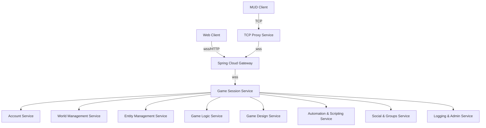

# 📈 FireMUD System Architecture: Diagram

```mermaid
flowchart TD
    MUD[MUD Client] -- TCP --> TCPProxy[TCP Proxy Service]
    Web[Web Client] -- wss/HTTP --> Gateway[Spring Cloud Gateway]
    TCPProxy -- wss --> Gateway
    Gateway -- wss --> Session[Game Session Service]

    Session --> Account[Account Service]
    Session --> World[World Management Service]
    Session --> Entity[Entity Management Service]
    Session --> Logic[Game Logic Service]
    Session --> Design[Game Design Service]
    Session --> Script[Automation & Scripting Service]
    Session --> Social[Social & Groups Service]
    Session --> Logging[Logging & Admin Service]
```

## 📚 Related Documentation

- [System Context Diagram](./system-context-diagram.md)
- [Gateway Architecture](./system-architecture-gateway.md)
