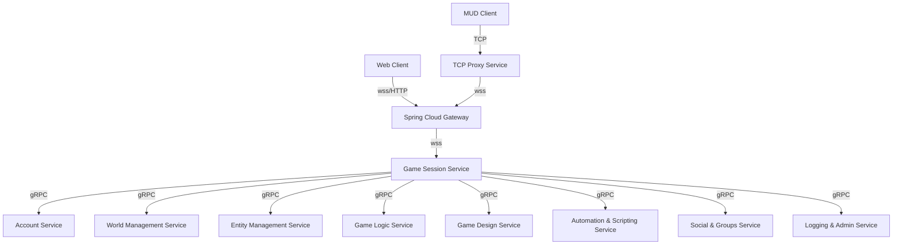

# 📈 FireMUD System Architecture: Diagram

All internal communication from the **Game Session Service** to downstream
microservices uses **gRPC** for high performance and schema enforcement.

## 📚 Related Documentation

- [System Context Diagram](./system-context-diagram.md)
- [Gateway Architecture](./system-architecture-gateway.md)
