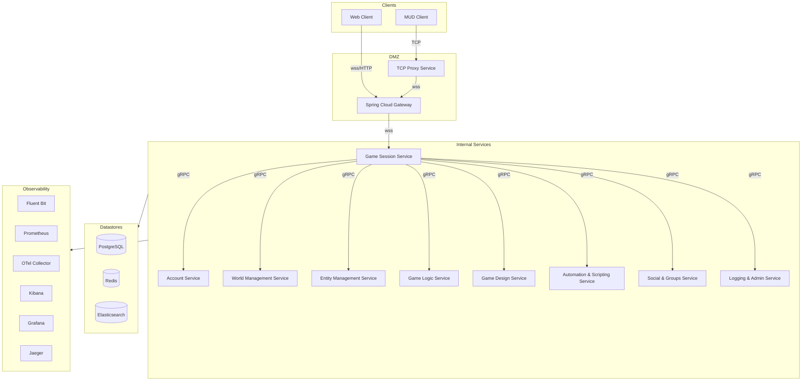

# 📈 FireMUD System Architecture: Diagram

All internal communication from the **Game Session Service** to downstream microservices uses **gRPC** for high performance and strict schema enforcement. All services persist data in PostgreSQL, cache transient state in Redis, and send structured logs to Elasticsearch.

## 📚 Related Documentation

- [System Context Diagram](./system-context-diagram.md)
- [Microservices Overview](./microservices/README.md)
- [Service Responsibility Matrix](./service-responsibility-matrix.md)
- [Gateway Architecture](./system-architecture-gateway.md)
- [Logging & Monitoring](./system-architecture-logging-monitoring.md)
