# FireMUD System Architecture: Diagram

```mermaid
flowchart TD
    subgraph Clients
        MUD[MUD Client]
        Web[Web Client]
    end

    ExtLB[External Load Balancer / Ingress]
    TelnetEdge[Telnet Edge Proxy]

    subgraph DMZ
        TCPProxy[TCP Proxy Service]
        Gateway[Spring Cloud Gateway]
    end

    subgraph InternalServices["Internal Services"]
        SessionFE[Game Session Service - Session Front-End]
        SessionExec[Game Session Service - Lease Owner / Executor]
        Account[Account Service]
        World[World Management Service]
        Entity[Entity Management Service]
        Logic[Game Logic Service]
        Design[Game Design Service]
        Script[Automation & Scripting Service]
        Social[Social & Groups Service]
        Logging[Logging & Admin Service]
    end

    subgraph Datastores
        DB[(PostgreSQL)]
        CoordRedis[(Redis - Coordination)]
        CacheRedis[(Redis - Cache/Rate Limit)]
        ES[(Elasticsearch)]
        AssetStore[(S3-compatible Asset Store)]
    end

    subgraph Observability
        FluentBit[Fluent Bit]
        Prom[Prometheus]
        Alertmgr[Alertmanager]
        OTel[OpenTelemetry Collector]
        Kibana[Kibana]
        Grafana[Grafana]
        Jaeger[Jaeger]
    end

    SMTP[Email / SMTP Provider]
    Admin[Admin / Operator Tools]

    MUD -- TCP --> TelnetEdge
    TelnetEdge -- TCP/PROXY --> TCPProxy
    Web -- wss/HTTP --> ExtLB
    ExtLB -- wss/HTTP (public ingress) --> Gateway
    TCPProxy -- wss (mTLS, internal-only listener) --> Gateway
    Gateway -- ws (in-cluster) --> SessionFE
    TCPProxy -. NotifyDisconnect gRPC (at-least-once, advisory) .-> SessionFE

    Admin -- gRPC mgmt (infra) --> Gateway
    Admin -- HTTP(S) admin APIs (via Gateway allowlist) --> Gateway
    Gateway -- routed admin API --> Logging
    Gateway -- routed admin API --> Account
    Gateway -- routed admin API --> SessionFE
    Gateway -- routed admin API --> Social
    Gateway -- routed admin API --> Design

    SessionFE -- internal gRPC (fenced forwarding) --> SessionExec
    SessionFE -- gRPC --> Account
    SessionExec -- gRPC --> World
    SessionExec -- gRPC --> Entity
    SessionExec -- gRPC --> Logic
    SessionExec -- gRPC --> Design
    SessionExec -- gRPC --> Script
    SessionExec -- gRPC --> Social
    SessionExec -- gRPC --> Logging
    SessionExec -. lifecycle and coordination signals .-> Logging
    Account -. audit and account-domain events .-> Logging

    Account --> DB
    SessionFE --> DB
    SessionExec --> DB
    World --> DB
    Entity --> DB
    Design --> DB
    Social --> DB
    Logging --> DB
    SessionExec -- owner writes --> CoordRedis
    Account -- auth-owner writes --> CoordRedis
    Entity -- shared-helper participation --> CoordRedis
    Script -- automation-owner writes --> CoordRedis
    TCPProxy --> CacheRedis
    Gateway --> CacheRedis
    World --> CacheRedis
    Entity --> CacheRedis
    Script --> CacheRedis
    Social --> CacheRedis
    Design --> AssetStore
    InternalServices -- logs --> FluentBit
    InternalServices -- metrics --> Prom
    InternalServices -- traces --> OTel
    TCPProxy -- logs --> FluentBit
    TCPProxy -- metrics --> Prom
    TCPProxy -- traces --> OTel
    Gateway -- logs --> FluentBit
    Gateway -- metrics --> Prom
    Gateway -- traces --> OTel
    FluentBit --> ES
    Prom --> Alertmgr
    Prom --> Grafana
    OTel --> Jaeger
    ES --> Kibana
    ES -- logs --> Logging
    Prom -- metrics --> Logging
    Jaeger -- traces --> Logging
    Alertmgr -- alerts --> Logging
    Alertmgr -- alerts/email --> SMTP
    Kibana -- dashboards --> Logging
    Grafana -- dashboards --> Logging

    Account -- email --> SMTP
    Logging -- email --> SMTP

```

The Web client is built with React and Material‑UI. For component layout and state management details see [Frontend Architecture](./system-architecture-frontend.md).

All services run as Docker containers inside a shared Kubernetes cluster. They reuse a [common shared library](./system-architecture-shared-libraries.md) for DTO definitions, logging interceptors, and metrics helpers. See [Deployment Environments](./infrastructure/deployment-environments.md) for how the cluster is configured.

Note on Gateway listener surfaces: the gateway serves the `player traffic plane` through a public ingress surface (typically behind an external load balancer) and an internal-only WebSocket mTLS listener used by the TCP Proxy Service. The diagram shows both flows terminating at the same gateway component; see [Gateway Architecture](./system-architecture-gateway.md) for the surface-level expectations.

Gameplay WebSocket route policy is canonicalized on `/ws/game/**` for player-facing gameplay admission.

Diagram callouts:

- External operator writes for moderation, quota overrides, runtime feature flags, and tick remediation enter through Logging & Admin via Gateway; direct domain-admin routes are read-only unless explicitly documented as bypass-safe.
- Canonical room state is not assembled by direct World ↔ Entity joins; Game Session allocates the causal-read floor from durable region commit authority, Game Logic propagates it unchanged to World and Entity and composes same-scope/epoch served-through proofs with opaque component versions, and Game Session renders/caches the resulting transcript. Current scope markers remain non-temporal.

Admin and creator API exposure on the `external admin/creator API plane` is intentionally allowlisted: external tools call domain admin APIs only through Gateway-routed HTTP(S) routes for owning services (for example Logging & Admin, Account, Game Session, Social & Groups, and Game Design). External mutating operator workflows for moderation, quota overrides, runtime feature-flag overrides, and tick remediation must enter through Logging & Admin; direct domain-admin routes are reserved for reads and explicitly documented bypass-safe workflows. External domain gRPC is not part of the edge contract unless a dedicated design update explicitly introduces it. Internal service-to-service gRPC remains direct and does not traverse Gateway or the `infrastructure management plane`.

Within the Game Session layer, the stable `/ws/game/**` edge surface maps to a session front-end pod plus lease-owner execution model: the connected pod owns socket I/O, per-session sequencing, and the current execution-region pointer, while region-scoped tick execution remains fenced to the current `<tenantId, gameInstanceId, regionId>` lease owner and may be reached through internal gRPC forwarding. The separate nodes in the diagram represent runtime roles, not separate products or independently exposed edge surfaces. See [System Architecture Overview](./system-architecture-overview.md#session-sharding--routing).

The `Gateway -> SessionFE` arrow represents both gameplay socket admission on `/ws/game/**` for the `player traffic plane` and the separate allowlisted Game Session admin/control routes on the `external admin/creator API plane` described in the overview and context docs. Admin/control requests terminate on the stable Game Session service surface; target-state region-scoped mutations must be forwarded to the current lease owner under a fenced internal contract rather than treating the session front-end as the owner of region coordination state.

The `SessionFE -> DB` and `SessionExec -> DB` arrows share Game Session-owned PostgreSQL infrastructure but do not imply overlapping write authority. The session front-end writes connection-scoped control metadata such as disconnect dedupe, session recovery markers, and front-end-owned operator bookkeeping. The lease owner / executor writes region-owned runtime control metadata such as remediation state, fenced coordination health records, and region-scoped cutover or lease-transition bookkeeping. When a record can be touched by both roles, the owning service contract must define a single-writer or fenced compare-and-swap rule rather than allowing last-writer-wins behavior.

For Gateway control-plane behavior in production-like environments (including the dynamic-route override dev/test scope), see the canonical [Gateway Management Plane Capability Matrix](./system-architecture-overview.md#gateway-management-plane-capability-matrix-canonical).

## Core Services Shown

The diagram covers every microservice in the repository:

- **[TCP Proxy Service](./microservices/tcp-proxy-service/README.md)** – Bridges Telnet clients into the WebSocket-based backend.
- **[Spring Cloud Gateway](./microservices/spring-cloud-gateway/README.md)** – Routes HTTP and WebSocket traffic to internal services.
- **[Game Session Service](./microservices/game-session-service/README.md)** – Orchestrates sessions, ticks, and runtime configuration.
- **[Account Service](./microservices/account-service/README.md)** – Handles accounts, authentication, and subscriptions.
- **[World Management Service](./microservices/world-management-service/README.md)** – Stores rooms, regions, and world maps plus navigation metadata; pathfinding algorithms and route computation live in the Game Logic Service. World Management does not own live entities, items, or inventories.
- **[Entity Management Service](./microservices/entity-management-service/README.md)** – Manages players, NPCs, items, and all inventories/containment, including player gear, containers, and items on the ground.
- **[Game Logic Service](./microservices/game-logic-service/README.md)** – Resolves commands and core gameplay mechanics.
- **[Game Design Service](./microservices/game-design-service/README.md)** – Provides authoring tools for game data and feature flags with version publishing copy steps and a web-based editor.
- **[Automation & Scripting Service](./microservices/automation-scripting-service/README.md)** – Executes AI behaviors and custom scripts.
- **[Social & Groups Service](./microservices/social-groups-service/README.md)** – Manages chat, guilds, and social networking.
- **[Logging & Admin Service](./microservices/logging-admin-service/README.md)** – Centralizes logging, metrics, and admin tools; owns moderation policy and audit state while using Elasticsearch, Prometheus, and Jaeger for supplemental investigation dashboards.

Only the **TCP Proxy Service** and **Spring Cloud Gateway** are reachable from the internet. They operate in the network DMZ while the remaining microservices run on the internal network. Admin and creator tools always connect to **Logging & Admin Service and other domain services via the Gateway**; Logging & Admin is not exposed directly at the edge. See [Security Architecture](./system-architecture-security.md#network-security--boundary-design) and [System Architecture Overview](./system-architecture-overview.md#admin-entry-points-and-control-plane) for details.

All internal synchronous communication from the **Game Session Service** to downstream microservices uses **gRPC** for high performance and strict schema enforcement. Asynchronous signaling flows (for example, `NotifyDisconnect`, lifecycle metrics/events, and audit/saga event streams) are documented separately and use explicit idempotency/ownership contracts. Stateful domain microservices persist data in PostgreSQL and use Redis for transient state; DMZ components such as the TCP Proxy Service and Spring Cloud Gateway remain stateless with respect to PostgreSQL but use Redis for rate limiting and caches. All services emit metrics to Prometheus and send structured logs to Elasticsearch.

Coordination Redis arrows in this diagram follow ownership boundaries from ADR 0009: Game Session owns gameplay coordination prefixes (for example `session:game:*`, `tick:*`, `timer:*`, `retry:*`, and `tick-executor-lease:*`), Account owns `session:auth:*`, Automation & Scripting owns `automation:*`, and non-owner services (for example Entity) participate only through approved shared-helper contracts rather than ad hoc key ownership.

Canonical room-state assembly is intentionally not shown as a direct World-to-Entity join: Game Session allocates the causal floor from durable region commit authority, Game Logic propagates it unchanged to World and Entity, and composes same-scope/epoch responses whose served-through proofs meet that floor with opaque owner-local component versions. Behind-floor or mixed-scope/epoch responses are rejected or retried; current scope markers do not prove freshness.

## Datastore Layer

Databases and caches shared across all services capture authoritative world state, runtime entities, and observability-ready analytics:

- **PostgreSQL** – Primary persistent store for world topology, entities, characters, items, and transactional metadata (tenant-scoped tables include `tenantId` so data never mixes across games).
- Not every service writes to PostgreSQL: some services are fully stateless with respect to persistence (for example, Game Logic), and others may be read-heavy. The diagram’s DB arrows indicate shared infrastructure only, not cross-service table ownership; services must not directly read or mutate another service’s runtime tables.
- For Game Session specifically, the DB arrows represent durable control-plane/runtime metadata (for example game-instance records, pinned runtime version/script patch state, feature-flag overrides, and disconnect/remediation bookkeeping). Gameplay session bindings, queues, timers, retries, and lease coordination remain Redis-owned.
- **Coordination Redis** – Volatile session and tick coordination state; Lua scripts enforce atomic command execution and reconnect recovery while TTLs keep the data transient. In production this runs as a dedicated cluster so cache and rate-limit spikes cannot interfere with gameplay coordination.
- **Cache/Rate-Limit Redis** – Best-effort caches, quotas, and rate limiting; this runs as a separate cluster in production and is safe to evict or scale independently of Coordination Redis.
- **Elasticsearch** – Stores structured logs emitted by every service (via Fluent Bit); the Logging & Admin Service reads directly from it for dashboards and audits.
- **S3-compatible Asset Store** – Stores published game assets and exported content produced by the Game Design Service; other services and clients consume these assets via configured URLs, typically fronted by the gateway or a CDN.

These datastores appear in the diagram as individual nodes (`PostgreSQL`, `Redis - Coordination`, `Redis - Cache/Rate Limit`, `Elasticsearch`, and the asset store) and are wired to service traffic and observability pipelines in the mermaid flowchart above.

All datastores are shared across games. Tenant-scoped tables include a `tenantId` column (or reference a tenant-keyed parent), and Redis keys use a matching prefix, which isolates per-game data while keeping the services stateless. See [Multi-Tenancy](./system-architecture-multi-tenancy.md) for details.

## Observability Components

Fluent Bit, Prometheus, and the OpenTelemetry Collector work together so logs, metrics, and traces share the same `traceId`. This makes it easy to correlate game events across Kibana, Grafana, and Jaeger dashboards.
The Logging & Admin Service queries Elasticsearch, Prometheus, and Jaeger and consumes Alertmanager notifications for observability-backed investigation. It may embed Kibana and Grafana dashboards, but moderation policy writes, audit capture, feature-flag requests, quota overrides, and tick-remediation controls must remain available when those observability backends are degraded.

The diagram also illustrates the monitoring stack shared by every service:

- **Fluent Bit** – Collects structured logs from each container.
- **Elasticsearch** – Stores logs for search and troubleshooting.
- **Prometheus** – Scrapes metrics and forwards alerts to **Alertmanager**.
- **Alertmanager** – Routes alerts and notifies the Logging & Admin Service.
- **Grafana** – Visualizes dashboards based on Prometheus data and exposes an API that the Logging & Admin Service uses for embedding.
- **OpenTelemetry Collector** – Aggregates distributed traces.
- **Jaeger** – Provides a UI for end‑to‑end trace analysis.
- **Kibana** – Queries and visualizes Elasticsearch logs and exposes an API that the Logging & Admin Service uses for embedding.

See [Logging & Monitoring](./system-architecture-logging-monitoring.md) for deployment details.

## Asynchronous Flows

The mermaid graph includes representative async/event edges that are architecture-relevant:

- TCP Proxy Service emits `NotifyDisconnect` to Game Session as a best-effort, at-least-once advisory signal keyed by `{proxyConnectionId, disconnectSequence}`.
- Game Session emits lifecycle and coordination health signals consumed by Logging & Admin for operator workflows.
- Account emits audit/account-domain events consumed by Logging & Admin using idempotent event identifiers (for example `{tenantId, eventType, eventId}`) so retries are replay-safe and deduplicable.
- Logging & Admin is a control-plane sink for these async flows and does not take ownership of runtime enforcement decisions from domain services.
- Moderation policy propagation from Logging & Admin to Game Session and Social & Groups uses versioned snapshots plus monotonic invalidation per `{tenantId, policyScope}`; enforcement services use bounded-staleness caches and fail-closed behavior for `gameplay_ban` and `chat_ban` when they cannot obtain a fresh snapshot within the allowed window.

Durable business events and saga updates in this architecture are implemented using service-local transactional outbox patterns plus background consumers, not an implicit shared event bus; see [Transaction Strategies](./system-architecture-transactions.md#tick-adjacent-workflows-outbox-boundary).

## Related Documentation

- [Deployment Environments](./infrastructure/deployment-environments.md)
- [Frontend Architecture](./system-architecture-frontend.md)
- [Gateway Architecture](./system-architecture-gateway.md)
- [Infrastructure Overview](./infrastructure/README.md)
- [Logging & Monitoring](./system-architecture-logging-monitoring.md)
- [Microservices Overview](./microservices/README.md)
- [Multi-Tenancy](./system-architecture-multi-tenancy.md)
- [Service Responsibility Matrix](./service-responsibility-matrix.md)
- [Shared Libraries Overview](./system-architecture-shared-libraries.md)
- [System Context Diagram](./system-context-diagram.md)
