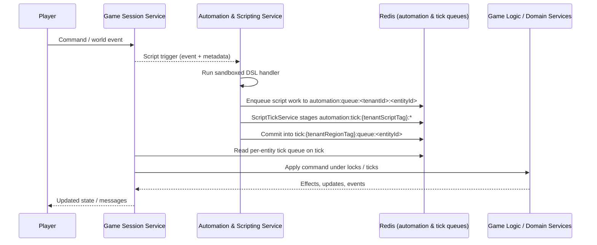

# FireMUD System Architecture: Scripting & Automation Framework

This document is the **hub** for FireMUD’s scripting and automation architecture. It outlines how custom in-game behavior is executed through a sandboxed scripting framework and points to focused reference docs for details.

It complements:

- [Automation & Scripting Service README](./microservices/automation-scripting-service/README.md)
- [System Architecture: Ticks](./system-architecture-ticks.md)
- [System Architecture: Versioning & Runtime Configuration](./system-architecture-versioning-runtime.md)

## Implementation Status

This section summarizes where the scripting and automation framework stands relative to the target-state design as of 2025-12-04.

For the most accurate, fine-grained status, refer to the [Automation & Scripting Service Task List](../project-management/task-list-automation-scripting-service.md).

- **Implemented and in active use**
  - Sandboxed script runtime and core Automation & Scripting Service, including quota enforcement via `ScriptQuotaService` and Redis-backed `ScriptTickService` staging.
  - Hot reloading of scripts published by the Game Design Service and version-aware script execution, aligned with the versioning model in [Versioning & Runtime Configuration](./system-architecture-versioning-runtime.md#script-only-patch-versions).
  - Visual DSL editor for script creation and testing in the Game Design Service, mapping component graphs to Automation & Scripting Service definitions.
  - Advanced NPC behavior modules (morale, PvE encounters, formations) and state-driven / event-driven NPC behaviors integrated with the tick system.

- **Planned or partially implemented**
  - Copying published version data into the Automation & Scripting Service schema via Saga, and broader script-driven world generation flows (runtime generation requests via isolated ticks, generation seed persistence, and script-driven population triggers).
  - Expansion of the PvE encounter library, biome-specific events, and world generation features called out in the Automation & Scripting Service and world generation task lists.
- Scheduler leadership leases and per-region tick-stream consumption for `script-leader:{<tenantId>}` are implemented; sharded leases, `automation:timer:{tenantRegionTag}` indexing, and long-term audit-retention jobs continue to evolve (see **Scheduler Leadership & Coordination** in `design/architecture/system-architecture-scripting-dsl-reference-and-lifecycle.md` and the Automation & Scripting Service README for current behavior).

Operators looking for **runtime knobs and environment variables** should now primarily consult `design/architecture/system-architecture-scripting-quotas-and-operations.md` and the Automation & Scripting Service README (`design/architecture/microservices/automation-scripting-service/README.md#environment-variables`), which are the authoritative sources for current settings and defaults.

Maintainers should update this section whenever major scripting features land or significant architecture pieces change so it remains a reliable guide to what is live versus aspirational.

### Area Status Snapshot

The table below summarizes the high-level implementation status of major areas in the scripting and automation stack:

| Area | Status (as of 2025-12-04) | Notes |
| --- | --- | --- |
| Script runtime & DSL | Implemented | Sandbox execution, core Automation & Scripting Service, and visual DSL editor are in active use, including basic quotas. |
| Automation queues & script ticks | Implemented | `automation:queue:<tenantId>:<entityId>` and `automation:tick:{tenantScriptTag}:...` staging are implemented; script work items flow into tick commands as described under [TL;DR Flow](#tldr-flow). |
| Integration with tick commands | Implemented | Script-generated tick commands are enqueued into the same per-entity tick queues used by Game Session, and participate in the normal lock/idempotency model. |
| Scheduler leadership & timers | Designed / partial | Per-tenant `script-leader:{<tenantId>}` leases and heartbeat-driven interval scheduling are implemented; sharded leases, `automation:timer:{tenantRegionTag}` indexing, and long-term audit-retention jobs are tracked in the Automation & Scripting Service README and task list. |
| Quotas & fairness | Implemented / evolving | Per-script quotas (`ScriptQuotaService`) and basic fairness rules are implemented; multi-level budgets and advanced throttling controls continue to evolve. |
| Audit & metrics | Implemented / evolving | `script_event_audit` and core automation metrics exist; retention policies and additional dashboards are being refined. |

## Table of Contents

- [Implementation Status](#implementation-status)
- [Who Should Read What](#who-should-read-what)
- [Goals](#goals)
- [TL;DR Flow](#tldr-flow)
- [Where to Find Details](#where-to-find-details)

---

## Who Should Read What

- **Game designers and content authors**
  - Focus on: [Goals](#goals), [TL;DR Flow](#tldr-flow), and the **DSL & examples** references:
    - `design/architecture/system-architecture-scripting-dsl-for-designers.md` (designer-facing overview of the DSL, core concepts, validation behavior, and how to work in the visual editor).
    - `design/architecture/system-architecture-scripting-examples-and-patterns.md` (for worked examples like `onEnterRegion` and periodic patrol).
    - For the web-based editor UX and world editing tools, see:
      - `design/architecture/microservices/game-design-service/web-visual-interface.md`
      - `design/architecture/microservices/game-design-service/world-editing-tools.md`

- **Implementers and backend developers**
  - Focus on: [TL;DR Flow](#tldr-flow) and:
    - `design/architecture/system-architecture-scripting-dsl-reference-and-lifecycle.md` for terminology, DSL semantics, determinism, timers, event lifecycle, **deployment & versioning behavior**, and advanced NPC modules; in particular, see **Determinism & Allowed Non-Determinism**, **Integration with Game Logic & Tick System**, **Script Timers vs Tick Timers**, and **Scheduler Leadership & Coordination**.
    - `design/architecture/system-architecture-scripting-quotas-and-operations.md` for **Per-Script Scheduling Policies**, **Resource Isolation and Multi-Level Budgets**, and outcome-to-metric mapping.
    - `design/architecture/system-architecture-ticks.md` and `design/architecture/system-architecture-transactions.md` for cross-cutting concerns.

- **Operators, SREs, and platform engineers**
  - Focus on:
    - `design/architecture/system-architecture-scripting-quotas-and-operations.md` for quotas, budgets, sandboxing, environment variables, and operational cookbook.
    - `design/architecture/system-architecture-scripting-dsl-reference-and-lifecycle.md` → **Failure Modes and Error Handling** and **`scriptEventId` Lifecycle and Deduplication** for outcome taxonomy, retry behavior, and at-most-once semantics.
    - `design/architecture/system-architecture-logging-monitoring.md` and `design/architecture/system-architecture-redis.md` for metrics, logging, and Redis behavior.
  - Use this hub primarily as an overview and routing guide.

---

## Goals

- Enable **event-driven scripting** and **NPC automation** so worlds feel alive even without active players.
- Keep the system **extensible** while preventing malicious or abusive scripts.
- Support **persistence** and versioned updates so game creators can iterate safely.

---

## TL;DR Flow

At a high level, scripting follows this pipeline:

1. **Event fires** – Game Session or another service emits a standard or custom event for an entity.
2. **Bindings & quotas** – The Automation & Scripting Service looks up bound handlers for that `<tenantId, eventType>` and applies per-script and per-tenant limits via `ScriptQuotaService`.
3. **Sandboxed DSL execution** – Allowed handlers run in the sandboxed DSL runtime, reading world state via gRPC and producing domain commands rather than mutating state directly.
4. **Automation queue staging** – After sandbox execution, the resulting **script work items** (domain commands plus metadata) are enqueued into Redis-backed automation queues under keys such as `automation:queue:<tenantId>:<entityId>`, along with `scriptEventId`, `scriptId`, and version metadata. These queues are per-tenant and per-entity and represent the backlog of post-DSL script work items awaiting processing by automation ticks; region-scoped tick keys remain the responsibility of the Game Session Service.
5. **Script ticks & commit** – `ScriptTickService` drains automation work items from `automation:queue:<tenantId>:<entityId>` entries, batches automation events into tick-compatible queues with quotas and budgets under `automation:tick:{tenantScriptTag}:...`, and only then commits the resulting **domain commands** into the tick command queues using Redis Lua scripts for atomic staging and commit.
6. **Game tick execution** – The Game Session Service consumes at most one command per entity per tick from the combined player-and-automation queues and applies effects under the normal lock and replay rules.

---

## Where to Find Details

This hub intentionally keeps only high-level flows and routing; detailed topics live in focused documents:

- **DSL semantics, terminology, lifecycle, determinism**
  - `design/architecture/system-architecture-scripting-dsl-and-lifecycle.md`

- **Deployment & versioning for scripts**
  - `design/architecture/system-architecture-scripting-dsl-and-lifecycle.md` (see **Deployment & Versioning** and **Hot Reload & Resume Behavior**)
  - `design/architecture/system-architecture-versioning-runtime.md` (see **Script-only patch versions**)

- **Examples and common patterns**
  - `design/architecture/system-architecture-scripting-examples-and-patterns.md`

- **Sandboxing, quotas, budgets, and operations**
  - `design/architecture/system-architecture-scripting-quotas-and-operations.md`

- **Developer tools and helper scripts**
  - See **Developer Tools** in `design/architecture/system-architecture-scripting-quotas-and-operations.md` for CLI and docs-generation helpers.

- **Service-level implementation**
  - `design/architecture/microservices/automation-scripting-service/README.md`

For logging, metrics, and observability, see `design/architecture/system-architecture-logging-monitoring.md`. For Redis keys and tick system behavior, see `design/architecture/system-architecture-redis.md` and `design/architecture/system-architecture-ticks.md`.
