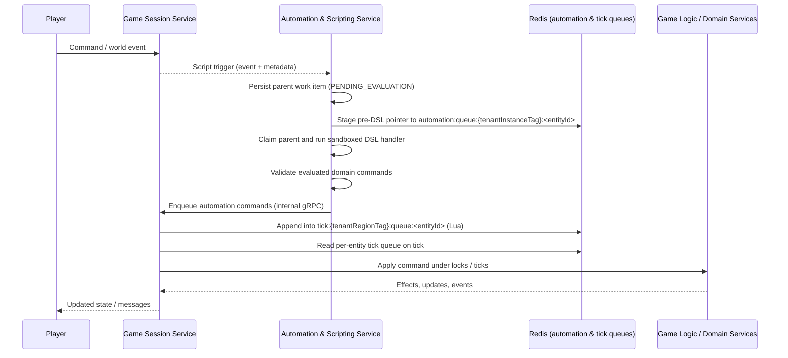

# FireMUD System Architecture: Scripting & Automation Framework

This document is the **hub** for FireMUD’s scripting and automation architecture. It outlines how custom in-game behavior is executed through a sandboxed scripting framework and points to focused reference docs for details. It is intentionally high level: for precise DSL semantics and sandbox behavior, treat `design/architecture/system-architecture-scripting-dsl-reference-and-lifecycle.md` and `design/architecture/microservices/automation-scripting-service/sandbox-runtime-design.md` as the canonical specifications.

Document conflict resolution order is defined in `design/architecture/system-architecture-scripting-normative-contract-tables.md#document-precedence-normative`.

For control-plane API contracts, see `design/architecture/system-architecture-scripting-control-plane-api.md`.
For workflow sequencing (pin/rollback orchestration, pause/resume, drain/purge, and convergence), see `design/architecture/system-architecture-scripting-control-plane-operations.md`.
For canonical custom-event definitions and producer authorization, see `design/architecture/system-architecture-scripting-event-registry.md`.

For the cross-service exact pin/epoch contract, use [Scripting & Automation: Cross-Service Contracts](./system-architecture-scripting-contracts.md). Rollout/rollback, schedule continuity, runtime admission/recovery, and DSL artifact/lifecycle distinctions are owned by [Rollout and Rollback](./system-architecture-scripting-rollout-and-rollback.md), [Scripting Scheduler and Timer Lifecycle](./system-architecture-scripting-scheduler-and-timers.md), [Scripting Runtime Execution](./system-architecture-scripting-runtime-execution.md), and [DSL Reference & Lifecycle](./system-architecture-scripting-dsl-reference-and-lifecycle.md), respectively. The hub does not define a competing active patch or fallback authority.

It complements:

- [Automation & Scripting Service README](./microservices/automation-scripting-service/README.md)
- [System Architecture: Ticks](./system-architecture-ticks.md)
- [System Architecture: Versioning & Runtime Configuration](./system-architecture-versioning-runtime.md)

## Implementation Status

This section is a high-level snapshot. For the current implementation record, use `design/project-management/implementation-tracking/automation-and-scheduler-runtime.md`; its canonical service subdocs are linked from `design/architecture/microservices/automation-scripting-service/README.md#document-map`. For sandbox-specific status, see `design/architecture/microservices/automation-scripting-service/sandbox-runtime-design.md#implementation-status`.

### Implementation Notes

The live Automation runtime is bounded to durable work-item execution, quotas, sandbox resource enforcement, and the current structured command-template evaluator. The broader visual graph DSL, compiled-artifact execution, advanced NPC behavior modules, procedural population, and richer sandbox/runtime seams described below are target-state architecture, not evidence of live end-to-end implementation.

- **Implemented and in active use**
  - Bounded sandboxed script runtime and core Automation & Scripting Service, including quota enforcement via `ScriptQuotaService`, durable work-item execution, structured command-template evaluation, and reset-tolerant queue-pointer projection.
  - Hot reloading of scripts published by the Game Design Service and version-aware script execution, aligned with the versioning model in [Versioning & Runtime Configuration](./system-architecture-versioning-runtime.md#script-only-patch-versions).

- **Implemented and evolving**
  - Script publish lifecycle integrates Game Design publish workflows with Automation runtime reload and readiness gating (`PENDING_VALIDATION` -> `ONLOAD_RUNNING` -> `READY`/`FAILED`, with `SUPERSEDED` for older pending patches displaced by newer publishes). Newer-publish supersession is separate from stale executor recovery: the former terminalizes the older readiness patch as `SUPERSEDED`, while stale `ONLOAD_RUNNING` executor work remains unreclaimed in the current implementation.
  - The tenant patch-readiness lifecycle is now durably tracked through the Temporal `script-patch-readiness` workflow family after `NotifyScriptVersionUpdate`; the canonical patch-status control-plane reads expose workflow identity and execution status directly rather than relying on process-local orchestration state.
  - World generation and PvE behavior libraries remain target-state/design areas; feature-level progress is tracked in service task lists rather than this hub.
  - Scheduler leadership leases and per-region tick-stream consumption are implemented; sharding/indexing and long-term retention jobs continue to evolve (see **Scheduler Leadership & Coordination** in `design/architecture/system-architecture-scripting-dsl-reference-and-lifecycle.md` and the Automation & Scripting Service README for current behavior).

Operators looking for **runtime knobs and environment variables** should now primarily consult `design/architecture/system-architecture-scripting-quotas-and-operations.md` and the Automation & Scripting Service README (`design/architecture/microservices/automation-scripting-service/README.md#environment-variables`), which are the authoritative sources for current settings and defaults.

Maintainers should update this section whenever major scripting features land or significant architecture pieces change so it remains a reliable guide to what is live versus aspirational.

### Area Status Snapshot

The table below summarizes high-level implementation status categories; verify current state against the implementation ledger linked above:

| Area | Status | Notes |
| --- | --- | --- |
| Script runtime & DSL | Implemented at a bounded runtime boundary | Sandbox execution, core Automation & Scripting Service, structured command-template evaluation, and basic quotas are live; the broader graph DSL/editor runtime remains target-state work. |
| Automation queues & durable execution | Implemented / evolving | Instance-aware automation queue indexes (for example `automation:queue:{tenantInstanceTag}:<entityId>`), canonical `automation:quota:<tenantId>:<scriptId>` counters, the durable work-item executor, and reset-tolerant queue rebuild are implemented; remaining `10.4` work is richer runtime output and any later queue-consumer evolution, not restoring a separate staging layer. |
| Integration with tick commands | Implemented / active | Script-generated gameplay commands now hand off to Game Session through the idempotent automation command API and enter the same per-entity tick queues used by player commands; ongoing `10.4` work is about richer runtime output semantics and observability, not a missing bridge. |
| Scheduler leadership & timers | Implemented / evolving | Scheduler leases and heartbeat-driven interval scheduling are implemented; region-scoped Redis timer/checkpoint coordination (for example `automation:timer:{tenantRegionTag}`) with instance-aware stored identities, and long-term audit-retention jobs are tracked in the Automation & Scripting Service README and task list. |
| Quotas & fairness | Implemented / evolving | Per-script quotas (`ScriptQuotaService`) and basic fairness rules are implemented; multi-level budgets and advanced throttling controls continue to evolve. |
| Audit & metrics | Implemented / evolving | `script_event_audit` and core automation metrics exist; retention policies and additional dashboards are being refined. |

## Table of Contents

- [Implementation Status](#implementation-status)
- [Who Should Read What](#who-should-read-what)
- [Goals](#goals)
- [Validation & Admission Pipeline](#validation--admission-pipeline)
- [Sandboxing & Security](#sandboxing--security)
- [TL;DR Flow](#tldr-flow)
- [Where to Find Details](#where-to-find-details)

---

## Who Should Read What

- **Game designers and content authors**
  - Focus on: [Goals](#goals), [TL;DR Flow](#tldr-flow), and the **DSL & examples** references:
    - `design/architecture/system-architecture-scripting-dsl-for-designers.md` (designer-facing overview of the DSL, core concepts, validation behavior, and how to work in the visual editor).
    - `design/architecture/system-architecture-scripting-examples-and-patterns.md` (for worked examples like `onEnterRegion` and periodic patrol).
    - For the web-based editor UX and world editing tools, see:
      - `design/architecture/microservices/game-design-service/web-visual-interface.md`
      - `design/architecture/microservices/game-design-service/world-editing-tools.md`

- **Implementers and backend developers**
  - Focus on: [TL;DR Flow](#tldr-flow) and:
    - `design/architecture/system-architecture-scripting-dsl-reference-and-lifecycle.md` for terminology, DSL semantics, determinism, timers, event lifecycle, **deployment & versioning behavior**, and advanced NPC modules; in particular, see **Determinism & Allowed Non-Determinism**, **Integration with Game Logic & Tick System**, **Script Timers vs Tick Timers**, and **Scheduler Leadership & Coordination**.
    - `design/architecture/system-architecture-scripting-event-registry.md` for canonical event-type ownership, schema versioning, producer authorization, and snapshot requirements.
    - `design/architecture/system-architecture-scripting-quotas-and-operations.md` for **Per-Script Scheduling Policies**, **Resource Isolation and Multi-Level Budgets**, and outcome-to-metric mapping.
    - `design/architecture/system-architecture-ticks.md` and `design/architecture/system-architecture-transactions.md` for cross-cutting concerns.

- **Operators, SREs, and platform engineers**
  - Focus on:
    - `design/architecture/system-architecture-scripting-quotas-and-operations.md` for quotas, budgets, sandboxing, environment variables, and operational cookbook.
    - `design/architecture/system-architecture-scripting-dsl-reference-and-lifecycle.md` → **Failure Modes and Error Handling** and **`scriptEventId` Lifecycle and Deduplication** for outcome taxonomy, retry behavior, and at-most-once semantics.
    - `design/architecture/system-architecture-logging-monitoring.md` and `design/architecture/system-architecture-redis.md` for metrics, logging, and Redis behavior.
  - Use this hub primarily as an overview and routing guide.

---

## Goals

- Enable **event-driven scripting** and **NPC automation** so worlds feel alive even without active players.
- Keep the system **extensible** while preventing malicious or abusive scripts.
- Support **persistence** and versioned updates so game creators can iterate safely.

---

## Validation & Admission Pipeline

At a high level, a script (or plugin) must pass through several stages before it can execute in production. Different services own different steps:

1. **Editor graph validation (Game Design Service)**
   - The visual editor enforces type correctness, required connections, and basic structural rules (for example, no missing inputs, no dangling edges).
   - Loop safety is checked at the graph level using the bounded-loop rules described in `design/architecture/system-architecture-scripting-dsl-reference-and-lifecycle.md#loop-safety-analysis`.
   - Errors at this stage are shown directly in the editor; scripts cannot be published until they are resolved.

2. **Compile-time validation and persistence (Automation & Scripting Service)**
   - When designers publish a new script patch, the Game Design Service drives the durable publish workflow that compiles the editor graph into the runtime DSL representation and persists it in the Automation & Scripting Service schema.
   - The Automation & Scripting Service revalidates the compiled graph (for example, type checks, guard-node presence in loops, supported component versions) and will reject or mark the patch as `FAILED` if compilation or validation fails.

3. **`onLoad` initialization (Automation & Scripting Service, per tenant patch)**
   - For each `<tenantId, scriptPatchVersion>`, the Automation & Scripting Service runs any configured `onLoad` handlers after static validation succeeds but **before** the patch is marked `READY` for that tenant. `READY` only means the patch is eligible for pinning; runtime admission, timers, reload pause, and rollback remain instance-scoped.
   - In the first implementation slice, `onLoad` is limited to **ephemeral readiness work** such as validating configuration and warming recomputable in-process caches. It is not a hook for creating durable shared state.
   - `onLoad` is a **mandatory gate**: if it fails with a logical or sandbox-level error, the patch is marked `FAILED` for that tenant, running instances remain on their previously pinned patch, and events referencing the failed patch are rejected with outcomes such as `version_unavailable`. The DSL evaluation itself is at-most-once and is never retried. Independently idempotent external infrastructure steps may retry transient failures only with the same persisted step identity, within an explicit maximum-attempts, maximum-elapsed-time/deadline, and bounded exponential-backoff-with-jitter budget; exhaustion records a terminal readiness failure and cannot advance the patch to `READY`.
   - The currently implemented durable recovery is scoped to the Temporal `script-patch-readiness` workflow and its persisted, independently idempotent external readiness steps: after a worker or process crash, that workflow can resume an unfinished step for the same patch and step identity, or record terminal exhaustion if its retry budget/deadline has elapsed. Stale executor `ONLOAD_RUNNING` work remains a current implementation gap: it is not reclaimed or terminalized, and the DSL must not be re-entered merely because the process was restarted. Recovery must not mint a new `scriptEventId` or step identity. Target recovery-owner behavior fences and terminalizes stale `ONLOAD_RUNNING` as audited `finalStage=DSL_EVAL`, `finalOutcome=canceled`, `finalReason=stale_execution_fenced` without DSL re-entry, as defined by the [DSL lifecycle owner](./system-architecture-scripting-dsl-reference-and-lifecycle.md#onload-semantics); this target behavior is not current proof and does not introduce a `ROLLED_BACK` readiness state.
   - Tenant readiness is single-pending: if a newer patch publish is accepted while an older patch is still `PENDING_VALIDATION` or `ONLOAD_RUNNING`, the older patch becomes `SUPERSEDED` and cannot later become `READY`.
   - The readiness wait itself is now durably hosted in the Temporal `script-patch-readiness` workflow family, which polls the canonical readiness projection until the patch reaches a terminal state and exposes workflow identity/status to operator control-plane reads.

4. **Version pinning (Game Session Service)**
   - **Target state:** Once a patch is `READY` for a tenant, the Game Session Service may explicitly pin it as the instance's `(scriptPatchVersion, scriptPinEpoch)` tuple. Every instance-bound gameplay/runtime event producer, including Game Session and authorized custom/service producers, forwards that exact Game Session-owned tuple and its upstream-generated `scriptEventId` unchanged; Automation's scheduler is the owner-known exception and derives the event-scope `scriptEventId` from the complete due-candidate identity before propagating it unchanged to resolved handlers. Custom/service producers obtain the tuple from Game Session rather than a local projection. Tenant-readiness `onLoad` remains the pre-instance-pin exception.
   - **Current implementation gap:** the live Automation-to-Game Session handoff carries `scriptPatchVersion` but omits `scriptPinEpoch`, so same-version old-epoch work is not rejected at that boundary today; the target propagation and fence remain unimplemented/proof-incomplete.
   - The Automation & Scripting Service never silently substitutes a different version; if it receives an unknown or `FAILED` patch for a tenant, it rejects the trigger rather than falling back.

5. **Quota and budget admission (Automation & Scripting Service)**
   - Only after a trigger passes version checks does `ScriptQuotaService` and the multi-level budgeting model decide whether it is allowed to run. Quota denials (`quota_denied`) happen **before** any sandbox work and do not consume CPU/memory budgets.
   - Ingress admission is evaluated first at the event scope. If the event is accepted for handler resolution, each resolved handler then records its own stage-aware outcome independently in `script_event_audit`; one inbound event can therefore yield a mixed set of handler-level success, quota, disable, or policy outcomes.

6. **Sandbox execution (Automation & Scripting Service)**
   - Admitted triggers run in the sandboxed DSL engine with per-run CPU/iteration and memory budgets as described in `design/architecture/microservices/automation-scripting-service/sandbox-runtime-design.md`.
   - Runtime guard violations are recorded as `sandbox_error` outcomes with specific reasons (for example, `cpu_budget_exceeded`, `memory_budget_exceeded`) and feed into failure-rate circuit breakers.

7. **Command staging and tick execution**
   - Successful runs produce durable work items plus `automation:queue:{tenantInstanceTag}:<entityId>` pointer entries. Automation's execution loop claims those work items, evaluates their emitted commands, and then hands those commands to the Game Session Service for enqueue into tick queues, where they follow the standard tick idempotency and replay semantics.
   - Before persistence/handoff, explicit output ceilings cap the number of emitted commands and the serialized work-item size so one admitted trigger cannot create an unbounded backlog.

All stages emit metrics and audit records (especially `script_event_audit`) so designers and operators can see where a script failed to progress. The quotas and operations document (`design/architecture/system-architecture-scripting-quotas-and-operations.md`) is the primary reference for interpreting these outcomes in production.

---

## Sandboxing & Security

From a system perspective, script safety comes from three layers:

- The **DSL and editor** restrict behavior to curated components with strong validation and loop-safety checks.
- The **sandbox runtime** in the Automation & Scripting Service enforces CPU, time, and memory budgets per run and per tenant, treating budget violations as `sandbox_error` outcomes that feed into failure-rate circuit breakers.
- **Infrastructure limits** (Kubernetes resource limits, Redis and database quotas) provide outer guards for catastrophic failures.

Detailed sandbox behavior and resource limits live in:

- `design/architecture/microservices/automation-scripting-service/sandbox-runtime-design.md` – engine-level sandbox and budget semantics.
- `design/architecture/system-architecture-scripting-quotas-and-operations.md#sandboxing--security` – how sandboxing interacts with quotas, multi-tenant fairness, and operations.

For security and trust boundaries around plugins and external content, see the modding and game-design docs referenced under **Where to Find Details**.

## TL;DR Flow

At a high level, scripting follows this pipeline:

1. **Event fires** – Game Session or another service emits a standard or custom event for an entity.
2. **Bindings & quotas** – The Automation & Scripting Service looks up bound handlers for that `<tenantId, eventType>` and applies per-script and per-tenant limits via `ScriptQuotaService`.
3. **Durable parent work persistence and queue staging** – After binding and quota admission, Automation persists the admitted parent work item in the durable outbox with `PENDING_EVALUATION` and stages a rebuildable pre-DSL queue pointer keyed and deduplicated by `outboxWorkItemId`. Current queue semantics and the target post-DSL evaluated-descriptor/child boundary are owned by [Scripting Runtime Execution](./system-architecture-scripting-runtime-execution.md#current-implementation-status); the pointer is a best-effort derived coordination index whose loss/reset is acceptable because the parent work item is durable and the index can be rebuilt. Loss/reset must still be observable. Region-scoped tick keys remain the responsibility of the Game Session Service.
4. **Sandboxed DSL execution** – Automation's durable executor picks up the persisted parent work item, runs the allowed handler in the sandboxed DSL runtime, reads world state via gRPC, and produces domain commands rather than mutating state directly. Those resulting commands proceed to durable execution and handoff below.
5. **Post-evaluation validation & handoff** – Automation validates the evaluated output and applies the applicable output-budget checks, then hands the resulting **domain commands** to the Game Session Service over internal gRPC so Game Session can enqueue them into per-entity tick queues through the shared [`firemud-common` Lua Script Registry, descriptors, key builders, and invocation helpers](./system-architecture-shared-libraries.md#redis-key-naming--lua-script-helpers), while retaining its tick invariants. `automation:queue:{tenantInstanceTag}:<entityId>` remains a rebuildable pointer index, not a second source of work truth.
6. **Game tick execution** – The Game Session Service selects at most one root actor action per eligible entity from the `actor_action` lane; the separately bounded `passive_effect` lane includes passive, inbound, and actor-generated effect sources without consuming that actor-action slot. Both lanes apply the canonical lock, fairness, ordering, and replay rules.

---

## Where to Find Details

This hub intentionally keeps only high-level flows and routing; detailed topics live in focused documents:

- **DSL semantics, terminology, lifecycle, determinism**
  - `design/architecture/system-architecture-scripting-dsl-reference-and-lifecycle.md`

- **Deployment & versioning for scripts**
  - `design/architecture/system-architecture-scripting-dsl-reference-and-lifecycle.md` (see **Script Patch Lifecycle** and **Hot Reload & Resume Behavior**)
  - `design/architecture/system-architecture-versioning-runtime.md` (see **Script-only patch versions**)

- **Examples and common patterns**
  - `design/architecture/system-architecture-scripting-examples-and-patterns.md`

- **Sandboxing, quotas, budgets, and operations**
  - `design/architecture/system-architecture-scripting-quotas-and-operations.md`

- **Cross-service invariants and contracts**
  - `design/architecture/system-architecture-scripting-contracts.md`
  - `design/architecture/system-architecture-scripting-event-registry.md`

- **Developer tools and helper scripts**
  - See **Developer Tools** in `design/architecture/system-architecture-scripting-quotas-and-operations.md` for CLI and docs-generation helpers.

- **Service-level implementation**
  - `design/architecture/microservices/automation-scripting-service/README.md`

For logging, metrics, and observability, see `design/architecture/system-architecture-logging-monitoring.md` and `design/architecture/system-architecture-scripting-observability-contract.md`. For Redis keys and tick system behavior, see `design/architecture/system-architecture-redis.md` and `design/architecture/system-architecture-ticks.md`.

For normative contract tables that other docs must not drift from (Trigger Identity required fields, audit stages/outcomes, timer semantics, and metric label sets), see `design/architecture/system-architecture-scripting-normative-contract-tables.md`.
