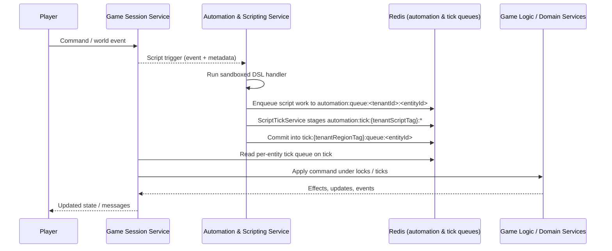

# FireMUD System Architecture: Scripting & Automation Framework

This document outlines how FireMUD executes custom in-game behavior through a sandboxed scripting framework. It complements the [Automation & Scripting Service](./microservices/automation-scripting-service/README.md) and expands on the extensibility goals in the [core requirements](../project-management/core-requirements.md).

## Implementation Status

This document describes the **target-state architecture** for scripting and automation. The implementation is evolving toward this design; this section captures a snapshot as of 2025-12-04.

Last reviewed: 2025-12-23

For the most accurate, fine-grained status, refer to the [Automation & Scripting Service Task List](../project-management/task-list-automation-scripting-service.md).

- **Implemented and in active use**
  - Sandboxed script runtime and core Automation & Scripting Service, including quota enforcement via `ScriptQuotaService` and Redis-backed `ScriptTickService` staging.
  - Hot reloading of scripts published by the Game Design Service and version-aware script execution, aligned with the versioning model in [Versioning & Runtime Configuration](./system-architecture-versioning-runtime.md#script-only-patch-versions).
  - Visual DSL editor for script creation and testing in the Game Design Service, mapping component graphs to Automation & Scripting Service definitions.
  - Advanced NPC behavior modules (morale, PvE encounters, formations) and state-driven / event-driven NPC behaviors integrated with the tick system.

- **Planned or partially implemented**
  - Copying published version data into the Automation & Scripting Service schema via Saga, and broader script-driven world generation flows (runtime generation requests via isolated ticks, generation seed persistence, and script-driven population triggers).
  - Expansion of the PvE encounter library, biome-specific events, and world generation features called out in the Automation & Scripting Service and world generation task lists.
- Scheduler leadership leases and per-region tick-stream consumption for `script-leader:{<tenantId>}` are implemented; sharded leases, `automation:timer:{tenantRegionTag}` indexing, and long-term audit-retention jobs continue to evolve. See [Scheduler Leadership & Coordination](#scheduler-leadership--coordination) for scripting-specific lease and timer keys, the Automation & Scripting Service README (`design/architecture/microservices/automation-scripting-service/README.md#architecture--design-notes`) for current runtime behavior, and the [Automation & Scripting Service Task List](../project-management/task-list-automation-scripting-service.md) for remaining work.

Operators looking for **runtime knobs and environment variables** should see the [Environment Variables](#environment-variables) section of this document and the Automation & Scripting Service README (`design/architecture/microservices/automation-scripting-service/README.md#environment-variables`), which is the authoritative source for current settings and defaults.

Maintainers should update this section whenever major scripting features land or significant architecture pieces change so it remains a reliable guide to what is live versus aspirational.

### Area Status Snapshot

The table below summarizes the high-level implementation status of major areas described in this document. For deeper or evolving details, always consult the Automation & Scripting Service task list and README.

| Area | Status (as of 2025-12-04) | Notes |
| --- | --- | --- |
| Script runtime & DSL | Implemented | Sandbox execution, core Automation & Scripting Service, and visual DSL editor are in active use, including basic quotas. |
| Automation queues & script ticks | Implemented | `automation:queue:<tenantId>:<entityId>` and `automation:tick:{tenantScriptTag}:...` staging are implemented; script work items flow into tick commands as described under [TL;DR Flow](#tldr-flow). |
| Integration with tick commands | Implemented | Script-generated tick commands are enqueued into the same per-entity tick queues used by Game Session, and participate in the normal lock/idempotency model. |
| Scheduler leadership & timers | Designed / partial | Per-tenant `script-leader:{<tenantId>}` leases and heartbeat-driven interval scheduling are implemented; sharded leases, `automation:timer:{tenantRegionTag}`–backed timer indexing, and long-term audit-retention jobs are tracked in the Automation & Scripting Service README and task list. |
| Quotas & fairness | Implemented / evolving | Per-script quotas (`ScriptQuotaService`) and basic fairness rules are implemented; multi-level budgets and advanced throttling controls continue to evolve. |
| Audit & metrics | Implemented / evolving | `script_event_audit` and core automation metrics exist; retention policies and additional dashboards are being refined. |

## Table of Contents

- [Implementation Status](#implementation-status)
- [Goals](#goals)
- [TL;DR Flow](#tldr-flow)
- [Supported Script Events](#supported-script-events)
- [Determinism & Allowed Non-Determinism](#determinism--allowed-non-determinism)
- [Integration with Game Logic & Tick System](#integration-with-game-logic--tick-system)
- [Sandboxing & Security](#sandboxing--security)
- [Redis Key Summary for Scripting](#redis-key-summary-for-scripting)
- [Script Timers vs Tick Timers](#script-timers-vs-tick-timers)
- [Scheduler Leadership & Coordination](#scheduler-leadership--coordination)
- [Fairness & Abuse Prevention](#fairness--abuse-prevention)
- [Resource Isolation and Multi-Level Budgets](#resource-isolation-and-multi-level-budgets)
- [Auditability & Metrics](#auditability--metrics)
- [Hot Reload & Resume Behavior](#hot-reload--resume-behavior)
- [Deployment & Versioning](#deployment--versioning)

---

### Who Should Read What

- **Game designers and content authors**
  - Focus on: [Goals](#goals), [TL;DR Flow](#tldr-flow), [Game Design vs Automation & Scripting Responsibilities](#game-design-vs-automation--scripting-responsibilities), [Scripting DSL](#scripting-dsl), [Supported Script Events](#supported-script-events), and the overview of advanced NPC modules.
  - Use these sections to understand what scripts can express, how events map to behaviors, and how publish / hot-reload works conceptually.

- **Implementers and backend developers**
  - Focus on: [Determinism & Allowed Non-Determinism](#determinism--allowed-non-determinism), [Integration with Game Logic & Tick System](#integration-with-game-logic--tick-system), [Script Timers vs Tick Timers](#script-timers-vs-tick-timers), [Scheduler Leadership & Coordination](#scheduler-leadership--coordination), and [Per-Script Scheduling Policies](#per-script-scheduling-policies).
  - These sections describe how scripts are executed, how timers and automation ticks relate to game ticks, and which Redis keys and services participate in scheduling.

- **Operators, SREs, and platform engineers**
  - Focus on: [Failure Modes and Error Handling](#failure-modes-and-error-handling), [Fairness & Abuse Prevention](#fairness--abuse-prevention), [Resource Isolation and Multi-Level Budgets](#resource-isolation-and-multi-level-budgets), [Auditability & Metrics](#auditability--metrics), and the high-level references to Redis and tick behavior.
  - Pair this document with [System Architecture: Logging & Monitoring](./system-architecture-logging-monitoring.md), [System Architecture: Redis](./system-architecture-redis.md), and the Automation & Scripting Service README for concrete metric, alerting, and runbook details.

## Terminology Glossary

- **Game tick** – a region-scoped tick in the Game Session Service. Each `<tenantId, regionId>` advances through a monotonic `tickId` stream; game ticks are authoritative for gameplay state changes and use `tick:{tenantRegionTag}:...` keys and locks as described in [Tick System and Runtime Design](./system-architecture-ticks.md).
- **Automation/script tick** – a batching cycle inside the Automation & Scripting Service. `ScriptTickService` drains **script work items** from Redis-backed queues such as `automation:queue:<tenantId>:<entityId>`, stages them under `automation:tick:{tenantScriptTag}:...`, and enqueues resulting **tick commands** into per-entity tick command queues for later execution by game ticks. Automation ticks control script-side quotas and batching, not authoritative game state.
- **Automation queue** – a per-tenant, per-entity Redis queue (`automation:queue:<tenantId>:<entityId>`) that holds **post-handler script work items** (domain commands plus script metadata such as `scriptEventId`, `scriptId`, and version information) after sandboxed DSL execution and before automation ticks convert them into tick commands and move them into tick-compatible queues.
- **Tick heartbeat** – a **gRPC streaming feed** produced by the Game Session Service that reports `tickId` progression per `<tenantId, regionId>`. The script scheduler consumes this heartbeat over a long-lived gRPC stream to count “every N ticks” intervals and align `onInterval` triggers with the canonical game tick timeline without owning tick execution itself. See [Tick Events & Heartbeat Stream](./system-architecture-ticks.md#tick-events--heartbeat-stream) for transport details.

### Versioning Terms

These definitions summarize how common versioning concepts are used in this document; the full model lives in [System Architecture: Versioning & Runtime Configuration](./system-architecture-versioning-runtime.md).

- **`scriptPatchVersion`** – a logical script-only patch identifier tracked per tenant/game (for example in the Game Session Service as `script_patch_version`). It pins which published script set is considered active at runtime so all triggers and timers execute against a consistent script configuration.
- **`versionId`** – an internal identifier for a concrete compiled script or component version. `versionId` values distinguish individual revisions within a `scriptPatchVersion` and are used by the Automation & Scripting Service to load the exact behavior that should run for a given trigger.
- **`runtimeStatus`** – the current runtime state of a script as seen by the scheduler (for example, `ENABLED`, `DISABLE_AFTER_DRAIN`, `DISABLED`, `DISABLED_DUE_TO_ERRORS`). `runtimeStatus` controls whether new triggers are accepted, drained, or skipped and is updated by hot reload flows and administrative actions described later in this document.

### Script Execution Lifecycle (Terminology)

The scripting pipeline uses a small set of terms repeatedly; the table below summarizes them and how they relate:

| Step | Term | Description | Stored as / example |
| --- | --- | --- | --- |
| 1 | **Trigger** | A concrete event such as `onEnterRegion`, `onCommand`, or a custom event emitted by a service. | gRPC `TriggerScriptEvent` call, tick heartbeat, or internal scheduler event. |
| 2 | **DSL run** | Execution of a script handler in the sandboxed DSL for a single trigger. Produces domain commands, not direct state changes. | In-memory execution in the Automation & Scripting Service; results summarized as script work items. |
| 3 | **Script work item** | A post-DSL, per-entity descriptor of what should happen (domain commands + `scriptEventId`, `scriptId`, version metadata). | Enqueued in `automation:queue:<tenantId>:<entityId>` and staged under `automation:tick:{tenantScriptTag}:...`. |
| 4 | **Tick command** | A concrete command that the Game Session Service executes during game ticks under its normal locking and idempotency rules. | Enqueued into `tick:{tenantRegionTag}:queue:<entityId>` for consumption by the tick loop. |

Later sections use these terms consistently: triggers lead to DSL runs, which produce script work items in the automation queues, which automation ticks turn into tick commands for the Game Session Service.

### `scriptEventId` lifecycle and deduplication

`scriptEventId` is the canonical identifier for a single script trigger/run; it appears on automation queue entries, tick commands, and `script_event_audit` rows so behavior can be correlated end-to-end.

- **Generation rules**
  - For **external events** (for example, `onEnterRegion`, `onSpawn`, `onCommand`, and custom service events), the **event source** that owns the trigger (typically the Game Session Service or another domain service) creates a `scriptEventId` when the event is first emitted and includes it in the `TriggerScriptEvent` payload. If the caller retries the gRPC call due to infrastructure errors, it must reuse the same `scriptEventId` so the Automation & Scripting Service can recognize the trigger as the same logical event.
  - For **scheduler-originated events** such as `onInterval` and `onTimerExpire`, the **Automation & Scripting Service scheduler** creates the `scriptEventId` when the timer or interval becomes due (see the `onInterval` example below).

- **Uniqueness scope**
- Within a given `<tenantId, regionId, scriptId, eventType>`, each logically distinct trigger is assigned a unique `scriptEventId`. There is no requirement for global uniqueness across all tenants; the combination of `<tenantId, regionId, scriptId, scriptEventId, tickId>` is what downstream services use as an idempotency key (see [Determinism & Allowed Non-Determinism](#determinism--allowed-non-determinism) and [Failure Modes and Error Handling](#failure-modes-and-error-handling)).

- **Handling retries and duplicates**
- The Automation & Scripting Service treats script execution as **at-most-once per `scriptEventId`**. If it receives a duplicate delivery for the same `<tenantId, regionId, scriptId, eventType, scriptEventId>`—for example, because the caller retried a `TriggerScriptEvent` gRPC call—it does **not** re-run the DSL graph for that trigger. Instead it consults existing `script_event_audit` state and treats the duplicate as a replay of an already completed or skipped trigger, optionally recording a no-op audit entry or metric.
  - Downstream services and replay tools rely on `(tenantId, regionId, tickId, scriptEventId)` (or a derived `effectId`) as their idempotency token when applying script-originated effects, so duplicate deliveries for the same tuple are safe replays that do not produce new side effects.
  - In the gRPC layer, these identifiers travel on a **TriggerScriptEvent-style** request and on script metadata fields attached to tick commands. The target-state API will carry them in fields such as `tenant_id`, `region_id`, `entity_id`, `script_event_id`, `script_id`, `script_patch_version`, and `tick_id` within the Automation & Scripting gRPC package; see the automation scripting section of the generated gRPC reference (`design/grpc-docs/grpc-api.md#automation-scripting_v1_automation_scripting_service-proto`) for the concrete schema as it evolves.

## Goals

- Enable **event-driven scripting** and **NPC automation** so worlds feel alive even without active players.
- Keep the system **extensible** while preventing malicious or abusive scripts.
- Support **persistence** and versioned updates so game creators can iterate safely.

## TL;DR Flow

At a high level, scripting follows this pipeline:

1. **Event fires** – Game Session or another service emits a standard or custom event for an entity.
2. **Bindings & quotas** – The Automation & Scripting Service looks up bound handlers for that `<tenantId, eventType>` and applies per-script and per-tenant limits via `ScriptQuotaService`.
3. **Sandboxed DSL execution** – Allowed handlers run in the sandboxed DSL runtime, reading world state via gRPC and producing domain commands rather than mutating state directly.
4. **Automation queue staging** – After sandbox execution, the resulting **script work items** (domain commands plus metadata) are enqueued into Redis-backed automation queues under keys such as `automation:queue:<tenantId>:<entityId>`, along with `scriptEventId`, `scriptId`, and version metadata. These queues are per-tenant and per-entity and represent the backlog of post-DSL script work items awaiting processing by automation ticks; region-scoped tick keys remain the responsibility of the Game Session Service.
5. **Script ticks & commit** – `ScriptTickService` drains automation work items from `automation:queue:<tenantId>:<entityId>` entries, batches automation events into tick-compatible queues with quotas and budgets under `automation:tick:{tenantScriptTag}:...`, and only then commits the resulting **domain commands** into the tick command queues using Redis Lua scripts for atomic staging and commit.
6. **Game tick execution** – The Game Session Service consumes at most one command per entity per tick from the combined player-and-automation queues and applies effects under the normal lock and replay rules.

## Game Design vs Automation & Scripting Responsibilities

Two services collaborate to deliver scripting and automation:

- **Game Design Service**
  - Owns the **authoring UX**: the visual DSL editor, component palettes, world-generation triggers, and per-tenant configuration screens.
  - Manages **draft and published configurations** for scripts, event bindings, and world-generation presets inside its own schema, including version history and “upgrade available” hints when components change.
  - Controls the **publish lifecycle** for scripts and component graphs: designers edit drafts, run validations, and then publish a new `scriptPatchVersion` tied to a `baseVersionId` as described in [Versioning & Runtime Configuration](./system-architecture-versioning-runtime.md#script-only-patch-versions).
  - Drives a **cross-service Saga** when a script version is published:
    - Writes the final, validated script graphs and bindings into its own tables.
    - Starts a Saga that upserts the compiled script definitions, event bindings, and any world-generation hooks into the Automation & Scripting Service schema for the target `<tenantId, scriptPatchVersion>`.
    - On success, marks the version as `PUBLISHED` and calls `NotifyScriptVersionUpdate` so the Automation & Scripting Service reloads runtime state.
    - On failure, rolls back or marks the publish as `FAILED`, keeping the prior `scriptPatchVersion` as the active one for that game.

- **Automation & Scripting Service**
  - Owns the **compiled graph schema and runtime registry**: it stores compiled DSL graphs, per-tenant script metadata, and runtime flags (`runtimeStatus`, quotas, priorities) in its own database.
  - Enforces **runtime behavior**: sandbox execution, loop safety, per-script and per-tenant quotas (`ScriptQuotaService`), tick integration, and leadership leases over automation ticks.
  - Maintains **auditability and observability** for script execution via the `script_event_audit` feed and automation metrics (for example, `automation_script_triggers_total`, `automation_script_skips_total`, `automation_script_triggers_dropped_total`, `script_quota_allowed_total`, `script_quota_denied_total`).
  - Implements **hot reload and failure handling** for script patches, including `activePatchVersion`, `pendingPatchVersion`, and `reloadState` as described in [Hot Reload & Resume Behavior](#hot-reload--resume-behavior).

This split lets the Game Design Service focus on ergonomics and version lifecycle, while the Automation & Scripting Service focuses on safe, deterministic execution, quotas, and operational guarantees.

## Example: `onEnterRegion` Script Execution

This section walks through a typical happy-path flow where an NPC script reacts when a player enters its room or region. It ties together the Game Session Service, the Automation & Scripting Service, the tick system, and the auditing/metrics layer.

1. **Player movement and event emission**
   - A player issues a movement command that causes them to enter a new room. The Game Session Service processes this action as part of a tick for the relevant `<tenantId, regionId>`.
   - After the move is committed and the player is now in the new region, the Game Session Service emits an `onEnterRegion` **script event** to the Automation & Scripting Service over gRPC. Conceptually this is a unary `TriggerScriptEvent` call on the Automation & Scripting Service that carries the `tenantId`, `regionId`, target `entityId` (for example, an NPC guarding the room), `eventType=onEnterRegion`, and the currently pinned `scriptPatchVersion` for that game as stored by the Game Session Service. For low-rate lifecycle events such as `onEnterRegion`, `onSpawn`, and `onCommand`, simple unary gRPC calls are sufficient; high-volume time-based scheduling comes from the tick heartbeat stream described later in this document.

2. **Script lookup and quota checks**
   - The Automation & Scripting Service looks up all scripts bound to `onEnterRegion` for the target entity and tenant, using the version metadata provided by the Game Session Service to resolve the correct script definitions.
   - For each candidate script, `ScriptQuotaService` applies per-script and per-tenant limits before any work is enqueued, following the quota and budgeting rules described in [Fairness & Abuse Prevention](#fairness--abuse-prevention) and [Per-Script Scheduling Policies](#per-script-scheduling-policies). Triggers that violate quotas or budgets are skipped and recorded in `script_event_audit` and metrics; other scripts bound to the same event may still proceed if their own quotas allow it.

3. **DSL graph evaluation in the sandbox**
   - Scripts that pass quota checks are compiled DSL graphs. The Automation & Scripting Service executes the `onEnterRegion` handler inside a sandboxed runtime, walking the graph of condition, timer, and action nodes for the current event payload.
   - Instead of mutating game state directly, action nodes produce a set of **domain commands** (for example, “NPC says a line,” “NPC targets the player,” “schedule a follow-up patrol timer”) that describe what should happen in the game world.

4. **Command enqueue into tick-compatible queues**
- After sandbox execution, the Automation & Scripting Service records **script event entries** into Redis-backed automation queues such as `automation:queue:<tenantId>:<entityId>`, tagging each entry with the originating `scriptEventId`, `scriptId`, version metadata, and the domain commands that should be materialized when the event is processed. At this stage, `automation:queue` is still an **event backlog**, not the final tick command queue.
- A dedicated Lua staging script (invoked by `ScriptTickService`) drains `automation:queue:*` work items, processes events under `automation:tick:{tenantScriptTag}:...`, and merges the resulting domain commands into the same per-entity tick command queues used by the Game Session Service. This preserves FIFO ordering and the invariant of at most one command per entity per tick as described in the [Tick System and Runtime Design](./system-architecture-ticks.md).
   - Each enqueued command carries the originating `scriptEventId`, `scriptId`, and version metadata so downstream logs, metrics, and audits can correlate behavior to the script that produced it.

5. **Tick execution and world updates**
   - On subsequent ticks for that `<tenantId, regionId>`, the Game Session Service’s `TickScheduler` pulls at most one command per entity from the combined player-and-automation queues and executes it under the usual lock and conflict-resolution rules.
   - The NPC’s script-produced command runs alongside player commands with the same fairness guarantees: if the tick budget is reached or locks are contended, the command is deferred or retried according to the logic in the tick architecture.

6. **Audit trail and metrics**
   - For each trigger, the Automation & Scripting Service emits an audit record into the `script_event_audit` store; in the target architecture this is a **PostgreSQL table** managed by the Automation & Scripting Service. The canonical schema is defined in the [Auditability & Metrics](#auditability--metrics) section, but in practice each row at minimum captures identifiers such as `scriptEventId`, `scriptId`, `tenantId`, `tickId`, the effective script version, and an `outcome` / `reason` pair. Retention is controlled by `SCRIPT_EVENT_AUDIT_RETENTION_DAYS` and `SCRIPT_EVENT_AUDIT_MAX_ROWS` as described in the Automation & Scripting Service README.
   - Metrics such as `automation_script_triggers_total`, `automation_script_skips_total`, `automation_script_triggers_dropped_total`, `script_quota_allowed_total`, `script_quota_denied_total`, and `automation_tick_events_enqueued_total` are updated throughout this flow so operators can monitor how often `onEnterRegion` scripts fire, how many are skipped by policy, and how much automation work is being handed to the tick system. These metrics integrate with the broader logging and monitoring strategy described in [System Architecture: Logging & Monitoring](./system-architecture-logging-monitoring.md).
   - If the `scriptPatchVersion` pinned by the Game Session Service for a given game is later marked failed or unknown for that tenant, subsequent triggers that reference it follow the behavior described under [Reload Failure Handling](#reload-failure-handling) rather than this happy-path flow.

## Example: Periodic Patrol via `onInterval`

This example shows how a script that runs on a fixed cadence (for example, an NPC patrol) moves through the same pipeline using `onInterval`.

1. **Script configuration and publish**
   - A designer configures an NPC patrol script in the Game Design Service, binding an `onInterval` handler with a chosen cadence (for example, every N ticks or seconds) and a sequence of waypoints.
   - When the script is published, its compiled DSL graph, `intervalTicks` (or equivalent cadence configuration), and version metadata are stored in the Automation & Scripting Service database and exposed under the current `scriptPatchVersion` for that game.

2. **Scheduling the next interval**
   - When the NPC spawns or when the script is first loaded, the Automation & Scripting Service’s scheduler registers an interval entry for the `<tenantId, scriptId, entityId>` tuple, computing a `nextTick` or `nextRunAt` timestamp based on the configured cadence and current tick/time.
   - Leaders track these interval entries alongside other automation timers, using bounded scans and the automation tick budget (`AUTOMATION_TICK_DURATION_MS`, `AUTOMATION_TICK_MAX_EVENTS`, `AUTOMATION_TICK_BUDGET_MS`) to decide which `onInterval` triggers should fire in each automation tick.

3. **Firing `onInterval` and enforcing budgets**
   - When an interval becomes due, the scheduler creates a `scriptEventId` for the `onInterval` trigger and evaluates it using the same quota, cadence, and budgeting layers described in [Fairness & Abuse Prevention](#fairness--abuse-prevention) and [Per-Script Scheduling Policies](#per-script-scheduling-policies). If the script is outside its budgets or disabled, the trigger is skipped and recorded in both metrics and the audit feed.
   - If allowed, the scheduler enqueues the `onInterval` trigger for sandbox execution and updates the interval entry with a new `nextTick` or `nextRunAt`, ensuring the cadence remains stable even if some intervals are occasionally delayed by load.

4. **Sandbox execution and command enqueue**
   - The `onInterval` handler runs inside the sandboxed DSL engine, evaluating conditions such as “is the NPC currently out of combat?” and “is the patrol still active?” before deciding on the next waypoint or behavior.
- Actions produced by the handler (for example, “move to the next patrol room,” “play an emote,” “schedule an `onTimerExpire` follow-up”) are converted into domain commands and recorded as script work items in `automation:queue:<tenantId>:<entityId>` for the affected entity. Each work item carries the originating `scriptEventId`, `scriptId`, version metadata, and the **current region** for the entity at enqueue time. `ScriptTickService` later drains `automation:queue`, stages these events under `automation:tick:{tenantScriptTag}:...`, and merges the resulting commands into the appropriate `tick:{tenantRegionTag}:queue:<entityId>` so they execute during future ticks.

5. **Execution, audit, and observability**
   - On subsequent ticks, the Game Session Service executes at most one command per entity per tick, so patrol movements and emotes follow the same fairness and conflict-resolution rules as player actions.
   - Each fired interval contributes to `automation_script_triggers_total` (tagged with `eventType=onInterval`) and, if it produces work, increases `automation_tick_events_enqueued_total`. An audit record is written to `script_event_audit` (see [Auditability & Metrics](#auditability--metrics)) so missed or delayed intervals can be debugged using the recorded `outcome` and `reason` fields alongside identifiers like `scriptEventId`, `scriptId`, and `tickId`.
   - If the `scriptPatchVersion` pinned by the Game Session Service for a given game is later marked failed or unknown for that tenant, triggers that reference it follow the behavior described under [Reload Failure Handling](#reload-failure-handling) instead of the happy-path flow outlined here.

## Scripting DSL

- **For game designers**
  - Build behaviors by wiring together predefined components (conditions, actions, timers, counters) in the visual editor; you never write raw Lua or general-purpose code.
  - Loops must always be bounded: use timers and counters to express “repeat every N ticks” or “do this up to N times,” rather than wiring a pure cycle with no guard.
  - If a graph would create an unsafe loop or an incompatible connection, the editor surfaces a clear validation error pointing at the offending nodes; fix the wiring (typically by adding a timer/counter or breaking the cycle) and re-run validation before publishing.
  - You do not need to understand the internal graph or analysis algorithms; they exist so the platform can guarantee scripts cannot busy-loop or hang the game.

- Scripts are authored as structured graphs of these components in the visual editor; the editor exports structured data that the Automation & Scripting Service compiles into execution units. Each component maps to a safe, well-defined operation, and the lack of raw code prevents arbitrary behavior while limiting scripts to the capabilities exposed by the platform.

### Control Flow and Predicates

- The DSL uses a **directed graph model**: nodes represent conditions, actions, and timers, and edges represent control-flow transitions (`onTrue`, `onFalse`, `onTimeout`, etc.). Execution walks this graph; there is no general-purpose stack or call frame.
- **Branching** is expressed via condition nodes that evaluate predicates and route to different successors; for example, a `HealthCheck` node exposes `onBelowThreshold` and `onAboveThreshold` outputs, and a `ReputationCheck` node exposes `onFriendly`, `onNeutral`, and `onHostile` outputs. Designers combine these via explicit condition nodes instead of inlining arbitrary expressions.
- **Loops** are supported only as **bounded, explicit cycles** in the graph (for example, timer nodes that reschedule the current subgraph or counter nodes that decrement and branch while a limit remains). The engine rejects graphs that contain unbounded cycles without a timer or counter guard to keep scripts from busy-waiting.
- **Complex predicates** such as “if reputation < X and HP < Y” are modeled as small subgraphs that compose simpler condition nodes. A typical pattern is `HealthCheck` → `ReputationCheck` → `AllOf`/`AnyOf` aggregator nodes, which then forward to action nodes. The visual editor enforces these patterns so predicates stay declarative and analyzable.
- Each node type defines **strongly typed inputs** (attributes, thresholds, flags) and a fixed set of outputs. The visual editor validates connections at design time, and the Automation & Scripting Service revalidates when compiling scripts so ill-typed or incompatible graphs never reach runtime.

### Loop Safety Analysis

The details in this subsection are primarily **engine internals** for implementers; designers generally only need to respond to the validation errors surfaced by the Game Design Service when a graph is unsafe.

Before a script is accepted, the Automation & Scripting Service runs a **loop safety analysis** over the component graph to ensure there are no unbounded cycles within a single script invocation:

- The compiler builds a **reduced graph** for analysis that includes only **same-run edges**. Asynchronous edges (for example, timer callbacks that fire in a future tick) are treated as new invocations and are excluded from this graph so they do not count as busy loops.
- It then computes **strongly connected components (SCCs)** on the reduced graph. Any SCC with more than one node, or a self-loop, is treated as a candidate loop.
- A loop is considered **safe** only if the SCC contains at least one **bounded guard node**, such as a `Counter` node with a finite `maxIterations`. Loops without such a guard are rejected at validation time with a descriptive error that points to the participating nodes and is surfaced in the Game Design Service UI so designers see exactly which connections must change before the script can be published.
- In addition to static checks, the runtime enforces a **per-run iteration budget**. If a bug or future change allows an unsafe loop to slip through static analysis, the engine aborts the run with a `sandbox_error` (for example, `reason=iteration_budget_exceeded`) before it can spin indefinitely. See `design/architecture/microservices/automation-scripting-service/sandbox-runtime-design.md` for details on runtime safeguards.

### Designer Debugging & Validation

From a game designer’s perspective, debugging a script centers on **what the editor shows** and **how the platform reports problems**, rather than on implementation details:

- **Graph validation and unsafe loops**
  - The Game Design Service highlights invalid wiring (for example, missing connections, incompatible types, or unbounded cycles) directly in the visual editor. Errors point to the specific nodes and edges that must change before publish, including loops rejected by the loop safety analysis described above.
  - Scripts with unsafe or deprecated components (for example, components marked `UNSAFE`) appear in a dedicated “requires migration” view. They must be migrated and republished before they are eligible to run again; see the forced deprecation flow in this section for details.

- **Runtime outcomes and auto-disable**
  - When a script misbehaves at runtime—exceeding quotas, hitting sandbox errors, or being disabled by the failure-rate circuit breaker—the Automation & Scripting Service records a canonical `outcome` and `reason` in `script_event_audit`. Common examples include `quota_denied`, `sandbox_error`, `disabled_due_to_errors`, and `skipped_disabled`; see [Failure Modes and Error Handling](#failure-modes-and-error-handling).
  - Administrative disables and throttling (for example, `runtimeStatus=DISABLED` or `DISABLE_AFTER_DRAIN`) are reflected in script metadata and surfaced through the Game Design and Logging & Admin tools. Designers can see which scripts are paused, why they were disabled (for example, `admin_hard_disable`), and when they can be safely re-enabled; see [Fairness & Abuse Prevention](#fairness--abuse-prevention).

- **Where to look when debugging**
  - For **editor-time issues**, fix the graph based on the validation errors in the Game Design Service UI and re-run validation before publishing.
  - For **runtime issues**, start from the script’s recent entries in `script_event_audit` and the associated metrics in [Auditability & Metrics](#auditability--metrics), then adjust quotas or disable/throttle the script using the flows described under [Fairness & Abuse Prevention](#fairness--abuse-prevention).

### Determinism & Allowed Non-Determinism

Scripts are designed to behave **deterministically for a given game configuration and event**, so that both the original execution and any offline replay in tools or tests produce the same observable behavior. The Automation & Scripting Service enforces this by constraining how randomness and time are exposed to DSL components:

- All **pseudo-random behavior** (for example, “pick a random waypoint”, “roll for loot”, or encounter selection) flows through curated components that read from a **seeded RNG** supplied by the runtime. The seed is derived from stable identifiers such as `<tenantId, regionId, scriptId, scriptEventId, tickId, scriptPatchVersion>` so that re-evaluating the same trigger with the same inputs produces the **same sequence of random values**. Components must not call process-wide RNG APIs directly; they receive a scoped RNG instance from the sandbox.
  Seeds are derived from this tuple primarily so offline replay tools and test harnesses can reproduce behavior for a given event stream; production tick replays never re-enter the DSL for the same `scriptEventId`.
- **Wall-clock time is not exposed** to scripts. DSL components see only **derived game time** sourced from the tick and session model (for example, `tickId`, region-local “world time” counters, or effect durations computed by Game Logic). This ensures that replaying the same tick timeline yields the same time values from the script’s perspective, independent of real-world clock drift.
- Any component that introduces variability must either:
  - be implemented in terms of the seeded RNG and tick-based time described above, or
  - be explicitly documented as **non-replayable** and confined to side channels such as logging and metrics where non-determinism does not affect gameplay state or authoritative decisions.

Under these rules, the combination of `<tenantId, regionId, scriptId, scriptEventId, tickId, scriptPatchVersion>` fully determines the observable behavior of a script run that contributes commands to the tick system. This aligns script behavior with the determinism guarantees of the underlying tick and transaction architecture.

Crucially, **script handlers are not re-executed during tick replay or recovery**. The Automation & Scripting Service evaluates each trigger at most once, produces a set of commands annotated with `scriptEventId`, and hands those commands to the tick system. Tick-level crash recovery and retries reapply those commands idempotently in the Game Session and domain services without re-entering the DSL graph for the same trigger. Determinism for scripting therefore depends on this **“no re-execution per trigger”** guarantee plus the seeded RNG and time constraints above, rather than on keeping RNG seeds stable across multiple script runs for a single `scriptEventId` (which the platform deliberately avoids).

These guarantees assume that the Game Session and domain services themselves follow the idempotency and transaction rules described in [Tick System and Runtime Design](./system-architecture-ticks.md) and [Transaction Strategies](./system-architecture-transactions.md); non-deterministic or side-effect–sensitive behavior in those services will break end-to-end replayability even if the scripting engine behaves deterministically.

### Component Versioning and Backwards Compatibility

- Each DSL component (node type) is versioned independently, for example `HealthCheck@v1`, `HealthCheck@v2`. Published scripts reference both the component key and its version so the Automation & Scripting Service can load the correct behavior for a given `scriptPatchVersion`.
- When a component evolves in a **backwards-compatible** way (adding an optional field or new output), a new minor version is registered and existing scripts remain pinned to their original version. The visual editor may offer an automatic migration that rewrites graphs to the new version, but runtime does not change behavior until a script revision is published.
- **Breaking changes** result in a new major component version (for example, `ReputationCheck@v2` with different output states). Existing scripts keep using the prior version and are flagged in the Game Design Service UI as “upgrade available” so designers can migrate them explicitly before publishing.
- Old component versions remain loadable as long as any published script still references them. Decommissioning a version requires migrating or retiring the dependent scripts; migration tooling in the Game Design Service generates updated graphs and revalidates them against the new component schema.
- The DSL and visual mapping are described in more depth in the Game Design Service documents; see [Web-Based Visual Design Interface](./microservices/game-design-service/web-visual-interface.md) and [World Editing & Customization Tools](./microservices/game-design-service/world-editing-tools.md) for how script graphs are created, versioned, and published.

In rare cases a component version may be marked **unsafe** (for example, due to a security issue or correctness bug that cannot be fixed in place). The platform supports a **forced deprecation** flow:

- The component version is marked `UNSAFE` in shared metadata and hidden from the visual editor so new scripts cannot reference it.
- The Automation & Scripting Service refuses to load or execute scripts that still depend on the unsafe version, treating them as disabled and recording audit entries with an outcome such as `disabled_unsafe_component`.
- The Game Design Service surfaces these scripts in a dedicated “requires migration” view so designers can migrate them to a safe component version. Only after migration and republish will the scripts become eligible for execution again.

## Supported Script Events

Scripts may register handlers for a set of standard lifecycle events. The Automation & Scripting Service emits these events and queues them as commands so they run during the normal tick flow.

- `onLoad` – when the script is first loaded or hot reloaded
- `onSpawn` – when the associated entity enters the world
- `onDeath` – when the entity dies
- `onDestroy` – when the entity is permanently removed
- `onEnterRegion` – when the entity moves into a new region
- `onLeaveRegion` – when the entity leaves a region
- `onTimerExpire` – when a scheduled timer finishes
- `onCommand` – when a player targets the entity with a command
- `onInterval` – periodic execution at a configured rate

### `onLoad` Semantics

`onLoad` is a **script-level lifecycle event**, not an entity-level event. It is designed for initializing script-global state (for example, loading lookups, seeding script-local caches, writing initial audit markers) rather than per-entity setup, which belongs in `onSpawn` or other entity-scoped events.

- **When it fires**
  - The scheduler emits an `onLoad` trigger exactly once per `<tenantId, scriptId, versionId>` after a script becomes active for that tenant. In practice this means:
    - When a script first becomes part of the tenant’s active script set under a given `scriptPatchVersion`, and
    - After a successful hot reload that changes `activePatchVersion` for that tenant, `onLoad` fires once for each script in the newly active patch.
  - If a reload fails and `activePatchVersion` remains unchanged (see [Hot Reload & Resume Behavior](#hot-reload--resume-behavior)), no additional `onLoad` events are generated.

- **Per-script vs per-entity**
  - `onLoad` runs **without an entity context**; it executes once per script definition and active version for a tenant, not once per NPC or player.
  - Scripts that need per-entity initialization (for example, setting up patrol state when an NPC enters the world) should use `onSpawn`, `onEnterRegion`, or other entity-scoped events instead of relying on `onLoad`.

- **Interaction with reloads and recovery**
  - The Automation & Scripting Service treats `onLoad` as **at-most-once per `<tenantId, scriptId, versionId>`**, even across process restarts and leader changes. Load-completion state is tracked in persistent metadata so that simply restarting a scheduler instance does not re-fire `onLoad` for a script whose current version is already active.
  - `onLoad` triggers are enqueued only after leaders have switched `activePatchVersion` and `reloadState` has returned to `IDLE`. Scripts never run `onLoad` against a `pendingPatchVersion` that is still being validated or has failed reload.
  - Like other events, each `onLoad` trigger is recorded in `script_event_audit` with `eventType=onLoad`, the effective `versionId` or `scriptPatchVersion`, and a canonical `outcome` / `reason` pair so operators can verify that initialization ran for a given script and version.

### Custom and Service-Specific Events

Beyond the standard lifecycle events, FireMUD supports **extensible event types** so games and services can introduce new triggers without changing the core scheduler:

- Each event is identified by a stable **event type key** (for example, `inventory.item_added`, `social.guild_rank_changed`) and an associated **versioned schema** defined in shared DTOs owned by the platform. Schemas live in a shared protobuf/DTO package referenced by participating services and follow the same compatibility rules as other platform contracts.
- The Game Design Service controls which event types are **enabled per game/tenant**. A game may opt into additional event types while another game ignores them, but the meaning of a given `{eventTypeKey, version}` pair is global and deterministic.
- The visual DSL exposes **event source nodes** for any event types enabled for the current game. Designers bind scripts to these nodes in the same way they do for `onSpawn` or `onCommand`; under the hood, bindings are stored as `<tenantId, eventTypeKey, eventSchemaVersion, scriptId>`.
- When an upstream service emits a custom event, it must include:
  - the event type key and schema version, and
  - a **canonical ordering token** that the scheduler can use for deterministic replay. For tick-originated events this is the region’s `tickId`. For other events it is a globally monotonic `{shardKey, sequenceId}` pair defined in the shared DTO/proto schema for that event type.
  The Automation & Scripting Service uses this metadata to:
  - deterministically route the event to matching script handlers, and
  - enqueue resulting commands into the same per-entity queues used for standard events, preserving tick-based ordering and replay guarantees. See [Determinism & Allowed Non-Determinism](#determinism--allowed-non-determinism) for how `<tenantId, regionId, scriptId, scriptEventId, tickId, scriptPatchVersion>` and event ordering tokens combine to make script behavior replayable, and refer to the shared event DTO/proto definitions for the exact `sequenceId` / `shardKey` fields required per event family.

New event types and their schemas are introduced via the normal design and review process for shared contracts: changes land in the shared DTO/proto package, are reviewed by platform maintainers, and are then surfaced in the Game Design Service as new event type options. Individual games cannot unilaterally mint conflicting event type keys or schemas; additions go through this centralized “event catalog” so producers, consumers, and scripting bindings stay aligned.

New event types therefore extend **what** can trigger scripts without changing **how** triggers are scheduled or executed, keeping determinism and fairness aligned with the existing tick and automation model.

### Event Fan-Out and Ordering

- Each entity may have **multiple scripts bound to the same event** (for example, two `onSpawn` handlers that set patrol routes and apply buffs). At design time the Game Design Service stores these bindings as an ordered list per `{entityId, eventType}`.
- When an event fires, the Automation & Scripting Service evaluates the bound handlers in a **deterministic order** sorted by `(orderIndex ASC, scriptId ASC)`. This ordering is stable across deployments so the same sequence of commands is enqueued given the same set of scripts. `orderIndex` is maintained per `<tenantId, entityId, eventType>`; two scripts with the same `orderIndex` for the same event are ordered by their `scriptId`.
- **Failures are isolated per script**. If one handler fails (for example, quota denial, sandbox exception, or compilation error), the scheduler records the failure, increments the appropriate metrics, and continues to the next handler by default. Designers may opt into **exclusive handling** on a per-binding basis in the Game Design Service UI by setting `requiresExclusiveEvent=true` for that script and event. In the exclusive case, a failure (or an explicit terminal outcome) short-circuits remaining handlers and the event fan-out ends early. The default for new bindings is `requiresExclusiveEvent=false` so one script’s failure does not block others unless explicitly configured.
- Quota checks (`ScriptQuotaService`) are performed **per script** before a handler runs. If a script exceeds its quota, its handler for that event is skipped and recorded with an outcome such as `quota_denied`, but other scripts bound to the same entity and event may still execute if their own quotas allow it.
- Script handlers enqueue commands **independently** into the entity’s command queue. The underlying tick system applies its normal fairness rules—only one command per entity per tick is executed—so even when many scripts respond to the same event, player-visible behavior remains bounded and replayable.

## Advanced NPC Behavior Modules

Several higher-level behavior modules build on the scripting framework and integrate with other microservices:

- `NpcMoraleService` adjusts aggression based on health and morale so NPCs may flee or surrender. It relies on Social & Groups–provided faction and reputation data; see `design/architecture/microservices/social-groups-service/README.md` for the `faction` and `faction_standing` model.
- `PveEncounterService` generates random encounters and environmental hazards, coordinating with world and game-logic services to spawn entities and apply effects. See the Automation & Scripting Service README (`design/architecture/microservices/automation-scripting-service/README.md`) and Game Logic Service design (`design/architecture/microservices/game-logic-service/README.md`) for encounter definitions and combat rules.
- `NpcFormationService` coordinates squad positioning for groups of NPCs, using shared world topology and movement rules from the World and Game Logic services.

Detailed behavior, data models, and service-specific responsibilities for these modules are defined in the Automation & Scripting Service README and the relevant microservice design docs; this section only highlights that they are implemented on top of the scripting and tick pipeline described here.
`NpcMoraleService` and basic encounter/formation behavior are implemented today; the **breadth of the PvE encounter library and biome-specific events is still expanding** and tracked in the Automation & Scripting Service task list (`design/project-management/task-list-automation-scripting-service.md`).

## Sandboxing & Security

- Script execution occurs in a **sandbox** with restricted APIs and resource limits. High-level behavior is described here; see [Script Sandbox & Resource Limits](./microservices/automation-scripting-service/sandbox-runtime-design.md) for a detailed model.
- Components interact with the **Game Logic Service** and other backends only through validated gRPC calls; scripts never call arbitrary services directly.
- The sandbox **prohibits direct access** to networking primitives, filesystems, blocking system calls, and process-wide time sources. Scripts see only curated DTOs, a seeded RNG, and tick-derived time as described in [Determinism & Allowed Non-Determinism](#determinism--allowed-non-determinism).
- CPU and memory limits are enforced via the sandbox runtime and Kubernetes resource limits, as detailed in the sandbox runtime design. Quotas and rate limits for script triggers are described centrally in [Fairness & Abuse Prevention](#fairness--abuse-prevention) and in the Automation & Scripting Service README.

### Failure Modes and Error Handling

Each script run produces a **structured `outcome` value** recorded in the `script_event_audit` table and exposed via metrics (see **Auditability & Metrics**) so operators can correlate behavior with specific `scriptId`, `tenantId`, and `tickId`. The canonical outcome enum is:

| Outcome | Meaning |
| --- | --- |
| `success` | Handler ran successfully and any resulting commands were enqueued. |
| `quota_denied` | Trigger was rejected by `ScriptQuotaService` before the handler executed. |
| `sandbox_error` | Handler failed inside the sandboxed DSL runtime (including runtime validation or rejected operations). |
| `validation_error` | Static validation on inputs or script configuration failed before sandbox execution. |
| `disabled_due_to_errors` | Failure-rate circuit breaker disabled the script due to repeated errors. |
| `skipped_disabled` | Trigger was skipped because the script was administratively disabled (for example, `runtimeStatus=DISABLED` / `DISABLE_AFTER_DRAIN`). |
| `skipped_reloading` | Trigger was skipped because scheduling for the tenant was paused during script reload (`reloadState=RELOADING`). |
| `dropped_quota` | Trigger was dropped because concurrency/queue limits were exceeded after quota checks (for example, oldest pending trigger evicted). |
| `tenant_budget_exceeded` | Trigger was skipped because the tenant's automation budget for the relevant tier was exhausted. |
| `version_unavailable` / `skipped_version_unavailable` | Trigger referenced a `scriptPatchVersion` that is unknown or marked as failed for the tenant. |
| `infrastructure_error` | Handler could not execute due to infrastructure issues (for example, gRPC `UNAVAILABLE`, transient Redis errors). |
| `disabled_unsafe_component` | Script was refused because it depends on a DSL component version marked `UNSAFE`. |

- By default, **failures are surfaced through logs and metrics**, not detailed player-visible stack traces. Players typically experience a missing or degraded behavior (for example, an NPC does not respond) unless the script deliberately enqueues a fallback command that emits a message through the Game Logic Service.
- Script executions are treated as **at-most-once per trigger by the Automation & Scripting Service**. If a handler fails due to a sandbox or validation error, the scheduler records the failure and moves on; it does not automatically re-run the script body for the same trigger to avoid hot loops and duplicate side effects. Infrastructure-level issues (for example, transient gRPC or Redis errors) may be retried by lower layers (for example, gRPC clients, Redis clients) according to the platform’s standard retry policies, but those retries operate on **idempotent downstream operations only** and do not cause the script logic to execute a second time for the same trigger. Tick-level idempotent replay and recovery remain the responsibility of the Game Session Service as described in the tick and Redis architecture docs. When script components call other services over gRPC, they must pass a stable idempotency key (for example, a composite of `<tenantId, regionId, scriptId, scriptEventId, tickId>` or a dedicated `effectId`) and rely on the [Transaction Strategies](./system-architecture-transactions.md) contracts so those downstream operations can be safely retried without duplicating effects.
- To guard against **repeated hot-loop failures**, the scheduler combines per-script quotas, concurrency limits, and a **failure-rate circuit breaker**. Scripts that exceed a configurable failure threshold within a time window are temporarily placed into a `disabled_due_to_errors` state: new triggers are skipped, failures are counted, and an audit entry is written so administrators can review and re-enable the script via the Game Design or Logging & Admin tools.
- Quota enforcement (`ScriptQuotaService`) runs **before** script execution; a script that misbehaves by emitting too many triggers is constrained by its quota window and `concurrencyPolicy`. Even if the logic always throws, it cannot exceed its configured execution rate, and the combination of quotas plus the circuit breaker prevents runaway resource usage.

The table below summarizes **which outcomes are retried** and which are treated as final for a given trigger:

| Outcome / error class | Typical source | Scheduler retry behavior |
| --- | --- | --- |
| `success` | Script ran and enqueued commands | No retry (completed) |
| `quota_denied` | `ScriptQuotaService` limit exceeded before execution | No retry for this trigger; future triggers may succeed when quota window resets |
| `sandbox_error` | Exception in sandboxed DSL runtime, validation failure, rejected operation | No retry; recorded as a failure, may contribute to circuit breaker and `disabled_due_to_errors` |
| `validation_error` | Static validation on inputs or script config fails | No retry; treat as a permanent failure until configuration changes |
| `disabled_due_to_errors` | Circuit breaker opened for the script | No retry while disabled; new triggers are skipped until operators re-enable the script |
| `version_unavailable` / `skipped_version_unavailable` | Trigger references a scriptPatchVersion that failed reload or is unknown | No retry; audit and metrics record the drop so design/ops can fix the version mapping |
| `infrastructure_error` (e.g., gRPC `UNAVAILABLE`, `DEADLINE_EXCEEDED`, transient Redis timeout) | Network hiccups, temporary downstream unavailability | **May be retried** according to platform retry policy (bounded attempts, backoff, and idempotent downstream handlers) |
| `INVALID_ARGUMENT` / `PERMISSION_DENIED` / other client or policy errors | Callers sent bad data or lack permission | No retry; callers must correct inputs or permissions |

### Outcome-to-Metric Mapping

This section is **illustrative**, not normative. The **authoritative definitions** for metric names, labels, and alerting behavior live in:

- [System Architecture: Logging & Monitoring](./system-architecture-logging-monitoring.md), and
- the Automation & Scripting Service README (`design/architecture/microservices/automation-scripting-service/README.md`).

Implementations should align emitted metrics with those documents; the intent here is only to show how common outcomes map conceptually to “counted”, “skipped”, or “dropped” signals so readers understand the observability story.

## Integration with Game Logic & Tick System

- **Scripts do not execute inside the tick system.** The Automation & Scripting Service evaluates scripts independently—on a schedule, via timers, or in response to events—and enqueues the resulting commands into each entity's command queue.
- These queued commands run during the **next tick cycle** via the normal Game Session and Game Logic flow, ensuring deterministic, replayable behavior that follows the tick system's fairness and retry rules.
- Script evaluation never blocks or interferes with tick execution. Scripts can still react to world events, NPC states, or timers provided by the tick system.
- Script-generated commands—like any gameplay command—may fail due to lock contention or target remote regions. These cases are automatically handled by the Game Session Service via standard tick rescheduling and cross-region routing logic.
- The Automation & Scripting Service only determines which commands to inject. It may query world state via gRPC but never mutates entity or world data directly—every action passes through the Game Session Service so tick regions remain consistent.
- **ScriptTickService** stages events in Redis before committing them to the tick queues. It uses a **per-script automation tick namespace**:
  - `automation:tick:{tenantScriptTag}:lock`
  - `automation:tick:{tenantScriptTag}:queue`
  - `automation:tick:{tenantScriptTag}:pending`

  Keys within this namespace share a hash tag on `{tenantScriptTag}` (derived from `<tenantId>` + `<scriptId>`) so multi-key Lua operations remain shard-local in Redis Cluster. These automation tick locks are **separate from the game tick locks** (`tick:{tenantRegionTag}:lock:<entityId>`) managed by the Game Session Service. Script ticks never bypass entity-level locking or tick isolation; they only batch and stage automation events before handing them to the normal tick pipeline. See [Tick System and Runtime Design](./system-architecture-ticks.md) for how staged commands are processed once they enter the per-entity command queues.

  **ScriptTickService lock isolation:** `ScriptTickService` uses only the `automation:tick:{tenantScriptTag}:*` keys for locking and staging. It never reads from or writes to `tick:{tenantRegionTag}:lock:<entityId>` or other `tick:{tenantRegionTag}:...` locks; those remain exclusively owned by the Game Session Service’s tick executors.

### Redis Key Summary for Scripting

The main Redis keys used by the Automation & Scripting Service are:

| Key pattern | Owner / service | Purpose | Hash tag / shard scope | TTL / retention expectations |
| --- | --- | --- | --- | --- |
| `automation:queue:<tenantId>:<entityId>` | Automation & Scripting | Per-tenant, per-entity queue of post-DSL script work items awaiting automation ticks. | Single-key queue per entity; automation ticks drain these and enqueue commands into tick queues. | Ephemeral backlog; drained continuously by automation ticks. Any TTL is a short safety valve, not long-term storage. |
| `automation:tick:{tenantScriptTag}:lock` | Automation & Scripting (`ScriptTickService`) | Per-script automation tick lock to serialize staging for a script’s work batch. | Hash-tagged on `{tenantScriptTag}` so multi-key operations remain shard-local. | Short-lived lock; lifetime bounded by a single automation tick batch and its retry window. |
| `automation:tick:{tenantScriptTag}:queue` | Automation & Scripting (`ScriptTickService`) | Staging queue for batched script events before they are written into per-entity tick queues. | Hash-tagged on `{tenantScriptTag}`. | Batch-scoped staging; entries exist only while a batch is being processed and are cleared on commit/rollback. |
| `automation:tick:{tenantScriptTag}:pending` | Automation & Scripting (`ScriptTickService`) | Pending entry for an in-flight automation tick batch; replayable if a crash occurs mid-staging. | Hash-tagged on `{tenantScriptTag}`. | Crash-replay state; retained only for the duration of an in-flight batch and removed once replay/commit completes. |
| `automation:timer:{tenantRegionTag}` | Automation & Scripting scheduler | Region-scoped index of script timers/intervals (`onTimerExpire`, `onInterval`, `intervalTicks`). | Hash-tagged on `{tenantRegionTag}` to align with tick-region keys. | Persistent while timers are active; entries are added/updated per timer and removed when the timer is cancelled or fully drained. |
| `automation:script:{tenantScriptTag}:timer` | Automation & Scripting scheduler | Optional script-centric projection of timers for debugging/maintenance; derived from the region index. | Projection only; not used for authoritative timing decisions. | Projection of the region index; retained only while corresponding region-index timers exist. |
| `script-leader:{<tenantId>}` / `script-leader:{<tenantId>:<shardId>}` | Automation & Scripting scheduler | Leadership lease key(s) for script schedulers per tenant and optional shard. | Hash-tagged on `{<tenantId>}` or `{<tenantId>:<shardId>}`, ensuring one leader per lease key. | Short TTL (seconds); continuously renewed by the active leader. Expiry triggers leadership failover, no historical retention. |
| `script-scheduler:{tenantRegionTag}:lastTickId` | Automation & Scripting scheduler | Stores the last processed `tickId` per region so new leaders can resume `onInterval` counting correctly. | Hash-tagged on `{tenantRegionTag}` to match the region’s tick keys. | Coordination state; retained across leader restarts and cleared only when regions/tenants are removed or reset by ops tooling. |

### Ordering Between Player and Script Commands

- Each entity has a **single authoritative command queue** in Redis (for example, `tick:{tenantRegionTag}:queue:<entityId>`) that aggregates both player-originated commands and script-generated commands.
- Player commands and automation commands are appended to this queue in the order they are accepted by the Game Session Service and the Automation & Scripting Service. Within a given entity’s queue, commands are therefore processed in **FIFO order**, regardless of whether they came from a player or a script.
- During tick processing, the Game Session Service:
  - Reads at most one command per entity per tick from this combined queue.
  - Applies its existing fairness and conflict-resolution rules (as described in the tick architecture) when deciding which entities to service on a given tick.
- Script-generated commands carry `scriptEventId`, `scriptId`, and (when applicable) upstream ordering tokens such as `tickId` from custom events. Combined with the per-entity FIFO queue and the monotonic `tickId` stream, this ensures that:
  - The order in which commands affect an entity is deterministic for a given event stream and configuration.
  - Automation ticks cannot “jump ahead of” or reorder already-queued player commands for the same entity; they simply contribute additional commands into the same ordered queue that ticks consume.

### Idempotency and Replay

- Script executions are treated as **at-most-once per trigger** at the scheduler level, but the resulting commands participate in the same **idempotent replay model** as other tick actions. Ticks may retry commands after lock contention or crash recovery as described in [Tick System and Runtime Design](./system-architecture-ticks.md) and [Redis Architecture](./system-architecture-redis.md).
- To support this, script-generated commands must be **idempotent with respect to `tickId` and `scriptEventId`**:
  - These identifiers travel with the command payload and are recorded alongside `scriptId` and `tenantId` in `script_event_audit` records and logs so operators can correlate replays and ensure side effects remain consistent even when ticks are retried.
  - When commands cause database writes or cross-service calls, domain services should treat `<tenantId, regionId, tickId, scriptEventId>` as an idempotency token, either directly or via a stable `effectId` derived from it, following the patterns in [Transaction Strategies](./system-architecture-transactions.md) and the tick idempotency rules described in [Tick System and Runtime Design](./system-architecture-ticks.md#domain-idempotency-rules-tickid-in-postgresql).
  - Conceptually, `scriptEventId` plays the same role for script-originated work that `effectKey` plays in tick-driven effects:
    - For purely tick-driven logic, idempotency guards are keyed by `(tenantId, regionId, tickId, effectKey)`.
    - For script-originated logic, guards may instead use `(tenantId, regionId, tickId, scriptEventId)` or `(tenantId, regionId, tickId, effectKey)` where `effectKey` is derived from `scriptEventId` plus additional context (for example, target entity or aggregate).
  - As described in [Transaction Strategies](./system-architecture-transactions.md), any downstream service that processes script-driven commands must:
    - Persist these idempotency keys (or their derived `effectId`) in its own database.
    - Treat duplicate deliveries for the same `(tenantId, regionId, tickId, scriptEventId/effectId)` as safe replays that do not apply new logical effects.

### Script Timers vs Tick Timers

- Core gameplay timers (cooldowns, regeneration, generic delayed effects) live in the **Game Session Service** under `timer:{tenantRegionTag}` and are processed as part of each region’s tick loop (see [Timers and Time Scaling](./system-architecture-ticks.md#timers-and-time-scaling)). These timers are governed by `game.tick-max-timers` and share pacing with other tick work.
- Scripted timers power `onTimerExpire`, `onInterval`, and `intervalTicks` scheduling and are tracked in a **two-level Automation & Scripting timer index**:
  - A **region index** under `automation:timer:{tenantRegionTag}` that stores one entry per active `<tenantId, regionId, scriptId, entityId>` interval or timer, including cadence (`intervalTicks` or equivalent) and the next due point (`nextTick` or `nextRunAt`). This region-scoped set is the **authoritative source of truth** for which timers exist and when they are due.
  - An optional **per-script index** under `automation:script:{tenantScriptTag}:timer` that provides a script-centric view of the same timers (for example, for debugging or script-level maintenance). When present, this index is derived from and kept consistent with the region index; it does not introduce additional timing state.
- Both timer key families share shard locality with the region’s tick keys but are never mixed into the core `timer:{tenantRegionTag}` ZSET.
- The script scheduler uses the **region index** as the single authoritative input when deciding which timers have expired for a `<tenantId, regionId>` and converts expirations into **script triggers**, then enqueues resulting commands into the same per-entity command queues that ticks consume. The per-script index, when used, is updated as a projection of this region-local truth.
- Script timers obey their own **per-tick and per-window limits** controlled by automation-specific settings such as `AUTOMATION_TICK_MAX_EVENTS` and `AUTOMATION_TICK_BUDGET_MS`, in addition to per-script quotas. They do **not** count against `game.tick-max-timers`; instead, they are bounded by `AUTOMATION_TICK_MAX_EVENTS` as they are staged into tick queues (see the Automation & Scripting Service README for the corresponding Spring property names and exact defaults).
- This separation avoids double-scheduling and unexpected load coupling: tick timers determine when gameplay effects should fire within a region, while script timers determine **when scripts decide to enqueue actions**. Both ultimately converge on the same tick-based command queues, but each subsystem enforces its own quotas and per-tick limits.

#### Tuning Playbook: Misbehaving Scripts

When a script or tenant consumes too many resources, adjust settings in this order:

1. **Per-script cadence and concurrency** – Start with the script’s own knobs in [Per-Script Scheduling Policies](#per-script-scheduling-policies): increase `intervalTicks`, reduce `maxConcurrent`, or switch `concurrencyPolicy` from `queue_until_free` to `drop_new` so the script enqueues less often and runs fewer overlapping instances.
2. **Per-script quota window** – If the script still runs too frequently, tighten `SCRIPT_QUOTA_LIMIT` / `SCRIPT_QUOTA_WINDOWSECONDS` for that script (see [Fairness & Abuse Prevention](#fairness--abuse-prevention) and [Quota & Budget Summary](#quota--budget-summary)) so abusive patterns are capped before they hit the tick queues.
3. **Per-tenant tier budgets** – When one tenant’s background work threatens others, adjust that tenant’s budgets per tier (for example, reduce `background` capacity) using the controls described under [Resource Isolation and Multi-Level Budgets](#resource-isolation-and-multi-level-budgets), watching `automation_script_skips_total{reason="tenant_budget_exceeded"}`.
4. **Cluster-wide ceilings and capacity** – Only after tuning the above should you raise or lower global ceilings such as `AUTOMATION_TICK_MAX_EVENTS` or cluster CPU budgets. Use the metrics in [Quota & Budget Summary](#quota--budget-summary) and [Auditability & Metrics](#auditability--metrics) to confirm whether you are cluster-bound or script/tenant-bound.

### End-to-End `onInterval` Timer Lifecycle

This section summarizes how a single `onInterval` timer behaves across normal operation, leader changes, and script reloads, and which Redis keys are authoritative at each step.

- **Normal operation**
  - When an NPC spawns or a script is first loaded, the scheduler creates or updates an interval entry for the `<tenantId, scriptId, entityId>` tuple in the **region index** under `automation:timer:{tenantRegionTag}`. That entry stores at least the configured cadence (`intervalTicks` or equivalent) and the next due point (`nextTick` or `nextRunAt`). If a per-script index is enabled, a corresponding projection entry is written under `automation:script:{tenantScriptTag}:timer`, but the region index remains authoritative.
  - Leaders advance a per-region notion of time by consuming the tick heartbeat stream and updating `script-scheduler:{tenantRegionTag}:lastTickId`. For **“every N ticks”** intervals, the leader compares `lastTickId` with the current `tickId` and the stored `intervalTicks` / `nextTick` for each timer entry to decide which `onInterval` triggers are due.
  - When an interval fires and passes quota/budget checks, the scheduler:
    - emits a trigger (and audit row) for the `onInterval` handler, and
    - recomputes and persists the next due point (`nextTick` or `nextRunAt`) in the timer entry so the cadence remains stable, even if some firings are delayed by load.

- **Leader failover**
  - Leaders periodically persist `script-scheduler:{tenantRegionTag}:lastTickId` as they process the heartbeat stream. The authoritative source of **“how far this region has progressed”** is therefore the combination of:
    - the most recent `tickId` seen on the heartbeat stream, and
    - the stored `lastTickId` for that `<tenantId, regionId>` key.
  - When leadership changes, the new leader:
    - reads `script-scheduler:{tenantRegionTag}:lastTickId` for each region it owns,
    - walks forward from `lastTickId` to the current `tickId` using the heartbeat stream, and
    - for each timer entry in the **region index** `automation:timer:{tenantRegionTag}`, determines which “every N ticks” boundaries were crossed during the gap. Any missed `onInterval` triggers are enqueued exactly once before the leader resumes normal scheduling from the latest `tickId`. If a per-script index is used, it is reconciled against the region index as needed; discrepancies are treated as projection bugs and corrected, not as new timers.
  - Because the authoritative timer state lives in Redis (the region index plus `lastTickId`), leader changes do not reset cadences; they only introduce a bounded delay before the new leader catches up.

- **Script reload**
  - During reload, leaders set `reloadState=RELOADING` for the affected `<tenantId, pendingPatchVersion>` and pause new triggers, including `onInterval` firings, while they load and validate the new script definitions. Existing timer entries in the **region index** `automation:timer:{tenantRegionTag}` (and any derived per-script projections) remain in Redis but are treated as **pending**.
  - Once reload succeeds and `activePatchVersion` is switched, the leader:
    - re-reads `script-scheduler:{tenantRegionTag}:lastTickId` and the current `tickId`,
    - updates each interval entry’s next due point (`nextTick` or `nextRunAt`) in the region index as needed so the cadence resumes from the latest tick/time (rather than replaying the paused window), and
    - resumes normal scheduling for `onInterval` using the updated `activePatchVersion`. No interval runs against a partially loaded script definition.
  - If reload fails, `activePatchVersion` remains unchanged, `pendingPatchVersion` is marked failed, and the leader resumes using the existing region-index timer entries as-is. Any `onInterval` triggers that fire after a failed reload are still scheduled according to the stored cadence, but always execute under the last known good patch version.

## Scheduler Leadership & Coordination

The script scheduler runs inside a small cohort of Automation & Scripting Service instances. Each node competes for a **leadership lease** in Redis and the current leader is responsible for driving timers and scheduled triggers. Unless explicitly sharded, each tenant has **exactly one active scheduler leader at a time**: leadership uses short-lived leases (for example, 5 seconds) keyed by `script-leader:{<tenantId>}`; the holder of that key is the sole leader for that tenant’s automation workload. Leaders refresh the lease via heartbeats and pause scheduling if their renewal fails, allowing another node to take over without duplicated work.

Leaders consume the tick heartbeat stream produced by the Game Session Service (see [Tick System and Runtime Design](./system-architecture-ticks.md#tick-events--heartbeat-stream)). That stream provides a monotonically increasing `tickId` per `<tenantId, regionId>`. By counting tick events, the scheduler knows when “every N ticks” has elapsed without needing to control why ticks fire. Each tick event includes shard metadata, so multiple leaders can coordinate per-shard schedules **only when sharding is enabled** (for example, different `<tenantId, shardId>` groups); a given lease key (`script-leader:{<tenantId>}` or `script-leader:{<tenantId>:<shardId>}`) is always held by at most one instance. If a leader misses a tick it simply replays the delta against the stored `lastTickId` before continuing.

To make this stream resumable across leadership changes, the scheduler stores the **last processed tick** per `<tenantId, regionId>` in Redis under a key such as `script-scheduler:{tenantRegionTag}:lastTickId` (sharing the same hash tag as the region’s tick keys). When a new leader takes over, it:

- Reads `lastTickId` for each region it owns.
- Compares it to the latest `tickId` observed on the heartbeat stream.
- Computes which “every N ticks” boundaries have passed since `lastTickId` and enqueues any missing triggers exactly once before continuing from the current `tickId`.

Multiple leaders may exist **across tenants** (one leader per `script-leader:{<tenantId>}`) and, in sharded deployments, per shard (one leader per `script-leader:{<tenantId>:<shardId>}`), but there is never more than one leader for the same lease key at a time. Each script’s metadata stores scheduling rules, concurrency policy, and type tags (e.g., `npc-behavior`, `world-background`, `maintenance`). The leader for a given lease key uses this metadata plus observed tick counts, `lastTickId` state, and available quotas to decide when to enqueue the next execution.

Automation-specific keys such as `script-leader:{<tenantId>}` and `script-scheduler:{tenantRegionTag}:lastTickId` follow the same naming and hash-tagging conventions described in [Redis Architecture – Key Naming and Shard Discipline](./system-architecture-redis.md#key-naming-and-shard-discipline). For a full catalog of tick and lock keys, see [Redis Architecture – Key Format Examples](./system-architecture-redis.md#key-format-examples); this document only calls out the scripting-specific keys used by the scheduler.

### Leadership Scope and Failure Semantics

- **Leadership scope**
  - By default, leadership is **one-per-tenant**: a single `script-leader:{<tenantId>}` key elects the Automation & Scripting Service instance responsible for that tenant’s automation workload across all regions.
  - Larger deployments may introduce sharding (for example, `script-leader:{<tenantId>:<shardId>}` or script-group–specific leases) so multiple leaders can coordinate independent subsets of a tenant’s scripts. When sharding is enabled, each shard’s leader still obeys the same lease and heartbeat rules described above; the mapping from `<tenantId, regionId>` to `<tenantId, shardId>` is defined in configuration and documented alongside the multi-tenancy design.

- **Heartbeat loss vs Redis availability**
  - If a leader loses access to the tick heartbeat stream (for example, due to network partition or Game Session unavailability) but can still reach Redis, it treats the tick timeline as **unreliable**:
    - `onInterval` and other cadence-based triggers pause for the affected `<tenantId, regionId>` entries rather than extrapolating tick counts locally.
    - The authoritative timer state in `automation:timer:{tenantRegionTag}` is effectively **frozen** during the outage: entries remain in Redis with their current `nextTick` / `nextRunAt` values, but leaders do not advance or fire them while the heartbeat is unhealthy.
    - When the heartbeat recovers and a healthy tick stream resumes, leaders:
      - Reconcile the stored `script-scheduler:{tenantRegionTag}:lastTickId` with the latest observed `tickId`.
      - Walk forward through the gap and determine which timers became due while the heartbeat was unavailable.
      - Enqueue a bounded set of **catch-up triggers** for each timer (typically one trigger per missed `onInterval` boundary or `onTimerExpire` event), subject to per-script quotas, per-tenant budgets, and cluster ceilings so that long outages do not produce unbounded bursts. There is no fixed global “catch-up horizon”; the effective replay window is defined by these budgets and ceilings, so very old due timers may never be replayed and are treated as intentionally dropped once the system has advanced to the current tick/time.
      - Update `lastTickId` and each timer’s `nextTick` / `nextRunAt` so cadence resumes from the latest tick/time, treating any skipped triggers as intentionally dropped once the system has caught up to “now.”
    - One-off event-driven triggers that do not depend on tick cadence may continue to run if safe and configured to do so, but the recommended default is to bias toward pausing automation rather than drifting away from the canonical tick stream.
  - Leaders log structured warnings and emit metrics (for example `automation_script_leadership_changes_total` and a heartbeat health gauge) so operators can detect and remediate heartbeat issues.

- **Reload windows and RELOADING state**
  - During a script reload for `<tenantId, pendingPatchVersion>`, leaders set `reloadState=RELOADING` and **pause new triggers** for that tenant’s scripts until the new definitions are loaded and validated.
  - Reloads are expected to be **short-lived** (on the order of seconds). A configurable threshold (for example `SCRIPT_RELOAD_MAX_PAUSE_SECONDS`) defines how long automation may remain paused in `RELOADING` before warnings and alerts fire.
  - While in `RELOADING`:
    - In-flight script executions are allowed to finish.
    - New triggers for affected scripts are queued or skipped according to policy, but no script runs against a partially-loaded definition.
    - Gameplay correctness remains governed by the tick system; the impact of extended reloads is increased latency or gaps in automation, not inconsistent authoritative state.

## Per-Script Scheduling Policies

Scripts bring configurable guards so workloads behave under load:

- **`intervalTicks`** defines the target cadence (e.g., 10). The scheduler increments a counter using the tick stream and enqueues a run when the configured interval is reached, ensuring scripts stay aligned with the canonical `tickId`.
- **`concurrencyPolicy`** is either `drop_new` (skip new triggers while the previous run is still active) or `queue_until_free` (retain the trigger in a short waiting queue until the running instance finishes). Running instances are never preempted; the policy only governs how new triggers are handled. Queued triggers count toward the `ScriptQuotaService` window so scripts cannot keep backing up indefinitely—once the quota is reached the scheduler drops the oldest pending trigger (counted by `automation_script_triggers_dropped_total`) and records an audit entry with outcome `dropped_quota`.
- **`maxConcurrent`** restricts how many instances can execute simultaneously, helping you bound resource use for noisy background scripts and preventing starvation of higher-tier workloads.
- **`priorityTag`** assigns a tier (`high`, `normal`, `background`). Each tier has an enqueue budget per minute (for example, `high≈8/min`, `normal≈4/min`, `background≈2/min` in a typical configuration), and the scheduler accounts for both that budget and any outstanding `ScriptQuotaService` usage before granting a slot. The exact per-tier budgets are configurable via the Automation & Scripting Service’s application properties/environment (see the service README for current defaults). High-tier scripts keep their allocation even under pressure, while background tier scripts may be deferred to preserve responsiveness for NPC and world-critical behaviors.

These settings can be updated via the Game Design Service’s script editor. Version metadata ensures the scheduler executes the configuration that matches the pinned `scriptPatchVersion`.

Once a script run emits commands, **tick fairness rules take over**: commands are appended to the per-entity queues and the Game Session Service still executes at most one command per entity per tick in FIFO order. `priorityTag` influences **which scripts get to enqueue work and how often**, but it does not change per-entity ordering or the deterministic conflict resolution defined in the tick system.

### Resource Isolation and Multi-Level Budgets

This section describes the **target-state** quota and budget layering for scripting. As summarized in the [Implementation Status](#implementation-status) table (see the **“Quotas & fairness”** row), per-script quotas and basic fairness rules are implemented; multi-level per-tenant and cluster-wide budgets are being rolled out and tuned over time.

- **Per-script budgets**: Each script is bounded by its own quota window (`SCRIPT_QUOTA_LIMIT` / `SCRIPT_QUOTA_WINDOWSECONDS`), `intervalTicks`, `maxConcurrent`, and `priorityTag`. These caps ensure that no single script can dominate Automation & Scripting Service capacity, even if it is triggered frequently.
- **Per-tenant budgets**: Leaders also maintain **tenant-scoped aggregates** per tier, such as `automation_script_tenant_budget_seconds{tenantId, tier}`. Each tenant receives a configurable slice of automation throughput per tier; if a tenant exceeds its budget in a window, lower-priority scripts for that tenant are throttled or skipped (`automation_script_skips_total` tagged with `reason=tenant_budget_exceeded`) while other tenants continue to make progress. Concrete per-tenant budget values are set via the service’s configuration; this document describes their role and interaction, not specific numbers and assumes future environments will standardize them.
- **Cluster-level safety limits**: The Automation & Scripting Service instances enforce global ceilings on automation work (for example, total automation CPU budget per second and `AUTOMATION_TICK_MAX_EVENTS` across all tenants and regions). When these cluster-level limits are reached, the scheduler favors `high`-priority, latency-sensitive scripts and defers or drops `background` work, emitting metrics so operators can tune capacity. As with per-tenant budgets, the exact ceilings come from the Automation & Scripting Service configuration, may vary by environment, and are expected to evolve alongside capacity planning.
- `priorityTag` interacts with these budgets at each level: high-priority scripts retain their share of per-script, per-tenant, and cluster budgets as long as possible, while `background` scripts are the first to be throttled when tenant or cluster-wide automation usage approaches configured limits.

Together, these **per-script**, **per-tenant**, and **cluster-wide** caps form a noisy-tenant protection story that aligns with the broader multi-tenancy model in [System Architecture: Multi-Tenancy](./system-architecture-multi-tenancy.md). All script-side keys and metrics are scoped by `tenantId`, and leadership leases such as `script-leader:{<tenantId>}` ensure that each tenant’s automation workload can be reasoned about and tuned independently while still sharing the same infrastructure.

### Quota & Budget Summary

The table below summarizes the major quota and budget types that apply to scripting, along with their scope, governing settings, and key metrics:

| Type | Scope | Governing settings / sources | Primary metrics |
| --- | --- | --- | --- |
| **Per-script quota** | Per script (`tenantId`, `scriptId`) | `SCRIPT_QUOTA_LIMIT`, `SCRIPT_QUOTA_WINDOWSECONDS`, evaluated by `ScriptQuotaService` before a run starts. | Quota-allow/deny and drop metrics for individual scripts; see the Automation & Scripting Service README for exact meter names and labels. |
| **Per-script cadence & concurrency** | Per script | `intervalTicks`, `concurrencyPolicy` (`drop_new` / `queue_until_free`), `maxConcurrent`. Stored in script metadata and used by the scheduler when deciding which triggers to admit. | Queue delay and drop metrics plus audit `outcome` / `reason` values such as `dropped_quota`; see the service README for the full metric catalog. |
| **Per-script priority** | Per script | `priorityTag` (`high`, `normal`, `background`) and per-tier enqueue budgets (for example, high=8/min, normal=4/min, background=2/min). | Tiered trigger/skip metrics that show how often high/normal/background work is admitted or throttled; exact meters are documented in the Automation & Scripting Service README. |
| **Per-tenant tier budgets** | Per tenant and priority tier | Tenant-scoped automation budgets per tier, tracked as aggregates such as `automation_script_tenant_budget_seconds{tenantId, tier}`. | Budget consumption and skip metrics per tenant/tier, plus matching audit outcomes such as `tenant_budget_exceeded`; see the README for concrete metric definitions. |
| **Cluster-wide safety limits** | Entire Automation & Scripting cluster | Global ceilings on automation work, including `AUTOMATION_TICK_MAX_EVENTS` and cluster-level CPU/time budgets. | Cluster-level throughput and drop metrics that indicate when global ceilings are hit; refer to the service README for the detailed metric list. |

These layers compose in order: a trigger must pass per-script quotas, cadence and concurrency checks, per-tenant budgets, and cluster-wide ceilings before it runs. When a trigger is rejected at any layer, the decision is reflected consistently via `script_event_audit.outcome` / `reason` and the metrics listed above.

#### Operational Cookbook: Quotas, Budgets, and Metrics

Use the following patterns to answer common operational questions:

- **“Which scripts are being hard-dropped by per-script quotas or queues?”**  
  - Look at `automation_script_triggers_dropped_total{reason="quota"}` for per-script window drops and `automation_script_triggers_dropped_total{reason="concurrency"}` / `automation_script_triggers_dropped_total{reason="concurrency_policy_drop_new"}` for drops caused by concurrency/queue limits. Pair with `script_quota_denied_total` and audit rows with `outcome=quota_denied` / `dropped_quota`.
- **“Is a tenant being throttled by its own automation budget?”**  
  - Check `automation_script_skips_total{reason="tenant_budget_exceeded", tenantId=...}` and audit rows with `outcome=tenant_budget_exceeded`. Use `automation_script_tenant_budget_seconds{tenantId, tier}` to see which tiers are consuming budget.
- **“Are cluster-wide ceilings causing drops?”**  
  - Monitor `automation_script_triggers_dropped_total{reason="cluster_limit_reached"}` alongside `automation_tick_events_enqueued_total` and infrastructure-level CPU/time metrics. This combination indicates pressure at the cluster layer rather than within a single script or tenant.
- **“Are lower-priority scripts being throttled in favor of higher-priority ones?”**  
  - Use `automation_script_skips_total{reason="priority_throttled"}` and compare `automation_script_triggers_total` broken out by `priorityTag` to confirm that background work is yielding capacity to high-priority scripts as configured.
- **“Are reloads or version issues causing skips?”**  
  - Inspect `automation_script_triggers_total{outcome="skipped_reloading"}` and `automation_script_triggers_dropped_total{reason="version_unavailable"}` (paired with audit outcomes `version_unavailable` / `skipped_version_unavailable`) to distinguish reload pauses from missing or failed script versions.

#### Worked Example: Noisy Background Script vs High-Priority Script

Consider two tenants sharing the same Automation & Scripting cluster:

- **Tenant A** – runs a noisy background script `npc-logger` tagged `priorityTag=background` that logs non-critical events frequently.
- **Tenant B** – runs a high-priority script `boss-ai` tagged `priorityTag=high` that drives a raid boss encounter.

Assume:

- Per-script quotas allow both scripts to run a reasonable number of times per window under normal conditions.
- Tenant budgets are configured so each tenant has its own automation budget per priority tier.
- Cluster-level ceilings cap total automation work per second across all tenants.

Under light load:

- `npc-logger` and `boss-ai` both operate within their per-script quotas.
- Tenant A and Tenant B remain within their per-tenant budgets.
- Cluster ceilings are not reached; both scripts run as expected.

Under heavy load from Tenant A:

1. **Per-script quota layer**
   - `npc-logger` may hit its per-script quota first; additional triggers for that script in the current window are skipped with `automation_script_triggers_dropped_total{reason="quota"}` and audit outcomes such as `quota_denied`.
   - `boss-ai` remains within its own per-script quota and continues to run when triggered.

2. **Per-tenant budget layer**
   - If Tenant A continues to generate background triggers, it may exhaust its **tenant-level budget** for the `background` tier.
   - Once Tenant A’s background budget is exceeded:
     - Further background triggers for Tenant A (including `npc-logger`) are throttled or skipped.
     - `automation_script_skips_total{reason="tenant_budget_exceeded", tenantId="A"}` increases.
   - Tenant B’s budgets are independent; its `high`-priority `boss-ai` script is unaffected as long as Tenant B stays within its own budgets.

3. **Cluster-level ceilings**
   - If total automation work across all tenants (including other games) approaches the cluster ceiling (`AUTOMATION_TICK_MAX_EVENTS` / CPU budget), the scheduler:
     - Continues to admit `high`-priority scripts like `boss-ai` as long as possible.
     - Preferentially defers or drops `background` work such as `npc-logger`, reflected in `automation_script_triggers_dropped_total` with reasons like `cluster_limit_reached`.

This example illustrates how the layers interact:

- Per-script quotas prevent any single script from running unboundedly.
- Per-tenant budgets prevent one tenant’s background scripts from starving another tenant’s automation.
- Cluster ceilings ensure the entire cluster remains healthy under extreme load, favoring high-priority, latency-sensitive scripts when trade-offs are required.

## Auditability & Metrics

Every scheduler decision emits an audit record stored in a lightweight `script_event_audit` table in PostgreSQL. `scriptEventId` uniquely identifies the trigger instance so retries, replays, and downstream side effects can be correlated across logs, metrics, and traces.

The canonical `script_event_audit` schema includes:

- **Core identifiers**
  - `scriptEventId` – unique identifier for a single trigger/run.
  - `tenantId` – tenant/game owning the script.
  - `regionId` – region (where applicable) associated with the trigger.
  - `scriptId` – script definition that handled the trigger.
  - `eventType` – logical event key (for example, `onEnterRegion`, `onInterval`, `inventory.item_added`).
  - `versionId` – effective script version or `scriptPatchVersion` applied at runtime.
  - `tickId` – canonical tick identifier associated with the trigger.

Per-tenant and per-script metrics include:

- `automation_script_triggers_total`, `automation_script_skips_total`, and `automation_script_triggers_dropped_total`, tagged with reasons such as `quota`, `tenant_budget_exceeded`, or `cluster_limit_reached`.
- `script_quota_allowed_total` / `script_quota_denied_total` for per-script quota checks.
- Queue-level metrics such as `automation_queue_enqueued_total` and `automation_queue_drained_total` are defined and documented in the Automation & Scripting Service README and should be used alongside the metrics above to monitor how quickly automation queues are filling and draining per tenant and script.
- A lightweight **orphan detection** signal helps catch drift between automation queues and tick execution:
  - `automation_queue_orphaned_entries_total` counts work items that have remained in `automation:queue:<tenantId>:<entityId>` beyond a bounded age window (for example, N ticks or seconds) without corresponding staging in `automation:tick:{tenantScriptTag}:...` or entries in the tick effect ledger.
  - `automation_queue_oldest_entry_age_seconds` records the age of the oldest sampled queue item per tenant/script so operators can see when automation backlogs are failing to drain into ticks.
  - A small, bounded inspector loop in `ScriptTickService` samples a subset of queues per interval to update these metrics; it does **not** attempt to repair or delete items itself, but surfaces misalignment between automation and tick processing for investigation.

- **Outcome and policy context**
  - `outcome` – canonical outcome enum value (see [Failure Modes and Error Handling](#failure-modes-and-error-handling)), for example `success`, `quota_denied`, `skipped_disabled`, `tenant_budget_exceeded`, `disabled_unsafe_component`.
  - `reason` – optional, machine-readable reason string providing additional detail for the outcome or policy decision (for example, `cpu_budget_exceeded`, `memory_budget_exceeded`, `concurrency_policy_drop_new`, `tenant_budget_exceeded`).
  - `policy` – optional, human-readable policy or rule name that produced the decision (for example, `quota_window`, `max_concurrent`, `tenant_budget`).

  Canonical `reason` strings used across audit records and metrics include:

  | Reason | Typical use |
  | --- | --- |
  | `quota` | Per-script quota window exceeded; additional triggers for that script in the current window are dropped or skipped. |
  | `tenant_budget_exceeded` | Tenant-level automation budget for the relevant tier is exhausted; lower-priority scripts for that tenant are throttled or skipped. |
  | `cluster_limit_reached` | Cluster-wide safety ceilings (for example, `AUTOMATION_TICK_MAX_EVENTS` or CPU budget) are hit; background work is deferred or dropped to protect high-priority scripts. |
  | `priority_throttled` | Trigger deferred because a lower-priority script yielded capacity to higher-priority work within a tenant or tier budget. |
  | `version_unavailable` | Trigger pinned to a `scriptPatchVersion` that is failed or unknown; paired with `outcome=version_unavailable` / `skipped_version_unavailable`. |
  | `cpu_budget_exceeded` | Script run or automation tick exceeded its configured CPU/time budget in the sandbox or scheduler. |
  | `memory_budget_exceeded` | Script run exceeded memory limits enforced by the sandbox or container. |
  | `concurrency_policy_drop_new` | New trigger dropped due to concurrency policy (for example, `concurrencyPolicy=drop_new` with an active run or full waiting queue). |
  | `admin_hard_disable` | Trigger skipped because an administrator explicitly disabled the script (hard stop) via Game Design or Logging & Admin tools. |

  Additional specialized `reason` values may be introduced over time; for the most complete, up-to-date list of labels used in Prometheus metrics and logs, see [System Architecture: Logging & Monitoring](./system-architecture-logging-monitoring.md) and the Automation & Scripting Service README.

- **Timing and actor metadata**
  - `latency` / `runtimeSeconds` – elapsed time for the script run or scheduling decision.
  - `leaderInstanceId` – identifier for the scheduler leader that processed the trigger.
  - `actorPrincipal` – acting principal for administrative actions (for example, disable/enable), when available.

Not all columns are populated for every row, but this shape ensures that sandbox errors, quota denials, tenant budget enforcement, unsafe-component disables, and administrative actions all share a common audit surface with consistent `outcome` / `reason` semantics.

Metrics include:

- **Scheduler metrics** tracking how often triggers are accepted, skipped, queued, replayed, or dropped, as well as leadership changes and queue delay under load.
- **Quota and budget metrics** tracking per-script quota decisions and per-tenant/cluster budget usage, so operators can tell whether pressure is coming from a specific script, tenant, or the entire cluster.

Logs annotate each audit row with the scheduler lease holder and tick details, making it easier to trace why a timer fired or was dropped.

The list above highlights the most important cross-cutting metric categories for the scripting architecture. The **Automation & Scripting Service README** remains the **single source of truth** for the complete set of service-specific metrics, their exact meter names and labels, and any future additions or removals.

Audit records remain available for troubleshooting for the first 30 days or until the table reaches 1,000,000 rows, whichever comes first; a nightly maintenance job truncates old entries to keep storage bounded while preserving recent history.
Operators tune retention via `SCRIPT_EVENT_AUDIT_RETENTION_DAYS` (default `30`) and `SCRIPT_EVENT_AUDIT_MAX_ROWS` (default `1000000`), ensuring the cleanup job can safely trim both by row count and elapsed duration.

## Hot Reload & Resume Behavior

At any point in time, the Automation & Scripting Service tracks, per tenant, an **active script patch version** (`activePatchVersion`) and may temporarily hold a **pending script patch version** (`pendingPatchVersion`) while a reload is in progress. A simple `reloadState` (`IDLE`, `RELOADING`, or `FAILED`) describes where a tenant currently sits in the reload lifecycle.

When a new script version is published, the Game Design Service calls `NotifyScriptVersionUpdate` with the target `<tenantId, scriptPatchVersion>`:

- Leaders set `pendingPatchVersion` for that tenant and flip `reloadState=RELOADING` while **leaving `activePatchVersion` unchanged**.
- Scheduling for that tenant is paused (leaders stop processing the automation tick stream), but in-progress executions finish without interruption. While `reloadState=RELOADING`:
  - No new triggers are admitted for the affected tenant; attempts to schedule additional runs are skipped and recorded in `script_event_audit` with outcomes such as `skipped_reloading`.
  - In-flight runs are strictly bounded by each script’s existing concurrency and queue settings:
    - At most `maxConcurrent` runs per script remain active.
    - Any short per-script waiting queues governed by `concurrencyPolicy=queue_until_free` are allowed to drain, but new entries are not added while reloading.
  - There is no unbounded backlog growth during reload; once active and queued runs complete or time out under their normal limits, no further work is started until `reloadState` returns to `IDLE`.
- Pending triggers (for example, timer-based triggers that were due but not yet executed) remain in the scheduler queue, bound to the tenant/shard, and resume after reload with whatever version ends up as `activePatchVersion`. Their `nextTick` is recalculated based on the latest tick count so timers and intervals remain coherent.
- Leaders coordinate with `ScriptVersionService` to load and validate the pending scripts, then listen for a `reloadComplete` confirmation before resuming scheduling. This explicit “pause until safe” handshake ensures no trigger runs against a partially-loaded definition.

Once reload succeeds, leaders atomically switch `activePatchVersion` to the new value, clear `pendingPatchVersion`, set `reloadState=IDLE`, and resume normal scheduling. From the perspective of callers, script execution jumps from the previous patch to the new patch without ever exposing a mixed or half-applied state.

### Reload Failure Handling

If reload or validation fails for `<tenantId, pendingPatchVersion>` (for example, due to a compilation error, incompatible component versions, or a sandbox configuration problem), the system **fails safely back** to the last known good patch:

- `activePatchVersion` remains unchanged; the new patch never becomes the active runtime configuration.
- `pendingPatchVersion` is marked as failed (for example, `FAILED_VALIDATION`) and `reloadState` is set to `FAILED` along with an error reason.
- Leaders discard any partially loaded state for the pending patch and resume scheduling using the existing `activePatchVersion`, ensuring automation continues to run on the previous, validated script set.
- `ScriptVersionService` emits a failure result (for example, `reloadComplete(failure)`) back to the Game Design Service so designers and operators can see that the publish did not take effect and inspect the error details.

Reload success is determined by the **leaders currently responsible for that tenant’s shards**. As long as each leader instance reloads and validates the pending patch successfully, the reload is considered accepted; non-leader replicas may pick up the new patch lazily or on restart. In very rare cases where some replicas fail to reload while leaders succeed, the platform treats this as a recoverable operational issue (for example, by restarting the unhealthy instances) rather than blocking the reload or running a partially active patch.

Triggers that reference a **failed** patch version are rejected explicitly:

- If the Game Session Service or another caller sends a trigger pinned to a `scriptPatchVersion` that is marked as failed or unknown for a tenant, the Automation & Scripting Service does not attempt to quietly fall back to the previous patch.
- Instead, it records an audit entry with an outcome such as `skipped_version_unavailable`, increments `automation_script_triggers_dropped_total{reason=version_unavailable}`, and returns an appropriate error or no-op outcome to the caller depending on the API contract.

This behavior makes reload outcomes predictable: scripts either continue to run on the prior patch, or they run on the new patch everywhere that matters. A bad patch cannot partially apply or silently change behavior; it simply fails to become active until the underlying issue is fixed and a new publish succeeds.

## Deployment & Versioning

- Script definitions are stored in the **Automation & Scripting Service** database and versioned alongside other game assets. Publishing updates from the Game Design Service is supported.
- Designers can deploy updated scripts without redeploying code. The Automation & Scripting Service retrieves the current live versions as needed.
- Script-only patches create a `scriptPatchVersion` (the logical/API name) tied to a `baseVersionId` so new behaviors can be loaded on the fly. In the Game Session Service database this is persisted as `script_patch_version`. See [Versioning & Runtime Configuration](./system-architecture-versioning-runtime.md#script-only-patch-versions) for how these patch versions work.
- The Game Session Service stores the active `scriptPatchVersion` for each running game. When a new patch is published, the Game Design Service calls `NotifyScriptVersionUpdate`, allowing the Automation & Scripting Service to reload updated scripts via `ScriptVersionService` without downtime.
- Timer events and scheduled evaluations always reference the version pinned by the Game Session Service at the moment they run.
- Older versions remain in the database for auditing or rollback, but only the pinned version is executed.

## Fairness & Abuse Prevention

The Automation & Scripting Service enforces several safeguards to prevent runaway
scripts and ensure fair resource usage:

For a consolidated view of the primary quota and budget knobs (per-script, per-tenant, and cluster-wide) and their metrics, see the [Quota & Budget Summary](#quota--budget-summary) section below.

- `ScriptQuotaService` limits how often a script may execute within a configurable
  window. **Quota checks happen before commands are enqueued**, so abusive scripts never reach
  the tick queues. When the quota is exceeded the event is ignored and the
  `script_quota_denied_total` metric is incremented. Successful executions are tracked via
  `script_quota_allowed_total`.
- Metrics such as `automation_tick_events_enqueued_total`, `script_quota_allowed_total`, and `script_quota_denied_total` expose script activity for monitoring.
- Administrators may disable or throttle problematic scripts via the Game Design
  Service, which updates definitions and triggers hot reloads in the Automation &
  Scripting Service.
- These quota and throttling controls work **in combination with** the failure-rate circuit breaker described under [Failure Modes and Error Handling](#failure-modes-and-error-handling), which can automatically place misbehaving scripts into a `disabled_due_to_errors` state when error rates exceed configured thresholds.

### Operational Disable / Throttle Flows

- **Disable now (hard stop)** – When an administrator marks a script as disabled in the Game Design or Logging & Admin tools, the Automation & Scripting Service flips a `runtimeStatus=DISABLED` flag in script metadata. The scheduler stops accepting **new triggers** for that script immediately (recording `outcome=skipped_disabled` and a suitable `reason`, such as `admin_hard_disable`, in `script_event_audit`), but does not preempt in-flight runs; they are allowed to complete under existing quotas.
- **Soft-disable after current run** – For scripts that should drain gracefully, administrators can set `runtimeStatus=DISABLE_AFTER_DRAIN`. The scheduler continues to run any currently queued triggers up to a small grace window, then transitions the script to `DISABLED` once its active and queued counts reach zero. Subsequent triggers are skipped and logged to `script_event_audit` with `outcome=skipped_disabled` and a reason that reflects the drain behavior.
- **Throttling** – Throttling is modeled as a temporary adjustment of per-script and per-tenant budgets rather than a separate toggle. Operators can reduce `SCRIPT_QUOTA_LIMIT`, increase `intervalTicks`, or change `priorityTag` to `background`; the scheduler immediately applies the new configuration when evaluating triggers. In addition, the failure-rate circuit breaker may place a script into `runtimeStatus=DISABLED_DUE_TO_ERRORS`, which behaves like a hard disable until an administrator explicitly clears the status; these transitions are also captured in `script_event_audit` using the canonical `outcome` values (`disabled_due_to_errors`, `tenant_budget_exceeded`, etc.) paired with specific `reason` strings.
- All disable/enable and throttle actions are **idempotent** and recorded in the `script_event_audit` table/feed with the acting principal (where available) via the `actorPrincipal` field, so operators can trace when and why a script stopped executing.

### Environment Variables

The **authoritative, up-to-date list of environment variables and defaults** lives in the Automation & Scripting Service README (`design/architecture/microservices/automation-scripting-service/README.md#environment-variables`). This architecture doc only calls out conceptual categories so it remains stable as new settings are added:

- **Quota knobs** – control per-script and per-tenant quota windows and budgets used by `ScriptQuotaService` and the multi-level budgeting model (for example, limits on how many triggers a script or tenant may execute per window).
- **Tick batch knobs** – bound how much automation work `ScriptTickService` performs per automation tick, including batch sizes, per-tick budgets, and cluster-wide ceilings on automation events.
- **Timer and scheduling knobs** – influence `onInterval` / `onTimerExpire` behavior, including cadence, maximum timers per tenant or region, and any backoff or delay settings applied when regions are degraded.
- **Audit and retention knobs** – govern how long `script_event_audit` and related records remain available for troubleshooting, and how large those tables are allowed to grow before automated cleanup.

For the exact variable names, defaults, and any future additions, always refer to the Automation & Scripting Service README rather than this document.

---

By constraining scripts to curated components and enforcing strict quotas, FireMUD delivers powerful automation tools while maintaining security and fair resource usage across all hosted games.

## Developer Tools

Several helper scripts streamline common tasks:

- `dev-tools/firemud-cli.sh` – command-line utility for starting and stopping the local stack.
- `dev-tools/docs/generate-erd.sh` – produces Entity Relationship Diagrams for each service.
- `dev-tools/docs/generate-grpc-docs.sh` – generates Markdown documentation from protobuf definitions.
- `dev-tools/seed/seed-automation-scripting-data.sh` – populates the Automation & Scripting Service with sample scripts, actions, and quotas so you can observe scheduler behavior without manual editing.

These scripts complement the web-based editor and allow creators to automate routine actions.
