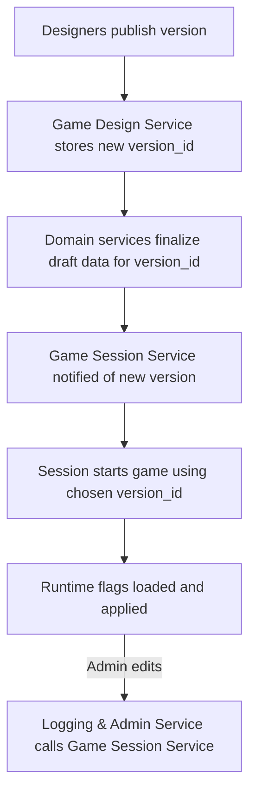

# FireMUD System Architecture: Versioning & Runtime Configuration

This document explains how game data is versioned and activated at runtime. It also shows where runtime feature flags live and how they are edited.

> For service ownership, see the [Service Responsibility Matrix](./service-responsibility-matrix.md). Multi-tenant storage details are covered in [Multi-Tenancy](./system-architecture-multi-tenancy.md).

---

## Game Version Publishing

The **Game Design Service** manages version metadata and publish workflows for game configuration (world layouts, scripts, item templates, etc.). Domain services (World Management, Entity Management, Game Logic, and others) store the actual versioned domain data for each `tenantId`.

1. When a version is ready, creators trigger a **Publish** action in the Game Design Service using the `PublishVersion` gRPC method.
2. The service writes a new `version_id` and associated records to its database, linking the version to each tenant and recording notes and base versions.
3. A Saga coordinates all domain services so they validate and finalize their draft data for the given `tenantId` and `version_id`, marking that data as published and ready for runtime use. Domain services already host the versioned graphs for their domains; no separate design database is copied at publish time.
4. A notification or message informs the Game Session Service that a new version exists so game instances can be started or patched against it.

Published versions are immutable; further changes require publishing a new `version_id`. Services may keep additional draft or experimental versions internally, but only published versions are eligible to be activated for live game instances.

### Script-Only Patch Versions

Minor fixes to NPC behavior or quest logic often only touch automation scripts.
To avoid a full world restart, the Game Design Service can publish a **script-only patch version** using the `PublishScriptPatchVersion` gRPC call.
These records include a `baseVersionId` pointing to the immutable data version
and a `scriptPatchVersion` value such as `v42-script.3`:

```json
{
  "isScriptOnly": true,
  "baseVersionId": "v42",
  "versionId": "v42-script.3"
}
```

Script-only versions appear in version history and audit logs but do not trigger
a data copy or world restart.
Runtime services reload the affected scripts in
memory and continue using the underlying `baseVersionId` for all other assets.
When a patch is published the Game Design Service calls the
[`NotifyScriptVersionUpdate`](./microservices/automation-scripting-service/README.md#notifyscriptversionupdate)
gRPC endpoint in the Automation & Scripting Service so modified scripts are
reloaded in memory. The Game Session Service records the active
`script_patch_version` with each running game instance for recovery. See
[Scripting & Automation](./system-architecture-scripting.md) for more details.

### Schema Migrations vs Design Data

Game versions contain **only** world data and scripts. Database schema changes
remain the responsibility of each microservice and are applied via Flyway when a
service container restarts during a platform deployment. Publishing a new design
version therefore does not run Flyway migrations—it simply loads new data when a
game instance starts or reloads scripts for patch versions. See
[Database Migrations](./system-architecture-database-migrations.md) for the
Flyway workflow.

## Version Activation & Rollback

The **Game Session Service** controls which published version is active for each live game instance. See [User Journeys – Publish and Start a Game Instance](./user-journeys-creators.md#4-publish-and-start-a-game-instance) for the high level flow.

- When starting a game, it reads the desired `version_id` from a manifest or launch request and stores this value as `runtime_version` in the `game_instances` table.
- The available versions a tenant can launch are listed in the `game_manifest`
  table managed by the Game Session Service.
- Only one version is active per game instance. If an issue occurs, administrators can instruct the service to roll back by selecting a previous `version_id` and restarting the instance.
- All runtime services read their data using the active `runtime_version`, ensuring consistent rules during play.

## Runtime Feature Flags

Runtime feature flags allow limited behavior changes without publishing a new design version.
They are **defined in the Game Design Service** and copied into the **Game Session Service**
when a version is published. The definitions table and copy steps manage this workflow.

- Designers create and maintain the set of flag definitions in the Game Design Service UI.
  Definitions are stored in a `runtime_flag` table for each tenant.
- Administrators toggle flag values through the
  [**Logging & Admin Service**](./microservices/logging-admin-service/README.md) web interface.
- The Logging & Admin Service forwards each change to the Game Session Service,
  calling `ToggleFeatureFlag` via gRPC so running instances update immediately.
- The Game Session Service persists active flag values in its `feature_flag` table.
  Sessions use consistent configuration even after reconnects.
  The Logging & Admin Service may store audit entries.
  It is not the source of truth for runtime behavior.
- During each tick cycle the active flags are applied before executing game logic.
  See [Tick System](./system-architecture-ticks.md) for details.

## Flow Summary



By decoupling published versions from runtime flags, FireMUD can rapidly iterate on new content while still allowing safe toggles for experimental features during live gameplay.

For API versioning conventions see [gRPC Protocol Guidelines](./system-architecture-grpc.md).

## Related Documentation

- [Database Migrations](./system-architecture-database-migrations.md)
- [Game Customization Options](./game-customization-options.md)
- [Game Session Service](./microservices/game-session-service/README.md)
- [Service Responsibility Matrix](./service-responsibility-matrix.md)
- [System Architecture Overview](./system-architecture-overview.md)
- [Testing Strategy](./system-architecture-testing.md)
- [Transaction Strategies](./system-architecture-transactions.md)
