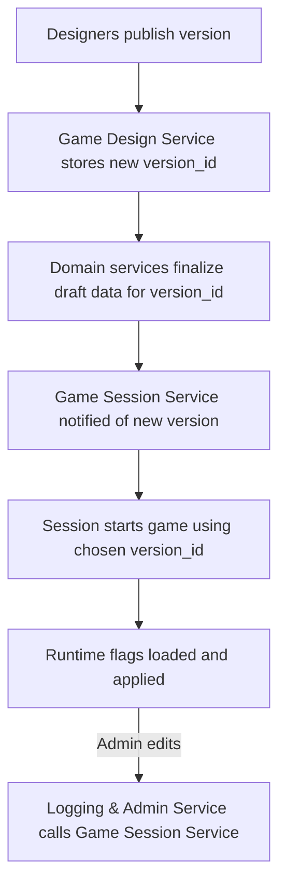

# FireMUD System Architecture: Versioning & Runtime Configuration

This document explains how game data is versioned and activated at runtime. It also shows where runtime feature flags live and how they are edited.

> For service ownership, see the [Service Responsibility Matrix](./service-responsibility-matrix.md). Multi-tenant storage details are covered in [Multi-Tenancy](./system-architecture-multi-tenancy.md).

---

## Implementation Status

The versioned publish and replacement-cutover substrate is partially implemented, including durable cutover preparation and execution records. The current admission-pointer writer performs a read-then-write version check and persists pointer, audit, and prepared-upgrade execution changes through separate repository calls; it does not yet prove the target single-transaction compare-and-set boundary described below. The target bounded source-drain contract is also not yet implemented: current cutover clears active bindings rather than preserving them through a persisted deadline, notice, socket closure, command fence, and terminal `InstanceTermination` workflow. The target sections that follow are normative design, not proof that the current runtime already satisfies those effects.

---

## Game Version Publishing

The **Game Design Service** manages version metadata and publish workflows for game configuration (world layouts, scripts, item templates, etc.). Domain services (World Management, Entity Management, Game Logic, and others) store the actual versioned domain data for each `tenantId`.

1. When a version is ready, creators trigger a **Publish** action in the Game Design Service using the `PublishVersion` gRPC method.
2. The service writes a new `version_id` and associated records to its database, linking the version to each tenant and recording notes and base versions.
3. During authoring, the Game Design Service applies revisions incrementally to **Draft** template rows hosted by the owning domain services via idempotent design APIs keyed by `(tenantId, versionId)`. At publish time, the durable `publish` workflow coordinates all domain services so they validate and finalize their existing Draft data for the given `tenantId` and `version_id`, marking that data as Published and ready for runtime use. No separate design database is copied into the domain services; they already host the versioned graphs for their domains.
   - Publish-time validation must be based on durable digests: every participating domain service must report `GetDraftDesignDigest` for the publish scope (`oneof {versionId, scriptPatchVersion}`) matching the commit being published (`appliedCommitId`, `contentDigest`, and `digestSchemaVersion`), and the Game Design Service must report a control-plane digest for normalized dependency tables (`game_template_*_ref`, `version_asset`, and related publish-critical metadata) for the same commit/version scope. If any required digest is missing or mismatched, publish must fail fast and the version must remain Draft/OUT_OF_SYNC until reconciliation succeeds. See `design/architecture/microservices/game-design-service/world-editing-tools.md`.
   - Publish gating must compare like-for-like commit scope across every required participant. A full publish is invalid if required participants attest different `appliedCommitId` values for the target scope, even when each individual digest is otherwise well-formed.
   - Participant selection is fixed by publish type (full publish vs script-only patch) using the matrix in `design/architecture/microservices/game-design-service/version-control.md#digest-participants-by-publish-type`; publish workflows must not change digest participants implicitly at runtime.
   - For versions that use procedural generation, publish must also freeze and persist a `generationConfigRevision`/hash identity for `(tenantId, versionId)` derived from the version-scoped generation inputs committed through Game Design workflows. Mutable World Management operational defaults are not valid publish inputs. World creation for that version must use the frozen identity and fail closed if it cannot be resolved.
4. As part of the durable `publish` workflow, the Game Design Service runs an **asset export** step for each `(tenantId, versionId)` that uploads design-time assets to object storage, generates a deterministic `manifest.json` for the version, and updates version metadata with the manifest location. This step is implemented as an idempotent workflow step with compensation-like failure handling as described in [Asset Storage Setup](./microservices/game-design-service/asset-storage.md). If this step or another publish step fails irrecoverably, the workflow marks the version as **Failed** and records the asset artifact as `FAILED` so it is not eligible for activation. Moving failed artifact bytes to `TOMBSTONED` remains a separate explicit abandonment/quarantine action rather than an automatic publish-failure transition.
   - The asset export step must persist a `manifestHash` in version metadata and treat any mismatch between recorded hash and served bytes as drift/corruption, not a legitimate “update” to a Published/Active version.
5. Before the version can transition to `Published`, the Game Design Service must persist a single immutable `published_release_bundle` attestation row for `(tenantId, versionId)` containing at minimum:
   - publish identity (`publishWorkflowId`, target `commitId`, `versionId`, `publishedAt`);
   - the digest attestation returned by each required publish participant (`serviceName`, `contentDigest`, `digestSchemaVersion`, `appliedCommitId`);
   - the frozen `generationConfigRevision`/hash for the version;
   - the exported asset `manifestHash` and manifest schema version;
   - bundle status fields proving the attestation was written only after all publish gates passed.
   Activation, rollback-preflight, repair, and audit workflows must treat this row as the canonical release attestation rather than reconstructing release state from multiple service-local tables.
   - Game Design must expose this attestation through `GetPublishedReleaseBundle(tenantId, versionId)`; runtime/control-plane consumers must not read attestation tables directly.
   - `GetPublishedReleaseBundle` must return deterministic fields at minimum:
     - `tenantId`, `versionId`, `commitId`, `publishWorkflowId`, `publishedAt`
     - `participantDigests[] { serviceName, appliedCommitId, contentDigest, digestSchemaVersion }`
     - `artifactDigests[] { artifactType, artifactPath?, artifactDigest, artifactSchemaVersion }` for any exported derived world artifacts in the release
     - `manifestHash`, `manifestSchemaVersion`
     - `requiredManifestAssetKeys[]` for stable manifest usage keys that are mandatory for launch/cutover validation of that release
     - `generationConfigRevision`
     - `attestationSchemaVersion`
   - Error/caching contract:
     - `NOT_FOUND` means the version is not release-attested and must be treated as non-launchable.
     - `SCHEMA_VERSION_UNSUPPORTED` means the caller cannot safely interpret the attestation and must fail closed.
     - A publish workflow that has not yet written `published_release_bundle` is not partially launchable; callers must treat it the same as any other non-attested version.
     - Activation, cutover preflight, and repair workflows must use a fresh attestation read; cached/stale attestation payloads are not sufficient for admission decisions.
     - Ordinary repair tooling must not mutate the attestation payload for a Published/Active release. If exact-bytes repair cannot reproduce the attested bundle, recovery requires a new `versionId` or a separately defined re-attestation workflow with its own audit and approval contract.

   Illustrative attestation payload:

```json
{
  "tenantId": "t1",
  "versionId": "v42",
  "commitId": "c-9001",
  "publishWorkflowId": "pub-42",
  "publishedAt": "2026-03-13T10:00:00Z",
  "participantDigests": [
    {
      "serviceName": "WORLD",
      "appliedCommitId": "c-9001",
      "contentDigest": "sha256:worlddigest",
      "digestSchemaVersion": 3
    },
    {
      "serviceName": "ENTITY",
      "appliedCommitId": "c-9001",
      "contentDigest": "sha256:entitydigest",
      "digestSchemaVersion": 2
    }
  ],
  "artifactDigests": [
    {
      "artifactType": "WORLD_NAVMESH_BUNDLE",
      "artifactPath": "versions/v42/world/navmesh.bundle",
      "artifactDigest": "sha256:navmesh42",
      "artifactSchemaVersion": 1
    },
    {
      "artifactType": "WORLD_PATH_GRAPH_BUNDLE",
      "artifactPath": "versions/v42/world/path-graph.bundle",
      "artifactDigest": "sha256:pathgraph42",
      "artifactSchemaVersion": 1
    }
  ],
  "manifestHash": "sha256:manifest42",
  "manifestSchemaVersion": 1,
  "requiredManifestAssetKeys": ["world.navmesh", "world.pathGraph"],
  "generationConfigRevision": "genrev-42a1",
  "attestationSchemaVersion": 1
}
```

In the initial slice, exported derived world artifacts such as navmesh/path graph bundles are discovered through entries in the attested version `manifest.json`. `GetPublishedReleaseBundle` attests the same release through `manifestHash`, typed `artifactDigests[]`, and `requiredManifestAssetKeys[]`; callers should not expect a separate ad hoc top-level artifact-path field outside that canonical bundle shape.

Illustrative attestation payload for a release with no derived world artifacts:

```json
{
  "tenantId": "t1",
  "versionId": "v43",
  "commitId": "c-9002",
  "publishWorkflowId": "pub-43",
  "publishedAt": "2026-03-13T11:00:00Z",
  "participantDigests": [
    {
      "serviceName": "WORLD",
      "appliedCommitId": "c-9002",
      "contentDigest": "sha256:worlddigest43",
      "digestSchemaVersion": 3
    }
  ],
  "artifactDigests": [],
  "manifestHash": "sha256:manifest43",
  "manifestSchemaVersion": 1,
  "requiredManifestAssetKeys": [],
  "generationConfigRevision": "genrev-43b2",
  "attestationSchemaVersion": 1
}
```

1. A notification or message informs the Game Session Service that a new version exists so game instances can be started or patched against it.

Published versions are immutable; further changes require publishing a new `version_id`. Services may keep additional draft or experimental versions internally, but only Published versions are eligible to be activated for live game instances.

### Ownership

Ownership is split between the Game Design Service and domain services:

- The Game Design Service is the canonical store for:
  - Version metadata and lifecycle (`Draft`, `Published`, `Active`, `Retired`, `Failed`).
  - Branches, commits, revisions, and their relationships to domain objects.
  - References from revisions/versions to assets, scripts, and templates via stable identifiers.
- Domain services such as World Management, Entity Management, Game Logic, and others are the canonical stores for:
  - Versioned template graphs keyed by `(tenantId, versionId)` (world topology, entity templates, balance records, etc.).
  - Runtime/instance state keyed by `(tenantId, gameInstanceId)` or equivalent.

Domain services must not persist their own commit histories; they expose only the current and historical template snapshots keyed by `(tenantId, versionId)`. Game Design Service must not maintain a second, divergent copy of world or entity template graphs; it references domain templates via stable IDs and version metadata.

### Version Lifecycle

Game versions go through a simple lifecycle:

- **Draft** – revisions are still being edited; the version cannot be activated.
- **Published** – the durable `publish` workflow has completed successfully (including asset export) and the version is available for use by game instances.
- **Active** – a specific Published version is recorded as the `runtime_version` for one or more entries in the `game_instances` table.
- **Failed** – a version whose durable `publish` workflow has failed in a way that leaves data incomplete or unusable. Failed versions are never eligible for activation until a repair/retry step transitions them back to Draft or Published.
- **Retired** (also referred to as “Archived” in some UIs) – the version is no longer eligible to be activated for new instances, and no `game_instances` reference it as `runtime_version`. Only **Retired** versions may have their object-store prefixes or other external assets deleted.

Administrative tooling (for example via the Game Design Service or Logging & Admin Service) should:

- Prevent retiring a version while any `game_instances` still reference it.
- Prevent retiring a version while any activation workflow is in-flight for the same `(tenantId, versionId)` (for example world creation still in `PREPARING` state).
- Prevent retiring a version while any **game templates** still reference it as their underlying world/entity/script version; designers must migrate those templates to a successor version before retirement.
- Ensure the `game_manifest` table and any launch manifests are updated when a version is retired so operators cannot accidentally start new instances against it.

Runbooks that remove published assets from the object store must validate that the corresponding version has already reached the **retired** state.
Asset purge must be initiated through CAS-guarded control-plane operations (`BeginPurgeVersionAssets` and `FinalizePurgeVersionAssets`) so eligibility re-check and artifact-state transitions are atomic; operators must not run purge as a separate check + manual delete sequence.

### Version State Ownership and CAS Authority

`versionState` and `versionStateEpoch` are control-plane metadata owned by the Game Design Service:

- Game Design persists version lifecycle state and epoch in its authoritative version tables.
- Other services may cache this metadata but must not mutate it directly.
- Logging & Admin and Game Session mutate lifecycle state only through Game Design control-plane APIs.

Required control-plane APIs:

- `GetVersionState(tenantId, versionId)` -> `{versionState, versionStateEpoch, updatedAt}`
- `CompareAndSetVersionState(tenantId, versionId, expectedVersionStateEpoch, newState, reason)` -> success/failure with current `{versionState, versionStateEpoch}`

`versionStateEpoch` increments on any lifecycle transition that can affect activation eligibility (for example `Published -> Retired`, `Failed -> Draft`, or admin policy transitions).

Normative CAS call flow for activation and rollback:

1. Game Session calls `GetVersionState` and stores `versionStateEpoch` in workflow state.
2. Pre-activation world setup runs under instance lifecycle fence (`PREPARING` only).
3. Game Session re-calls `GetVersionState` immediately before admission.
4. If state/epoch differs from the stored value, workflow fails closed and does not admit gameplay.
5. Admission can open only when state/epoch still match and world lifecycle transition succeeds.

### Template Mutability Rules

Published versions are immutable from the perspective of domain templates:

- The Game Design Service is the source of truth for version state (`Draft`, `Published`, `Active`, `Failed`, `Retired`).
- Domain services such as World Management and Entity Management expose **design APIs** that create or update template rows only for Draft versions keyed by `(tenantId, versionId)`. Authoring tools call these APIs incrementally as revisions are saved so Draft template graphs in domain services always reflect the latest committed design state for that version.
- Once a version reaches the Published state, template tables in domain services must treat rows for that `(tenantId, versionId)` as read-only. Any attempt to modify templates for a Published, Active, or Failed version should fail fast at the design API boundary and be surfaced as a validation error in the Game Design UI.
- Runtime gameplay flows (ticks, world-lifecycle workflows, etc.) never mutate template tables. They only read templates for the active `runtime_version` and write to runtime/instance tables keyed by `(tenantId, gameInstanceId)` or equivalent.

At a high level, each `(tenantId, versionId)` template graph in a domain service follows this lifecycle:

- **Absent** – no rows exist for the version.
- **Draft** – design APIs have created or updated rows keyed by `(tenantId, versionId)`; additional revisions may continue to modify these templates.
- **Published** – the durable `publish` workflow has validated the Draft data and marked the version Published. Template rows are now immutable.
- **Active** – some game instances reference the version as `runtime_version`, but templates remain immutable.
- **Failed** – publish attempted but left the version in an unusable state; templates, if present, must not be used for new instances until the version is repaired.
- **Retired** – no `game_instances` reference the version and it is no longer eligible for activation; templates may be kept for historical inspection until migrations retire them.

This contract ensures that Published template graphs remain stable inputs for rollback and historical inspection. Structural changes to templates must always occur by creating a new Draft version, applying revisions, and publishing a new `version_id`.

### Script-Only Patch Versions

Minor fixes to NPC behavior or quest logic often only touch automation scripts.
To avoid a full world restart, the Game Design Service can publish a **script-only patch version** using the `PublishScriptPatchVersion` gRPC call.
These records include a `baseVersionId` pointing to the immutable data version
and a `scriptPatchVersion` value such as `v42-script.3`:

```json
{
  "isScriptOnly": true,
  "baseVersionId": "v42",
  "versionId": "v42",
  "scriptPatchVersion": "v42-script.3"
}
```

Script-only versions appear in version history and audit logs but do not trigger
a data copy or world restart.
Runtime services reload the affected scripts in
memory and continue using the underlying `baseVersionId` for all other assets and templates. Script-only patches are **strictly limited to script definitions and related Automation & Scripting metadata**; any change that needs new or modified assets, world layouts, entity templates, or other non-script configuration must be delivered via a full `PublishVersion` flow that produces a new `versionId`.
When a patch is published the Game Design Service calls the
[`NotifyScriptVersionUpdate`](./microservices/automation-scripting-service/README.md#notifyscriptversionupdate)
gRPC endpoint in the Automation & Scripting Service so modified scripts are
reloaded in memory. The Game Session Service records the active
`script_patch_version` with each running game instance for recovery. See
[Scripting & Automation](./system-architecture-scripting.md) for more details.

Patch selection must be explicit and pinned:

- Runtime must never implicitly select “latest READY patch” for an instance. The pinned `scriptPatchVersion` for a running `(tenantId, gameInstanceId)` is the only script patch that may be referenced by gameplay triggers.
- Pin/rollback operations must enforce base-version cohesion: a patch can be pinned only when `patch.baseVersionId` matches the instance `runtime_version`/`runtimeVersionId`; mismatches must fail deterministically rather than auto-switching the instance base version.
- Plugin enablement and active `pluginVersionId` selection must also be explicit per `(tenantId, gameInstanceId)`; automation must not implicitly activate “latest” plugin versions for a running instance.
- Pin/rollback APIs are specified in `design/architecture/system-architecture-scripting-control-plane-api.md`, and their required control-plane events are specified in `design/architecture/system-architecture-scripting-control-plane-events.md`.
- Trigger Identity required fields (including `gameInstanceId` and when `regionEpoch` is required) are specified in `design/architecture/system-architecture-scripting-normative-contract-tables.md`.

### Cross-Asset Version Cohesion

Several kinds of design-time assets participate in a published game version:

- **Core templates and world data** owned by domain services such as World Management, Entity Management, and Game Logic.
- **Abilities and actions** owned by the Game Logic Service and authored via the Ability & Action tools.
- **Automation scripts and plugins** owned by the Automation & Scripting Service and authored via the scripting DSL and modding framework.

The versioning model treats a published `version_id` as the **cohesive bundle** of these assets for a tenant:

- For a given `(tenantId, versionId)`:
  - Template and ability schemas and identifiers are stable for the lifetime of that version.
  - Scripts and plugins may evolve through **script-only and plugin-only patch versions**, expressed as `scriptPatchVersion` and `pluginVersionId` values, as long as they remain compatible with the underlying templates and ability schemas.
- Script-only and plugin-only patches:
  - Are tied to a `baseVersionId` and do not change core world or ability data.
  - May be hot-reloaded for running game instances without changing the `runtime_version`, following the semantics in the scripting architecture and Automation & Scripting Service docs.
  - Must not introduce dependencies on ability or template changes that require a new `version_id`; such changes should be delivered via a new game version publish.

Rollback behavior follows the same cohesion rules:

- Rolling back `runtime_version` for a game instance reverts templates and abilities to those for the selected `version_id`, and script/plugin patch selection follows the version/pinning rules in the scripting docs.
- Rolling back a script-only or plugin-only patch affects only automation behavior for the current `version_id`; it does not change templates or abilities.

Tooling in the Game Design and Logging & Admin services should surface these relationships so creators and operators can see, for a given game instance, which `version_id`, `scriptPatchVersion`, and plugin versions are in effect. Admin APIs in the Game Design or Logging & Admin services should also support:

- Listing game templates that reference a given `versionId`, so that designers can migrate or delete them before retiring that version.
- Bulk migration operations that rewrite `GameTemplateDto.config` references from an old `versionId` to a successor `versionId` in a controlled, auditable way.
  - These operations must be driven by normalized dependency tables (for example `game_template_version_ref` and related reference rows), not by best-effort parsing of arbitrary JSON blobs.
  - When templates pin defaults such as `scriptPatchVersion`, migration tooling must update both the JSON payload and the normalized `game_template_script_patch_ref` rows atomically so instance creation does not observe mixed dependencies.

Launch descriptor version-resolution rules:

- A launchable game template resolves to exactly one base `versionId`.
- `game_template_version_ref` is the canonical source for that base version; other normalized template references must agree with it.
- Mixed-version template bundles are invalid for launch and must be rejected during template validation and launch-descriptor resolution rather than interpreted heuristically at runtime.
- `scriptPatchVersion` is the only supported per-launch patch override and must reference the same `baseVersionId` as the resolved `versionId`.
- `ResolveLaunchDescriptor` is idempotent per `controlPlaneRequestId`: a retry with the same `(tenantId, gameTemplateId, controlPlaneRequestId)` and the same input fields must return the same descriptor values, and it must not re-resolve to a newer attestation, patch, or runtime default.
- A fresh launch attempt with a new `controlPlaneRequestId` may resolve against newer valid published state if the underlying template, attestation, or patch data has advanced.
- A retry that already failed with a deterministic business outcome (for example invalid template wiring, missing attestation, stale version-state epoch, or patch override conflict) must return the same failure result for that `controlPlaneRequestId`; callers must not expect retries on the same launch-attempt identity to “pick up” newer control-plane state.
- Caller-supplied runtime overrides are only honored when the template leaves the corresponding field unset. If the template already supplies a default, any caller-supplied value for that field is a deterministic launch-descriptor failure instead of being merged heuristically.
- The launch orchestrator must treat `versionStateEpoch` as part of preflight proof, not informational metadata. If attestation verification or downstream activation sees a different epoch than the one frozen into the descriptor, launch fails closed before any persistent instance row or `PREPARING` world state is created.
- World Management and Game Session may cache launch-descriptor values only as execution inputs for the current `controlPlaneRequestId`; they must not persist or reuse a descriptor as a rolling "latest launch defaults" record for later requests.
- `GetPublishedReleaseBundle(tenantId, versionId)` is the canonical release-attestation surface for launch, cutover, and repair. In the initial slice it must expose:
  - `participantDigests[]`
  - `artifactDigests[]` for each exported derived world artifact
  - `manifestHash`
  - `requiredManifestAssetKeys[]` for stable manifest usage keys that are mandatory for launch/cutover validation of that release
- `artifactDigests[]` and `requiredManifestAssetKeys[]` are complementary, not competing fields: typed artifact digests attest the exact exported bytes, while `requiredManifestAssetKeys[]` declares which manifest entries are required for a valid launch of that release.
- The contract intentionally does not introduce a separate top-level artifact-path reference field outside this attested bundle shape. Runtime consumers still discover artifact locations through the attested `manifest.json`, not through ad hoc object-store path reconstruction.

Launch and cutover preflight use one fail-closed predicate for a full-version release:

- `GetVersionState(tenantId, versionId)` must return `Published` or `Active`, and its `versionStateEpoch` must match the epoch frozen into the resolved launch descriptor or prepared cutover proof.
- `GetPublishedReleaseBundle(tenantId, versionId)` must return a supported attestation for the same release identity, generation config revision, participant digests, and `manifestHash` used by the launch/cutover proof.
- `GetVersionAssetArtifactState(tenantId, versionId)` must return `artifactState=PUBLISHED`, the frozen `exportedVersionNumber`, the same `manifestHash` attested by the release bundle, and exported manifest asset keys containing every `requiredManifestAssetKeys[]` entry.
- If any proof is missing, unsupported, stale, or mismatched, launch/cutover fails before gameplay admission or admission-pointer swap. Callers must not fall back to reconstructing release truth from object-store paths, local template tables, cached descriptors, or partial publish workflow state.

Illustrative launch-descriptor examples:

- Fresh launch:
  - `ResolveLaunchDescriptor(tenantId=t1, gameTemplateId=gt-default, controlPlaneRequestId=ld-req-1001)` resolves to exactly one `versionId` (for example `v42`) plus any explicit patch/defaults pinned to that same base version.
  - Repeating the same launch attempt with the same `controlPlaneRequestId` returns the same `versionId`, `scriptPatchVersion`, and release attestation identity.
- Replacement-instance upgrade:
  - `ResolveLaunchDescriptor(tenantId=t1, gameTemplateId=gt-default, controlPlaneRequestId=ld-req-2001, sourceVersionId=v42, targetVersionId=v43)` resolves to `versionId=v43` only when template references, release attestation, and any required `remapSetId` all validate against the target version.
  - If `targetVersionId` would cause mixed-version dependencies or requires an unapproved remap, descriptor resolution fails before any instance rows are created.
- Mixed-version rejection:
  - If `game_template_world_ref` resolves to `versionId=v42` while `game_template_entity_ref` resolves to `versionId=v43`, `ResolveLaunchDescriptor` must fail validation instead of choosing one version heuristically.

Required preflight failure outcomes:

- `TEMPLATE_REFERENCE_PHASE_NOT_ENFORCED`
- `INVALID_TEMPLATE_CONFIGURATION`
- `SCRIPT_PATCH_OVERRIDE_CONFLICT`
- `SCRIPT_PATCH_NOT_READY`
- `RELEASE_BUNDLE_NOT_FOUND`
- `RELEASE_ATTESTATION_MISMATCH`
- `VERSION_STATE_EPOCH_STALE`
- `LAUNCH_REMAP_REQUIRED`

These are deterministic application outcomes. Launch preflight must return them in normal responses and must not encode them as transport errors.

Normalized-template dependency checks require explicit phase enforcement:

- Game Design exposes persisted cutover state via `GetTemplateReferencePhase(tenantId)` with values `BACKFILLING`, `VALIDATED`, `ENFORCED`.
- Game Session and retirement tooling must block dependency-sensitive operations unless the tenant phase is `ENFORCED`.
- Once `ENFORCED`, control-plane checks must not fall back to JSON parsing for dependency resolution.

### Replacement-Instance Upgrade Contract

Replacement-instance cutover is not allowed to infer runtime-state behavior. The system must classify persistent state before any version cutover workflow is considered complete:

- **Class S1: account-scoped durable state** – state expected to survive version replacement by default (for example character identity, progression, account ownership, currency balances, stable inventory contents where the referenced templates remain valid).
- **Class S2: version-mapped durable state** – state that may survive only through an explicit upgrade mapping validated against the target version (for example equipment slots tied to item templates, learned abilities tied to ability identifiers, starter-loadout references, housing metadata keyed to world templates).
- **Class S3: instance-scoped ephemeral state** – state that never survives replacement-instance cutover unless a feature-specific migration contract says otherwise (for example room-ground containers, transient ambient world state, temporary dungeon topology, in-flight instanced events, and other data keyed to the source `gameInstanceId`).

Required cutover workflow additions:

- Game Session owns a pre-admission `PrepareVersionUpgrade(tenantId, sourceGameInstanceId, targetVersionId)` compatibility workflow.
- Entity Management must expose an upgrade surface that validates entity-owned S1/S2 runtime entities against the target version and returns deterministic outcomes: `COMPATIBLE`, `REQUIRES_MAPPING`, or `INCOMPATIBLE`.
- World Management must expose `ValidateWorldUpgradeMappings`, which validates world-owned S2 references and persistent world-bound metadata against the target version using the same outcome vocabulary.
- Any S2 data that survives must do so through explicit versioned remap records owned by the domain service that owns the referenced template identifiers. The system must not infer remaps from names, slugs, or “closest match” heuristics.
- Game Design control-plane metadata is the source of truth for approved version-to-version remap set identities and audit history when a cutover depends on remapped template references across services.
- Remap sets must be persisted explicitly in Game Design control-plane storage (for example `version_template_remap_set` and child mapping rows) and exposed through APIs such as:
  - `CreateTemplateRemapSet(sourceVersionId, targetVersionId, mappings...)`
  - `ApproveTemplateRemapSet(remapSetId, reason)`
  - `GetTemplateRemapSet(remapSetId)`
- The first launch-resolution substrate is now live on this model: `ResolveLaunchDescriptor` freezes the approved `remapSetId` for cross-version replacement launches, and runtime `game_instance` / `world_instance` rows persist that frozen id as launch proof.
- The first cutover-preflight substrate is now live too: Game Session exposes `ValidateInstanceCutoverCompatibility`, resolves the target launch descriptor to freeze the approved `remapSetId`, checks target version-state / published-release-bundle proof through Game Design, and gathers World / Entity participant attestations before admission-pointer swap can proceed.
- The first persisted cutover-preparation substrate is also live: `PrepareVersionUpgrade` now records one durable `prepared_version_upgrade` control-plane artifact containing the target launch-descriptor identity, frozen `remapSetId`, participant results, and checked-at timestamp for the requested source-instance -> target-version pair, keyed by explicit `controlPlaneRequestId` for retry-safe idempotency.
- Once `ExecutePreparedVersionCutover` succeeds, that same durable artifact now records execution state as well (`executedTargetGameInstanceId`, `executedPointerVersion`, `executedAt`, `executionControlPlaneRequestId`) so later reads can prove which prepared cutover actually ran.
- The first canonical cutover-execution substrate is now live too: `ExecutePreparedVersionCutover` consumes one durable `prepared_version_upgrade` id plus the replacement `gameInstanceId`, revalidates the proof against the current admission pointer and target instance, and performs the pointer swap under the same CAS/audit surface instead of leaving operators to stitch preparation and pointer mutation manually. Retrying the same execution request after the pointer has already moved is idempotent when the durable preparation execution state matches the requested target and request id.
- `PrepareVersionUpgrade` and `ValidateInstanceCutoverCompatibility` must reference a concrete `remapSetId` whenever cutover depends on remapped S2 state. Ad hoc inferred remaps are not allowed.
- If any surviving runtime row references missing or incompatible target-version templates and no approved remap exists, cutover fails closed before admission-pointer swap.
- S3 state is discarded with the source instance through standard termination workflows. No component may silently copy room-ground containers, room ambient state, or instance topology to the target `gameInstanceId`.
- The owning domain service docs must publish a table-family classification for their persistence slice:
  - `S1` rows that survive by default,
  - `S2` rows that survive only with a validated remap,
  - `S3` rows that never survive cutover.
  Cutover preflight is incomplete until every owning domain has documented this mapping or explicitly declared that a class has no rows in the current supported boundary.

Current row-family references used by preflight:

- World Management:
  - `region_instance`, `zone_instance`, `room_instance`, `character_location`, `npc_location`, instance-scoped `world_event`, and instance-scoped population-materialization tables are `S3`.
  - no mandatory World-owned `S2` rows in the initial slice.
- Entity Management:
  - `character` plus attached progression/currency/account-ownership rows are `S1` unless they reference templates that require remap;
  - equipment-binding rows and durable class/archetype / learned-ability / starter-loadout references are `S2`;
  - synthetic room-ground containers and encounter-scoped containment rows keyed to the source `gameInstanceId` are `S3`.

These names are the canonical initial-slice preflight vocabulary until service implementation docs replace them with exact schema table names.

Initial-slice notes:

- In the first live implementation slice, World Management declares no mandatory `S2` row families. `ValidateWorldUpgradeMappings` therefore still reports `stateClassesChecked=["S3"]` and `hasS2Rows=false`, but it now proves more than one row exists: the source world must be in a cutover-eligible lifecycle state and still have retained `region_instance`, `zone_instance`, and `room_instance` topology before it reports `COMPATIBLE`.
- In the first live Entity Management implementation slice, the validation surface is also honest about current persisted runtime families: it checks tenant-surviving `character`, `inventory`, `character_equipment`, and `character_friend` families plus the current instance-scoped `S3` families (`room_ground_inventory`, `item_instances`, `item_stacks`, `container_instances`). `character` and `character_friend` are supported `S1` survivor state. `inventory` and `character_equipment` are treated as current `S2` template-bound survivor state: if either family has rows, cutover requires the frozen approved `remapSetId`; without that id Entity returns `INCOMPATIBLE` with `ENTITY_REMAP_REQUIRED`, and with it Entity reports `COMPATIBLE` while echoing the exact id bound into the prepared cutover proof.

The `ValidateInstanceCutoverCompatibility` contract below is the orchestration surface for these rules; it must report which state classes were checked, which owning domains attested compatibility, and whether any remap set was required.

### Schema Migrations vs Design Data

Published game versions are **design-data bundles** (world templates, entity templates, abilities/actions, scripts/plugins, and asset manifests) keyed by `versionId` and scoped to a `tenantId`. Database schema changes remain the responsibility of each microservice and are applied via Flyway when a service container restarts during a platform deployment. Publishing a new design version therefore does not run Flyway migrations—it finalizes versioned data already stored in domain services, exports version-scoped manifests/assets, and makes the new `versionId` eligible for activation. Runtime instances load data by `runtime_version` and may hot-reload only script/plugin patch layers where explicitly supported. See
[Database Migrations](./system-architecture-database-migrations.md) for the
Flyway workflow.

### Non-Script Content Updates

Non-script content such as world layouts, item templates, and balance curves follow
a stricter lifecycle than scripts:

- Changes to these templates are always delivered via new versions (`version_id`)
  published by the Game Design Service. Domain services never apply in-place edits
  to template rows for Published or Active versions.
- Switching non-script content to a different `runtime_version` is a controlled
  **replacement-instance** operation managed by the Game Session Service.
  Instances do not hot-swap non-script templates mid-session; operators prepare
  a new `gameInstanceId` on the target version, perform an admission-pointer
  swap, then drain/terminate the old instance so all services use consistent
  data for each instance’s pinned version.
- Template identifiers and their semantics are stable within each version; a given
  template ID must not be repurposed to point at a different conceptual entity
  while any non-Retired version references it.
- Destructive changes to template schemas or semantics (for example removing an
  item archetype or reusing a template ID for a different purpose) are only
  allowed after all versions that depend on the previous behavior have entered
  the Retired state and migrations have followed the guidelines in
  [Database Migrations](./system-architecture-database-migrations.md).

For non-script content, there is no cross-version reuse of instance data. A given `gameInstanceId` is always tied to a single `runtime_version`, and all `*_instance` rows for that instance must be derivable from that version’s templates. Migrating a game to a different version is modeled as starting a new game instance with its own `gameInstanceId` (and fresh world creation workflow) rather than reusing existing world instance rows across versions.

Replacement-instance cutover requires an explicit compatibility preflight before admission-pointer swap:

- Game Session Service is the authoritative owner of cutover preflight orchestration and now exposes `ValidateInstanceCutoverCompatibility(tenantId, sourceGameInstanceId, targetVersionId)`.
- The API must return deterministic payload fields at minimum: `{result: COMPATIBLE|INCOMPATIBLE|UNAVAILABLE, reasons[], checkedParticipants[], checkedAt}`.
- `UNAVAILABLE` (for participant outage or stale dependency state) is fail-closed for cutover.
- Minimum required checks:
  - S1/S2 runtime-state compatibility passes in every owning domain and all required remap sets are present, versioned, and approved.
  - All template identifiers referenced by the target launch path resolve in owning domain services for `(tenantId, targetVersionId)`.
  - Entity/runtime bootstrap compatibility passes (starter inventory, class/archetype mappings, required item/NPC templates, balance schema compatibility).
  - World/runtime bootstrap compatibility passes (required region/room templates, persistent world-bound metadata mappings, generation config revision resolution, required script patch readiness when pinned).
  - No unresolved `OUT_OF_SYNC` digest state for required publish participants.
  - The target `published_release_bundle` attestation returned by `GetPublishedReleaseBundle` exists and matches the digests, `manifestHash`, and `generationConfigRevision` used during preflight.
- Current live first slice:
  - Game Session resolves the replacement launch descriptor first, freezing any approved `remapSetId`.
  - Game Session then fails closed if target Game Design version-state or published-release-bundle proof is missing/invalid.
  - Game Session gathers World and Entity participant attestations into one canonical response.
  - `PrepareVersionUpgrade` persists that same proof bundle as a durable `prepared_version_upgrade` control-plane record for later cutover consumers.
  - World currently reports the honest first-cut `S3` row-family view described above. Entity now enumerates both survivor and instance-scoped row families, accepts current `S1` survivor rows, and requires the frozen approved `remapSetId` whenever current `S2` inventory/equipment rows exist.
- Pointer swap is forbidden until this preflight reports `COMPATIBLE`; no best-effort fallback defaults are allowed at cutover time.

Illustrative compatibility responses:

- Compatible cutover with no remap:

```json
{
  "result": "COMPATIBLE",
  "reasons": [],
  "checkedParticipants": ["GAME_DESIGN", "WORLD", "ENTITY"],
  "checkedAt": "2026-03-13T10:15:00Z",
  "remapSetId": null
}
```

- Incompatible cutover because a remap is required but not approved:

```json
{
  "result": "INCOMPATIBLE",
  "reasons": [
    "ENTITY.class_assignment requires approved remapSetId",
    "WORLD.housing_anchor requires approved remapSetId"
  ],
  "checkedParticipants": ["GAME_DESIGN", "WORLD", "ENTITY"],
  "checkedAt": "2026-03-13T10:16:00Z",
  "remapSetId": null
}
```

- Compatible cutover with explicit per-domain attestations and an approved remap:

```json
{
  "result": "COMPATIBLE",
  "reasons": [],
  "checkedParticipants": ["GAME_DESIGN", "WORLD", "ENTITY"],
  "checkedAt": "2026-03-13T10:17:00Z",
  "remapSetId": "remap-v42-v43-r1",
  "participantResults": [
    {
      "participant": "WORLD",
      "stateClassesChecked": ["S3"],
      "checkedFamilies": [
        "region_instance",
        "zone_instance",
        "room_instance",
        "character_location",
        "npc_location",
        "world_event",
        "population_schedule_instance"
      ],
      "hasS2Rows": false,
      "result": "COMPATIBLE"
    },
    {
      "participant": "ENTITY",
      "stateClassesChecked": ["S1", "S2", "S3"],
      "checkedFamilies": [
        "character",
        "equipment_bindings",
        "class_assignment",
        "room_ground_container"
      ],
      "hasS2Rows": true,
      "result": "COMPATIBLE"
    }
  ]
}
```

## Version Activation & Rollback

The **Game Session Service** controls which published version is active for each live game instance. See [User Journeys – Publish and Start a Game Instance](./user-journeys-creators.md#4-publish-and-start-a-game-instance) for the high level flow.

- When starting a game, it reads the desired `version_id` from a manifest or launch request and stores this value as `runtime_version` in the `game_instances` table.
- The available versions a tenant can launch are listed in the `game_manifest`
  table managed by the Game Session Service.
- Only one version is active per game instance. If an issue occurs, administrators can instruct the service to roll back by preparing a replacement instance on a previous `version_id`, atomically swapping admission, and terminating the old instance.
- All runtime services read their data using the active `runtime_version`, ensuring consistent rules during play.

Activation and rollback must be guarded by a version-state compare-and-set token (for example `versionStateEpoch`) to avoid races with retirement or state transitions:

- At activation start, Game Session calls `GetVersionState(tenantId, versionId)` and records the returned epoch in the activation workflow.
- Before committing activation (or rollback) and admitting gameplay, Game Session re-validates the same epoch.
- If the epoch changed (for example due to retirement or admin state edits), activation fails with no admission and requires a new explicit operator action.

Activation workflows must also respect per-instance lifecycle fencing in World Management so activation and termination cannot both commit for the same `gameInstanceId`. See [World Creation Workflow](./microservices/world-management-service/world-creation-workflow.md#activation-vs-termination-fencing).

### Instance Termination Handoff

Termination requires ordered handoff across runtime and domain owners:

1. Game Session marks the instance non-admissible/draining and blocks new admissions.
2. World Management acquires the lifecycle fence, transitions to `TERMINATING`, and runs `InstanceTermination` with Entity Management cleanup.
3. World Management commits `TERMINATED` only after Entity Management confirms cleanup.
4. Game Session marks the `game_instances` runtime record terminated/stopped only after step 3.

If any step after step 1 fails, admission remains closed and the same termination workflow identity must retry until convergence.

Before any operation that changes whether a tenant is actively serving gameplay through one of its player-addressable realms (for example, starting the default production realm, creating a playtest fork, cutting a realm over to a replacement instance with a different `runtime_version`, or rolling a realm back to a previous version), the Game Session Service must consult the runtime entitlement contract:

- Call `GetTenantEntitlementsForRuntime(tenantId)` in the Account Service and enforce that:
  - The tenant is currently **available for gameplay** under its subscription and billing state (for example, not `suspended` or `canceled`).  
  - The operation-specific new-instance/scale flag permits the requested lifecycle change; general gameplay availability during `grace` does not authorize new capacity.
  - The requested instance count and configuration remain within plan-derived quotas (for example, maximum concurrent instances for the tenant).
- If entitlements indicate that the tenant is unavailable for gameplay or that quotas would be exceeded, the operation fails with a clear, tenant-scoped error and no instance-level changes are applied.
- New instances, scale-out, quota increases, paid-feature activation, and replacement cutovers that create capacity are strict paths: they require an entitlement snapshot with `0 <= ageMs < 15000`, where `ageMs = now - evaluatedAt` is computed from Account's authoritative `evaluatedAt`. A future-dated `evaluatedAt` produces a negative age and is rejected; it is never treated as fresh. If a fresh snapshot cannot be established, the operation fails closed with `ENTITLEMENT_UNAVAILABLE`.
- Restart, rollback, or recovery of already-entitled capacity may use a previously authoritative positive snapshot as last-known-good only when the operation does not increase capacity or quota consumption, `0 <= ageMs < 300000`, and there is no observed hard denial, revocation, newer billing sequence, or sequence gap. A future-dated `evaluatedAt` is therefore invalid for last-known-good as well as for strict admission. A reconnect that creates a new binding or changes realm target is a strict new-admission path, not this exception.
- Entitlement snapshots must include `evaluatedAt`, `entitlementVersion`, and `tenantBillingSequence`. For both strict and last-known-good use, `ageMs` must be a finite, nonnegative integer; exact-boundary ages (`15000` ms for strict or `300000` ms for last-known-good) are expired. A stale, future-dated, malformed, or sequence-unsafe snapshot is never usable. When the bounded exception does not apply, the runtime must reconcile through `GetTenantEntitlementsForRuntime(tenantId)` and fail closed if that authoritative read cannot establish the required fresh and sequence-safe result.
- Immediately before the final activation or admission-pointer commit, Game Session must apply this ADR 0028 gate again. A capacity-creating operation requires a fresh snapshot and an allowed operation-specific flag; a non-expanding restart, rollback, or recovery may use eligible last-known-good as its entitlement input within the bounded continuity contract. Same-binding player resumption additionally requires Account to validate current lifecycle, security, membership, and revocation authority and commit the ADR 0030 resume lease. Last-known-good never substitutes for version-state, release-attestation, compatibility, lifecycle-fence, or routing-pointer proof. If the required entitlement evidence is unavailable or unsafe, the realm remains closed or the previous pointer remains the sole admissible target.
- Runtime operations must enforce the realm-routing contract exposed to players: each player-addressable realm is `OPEN` on exactly one gameplay-admissible instance or explicitly `CLOSED`, and control-plane workflows must not create ambiguity about which instance is admissible for a given realm.

### Realm Routing Contract For Player-Addressable Realms

Version cutover contract for a player-addressable realm:

1. Prepare the replacement instance as non-admissible (`PREPARING`/draining-safe) and run world creation to completion.
2. Run compatibility preflight for source instance -> target version and fail closed on mismatch.
3. Persist a durable `PrepareVersionUpgrade` artifact for that cutover attempt and use it as the proof input to the realm-route swap.
4. Re-run the final activation gate above immediately before changing admission state.
5. Perform one atomic `OPEN(source)` -> `OPEN(target)` realm-route swap so the selected realm has exactly one target for new or renewed bindings at any instant.
6. In the same cutover commit, persist the source instance, a unique `sourceDrainId`, and absolute `sourceDrainDeadlineAt` resolved from `firemud.game-session.cutover-drain.duration-ms`. Keep the old instance closed to new/reconnected bindings while already connected source sessions finish before that deadline, then terminate it through the standard `InstanceTermination` workflow.
7. If swap fails, keep the previously routed instance as the sole admissible target for that realm and retry; do not open dual admission for the same realm.

Realm-routing contract (required):

- Each player-addressable realm must have exactly one authoritative routing record managed by Game Session. Its state is `OPEN(admissibleGameInstanceId)` or `CLOSED`; only an open realm has an admission target.
- The authoritative routing record includes `worldSlug`, and the routing identity plus every routing read, write, and CAS operation are exactly `{tenantId, worldSlug, realmSlug}`. `worldSlug` must not be inferred from `realmSlug`, display metadata, or the target `gameInstanceId`.
- Each routing record must contain at minimum:
  - `tenantId`,
  - `worldSlug`,
  - `realmSlug` (or equivalent stable player-facing realm selector),
  - `admissionState`,
  - `admissibleGameInstanceId` only when `OPEN`,
  - `pointerVersion` (monotonic CAS version),
  - `catalogRevision`, the one canonical monotonic reference to the separately versioned catalog/policy snapshot used for visibility and public-production reads,
  - `updatedAt`,
  - `updatedBy` / change reason for audit.
- `catalogRevision` identifies the separately versioned catalog/policy snapshot and is the sole authority for the realm's visibility, access policy, and public-production designation. It is the only catalog-only monotonic field; there is no separate `policyRevision`. The routing record stores `catalogRevision` and the admission pointer; it must not duplicate the `publicProduction` policy value or derive public-production behavior from `realmSlug`, display metadata, or `admissibleGameInstanceId`.
- All player and control-plane flows must resolve the referenced catalog/policy revision together with the routing pointer, and must fail closed on a missing, stale, mismatched, or ambiguous pair:
  - `WORLDS` uses the catalog/policy public-production designation and visibility policy when building world discovery.
  - `REALMS` uses the same policy revision for public-production visibility versus explicit realm grants.
  - `CHARS` uses that policy decision before resolving caller-valid characters for the selected realm and routed instance.
  - Bootstrap discovery and connect-token issuance reread the same policy reference and routing pointer before issuing target-specific evidence.
  - Admission (`PLAY`) and reconnect validation revalidate the current policy designation/access decision and the current admissible routing target; neither trusts a duplicated flag in a routing payload or a stale discovery result.
  - Runtime control-plane launch, cutover, rollback, and fork operations publish or consume the versioned catalog/policy reference and routing pointer as one auditable authority pair; they must not maintain a second public-production flag in routing state.
- **Target transaction boundary:** routing updates use an atomic database compare-and-set on the stable tenant-qualified `{tenantId, worldSlug, realmSlug}` identity, with the expected `pointerVersion` included in the update predicate and advanced in the stored value. Failed CAS must not admit or expose dual-admissible state for the same realm. The expected version is required for an existing record, and ordinary `OPEN`/`CLOSED` pointer state, its audit event, and its idempotent request outcome commit atomically. A replacement cutover that changes `gameInstanceId` additionally commits the applicable prepared-cutover execution state in that same transaction; ordinary pointer updates do not require a `prepared_version_upgrade`. The current separate repository writes are an implementation gap and must not be cited as proof of this boundary.
- Ownership: Game Session Service is the sole writer and system of record for gameplay realm-routing state; other services consume via API/read models and must not write routing state directly.
- API surface: Game Session exposes control-plane APIs for reading/updating realm-routing state. All launch, cutover, rollback, and fork lifecycle workflows must use these APIs rather than direct table writes.
- A pointer swap to a different `gameInstanceId` is a cutover operation, not a generic edit. It must reference one durable `prepared_version_upgrade` record, and Game Session must reject the swap unless that preparation is still `COMPATIBLE` and matches both the current source pointer target and the replacement instance's frozen launch proof (`versionId`, `launchDescriptorId`, `remapSetId`).
- Pointer-audit history must preserve that same preparation identity. A successful cutover write records the `preparedVersionUpgradeId` on the resulting admission-pointer audit event so operators can prove which durable preparation authorized a given swap.
- Stopping a realm without a replacement atomically moves it to `CLOSED` before the old instance drains. `CLOSED` returns a stable realm-unavailable outcome; unavailable, malformed, or ambiguous routing state fails with `ADMISSION_POINTER_UNAVAILABLE` until reconciled.
- **Target cutover behavior:** pointer state controls new or renewed gameplay bindings. Existing connected source sessions do not re-read it per action and remain on the source only before the persisted drain deadline; fresh `PLAY` and reconnect use the current target.
- In that target, `firemud.game-session.cutover-drain.duration-ms` has a five-minute platform default and hard maximum. Tenant/game overrides may shorten it or set it to zero but cannot extend it. The cutover audit and prepared-upgrade execution record preserve the effective value, policy version, `sourceDrainId`, and `sourceDrainDeadlineAt` so retries and operators observe one deadline.
- Game Session may then complete a drain early after the source session index is empty. When the deadline is reached, it sends one bounded update notice, closes remaining source sockets, rejects further source commands through the instance lifecycle fence, marks the source `STOPPING`, and retries the idempotent `InstanceTermination` workflow until the source is terminal.
- **Current implementation gap:** cutover clears active bindings rather than preserving them through a bounded drain. The creator journey records the player-visible limitation until the target contract above is implemented.
- One visible realm may be marked as the public-production realm by the `publicProduction` policy value in the referenced catalog/policy revision. Additional realms, including playtest forks, are valid first-class player-addressable realms only when intentionally exposed through that policy and an explicit Account-owned realm-access grant in the authenticated discovery contract; public-production onboarding must consume that policy value and never infer behavior from `realmSlug` or a duplicate routing-record flag.

### Fork-Snapshot Boundary For Playtest Realms

Creator-managed playtest forks are temporary player-addressable realms derived from a source realm snapshot. The fork-snapshot boundary is normative for v1:

- **Source identity** – A fork is created from a specific `{tenantId, sourceRealmSlug, sourceGameInstanceId}` plus the resolved source build identity (`runtimeVersionId` and optional `scriptPatchVersion`) captured at snapshot time.
- **Account model** – Forks reuse the same platform `accountId` identities as production. Visibility is controlled by explicit tester/creator/operator access grants; unauthorized accounts must not see the fork in `REALMS <world>`.
- **Copied gameplay state** – The snapshot copies the source realm's player gameplay state needed for realistic validation, including character progression, inventory, learned abilities, and other realm-scoped runtime/world state required to reproduce gameplay behavior.
- **Fork-local identity** – Copied gameplay state becomes fork-local runtime state keyed to the fork's `gameInstanceId`. A copied character in the fork remains associated with the same platform account, but it is a separate fork-local gameplay record, not a live reference back to production rows.
- **Relation to tenant ownership** – This fork-local gameplay record does not create a new tenant or a new platform account. It is an isolated realm-state variant of a tenant-owned character, which is why discovery and admission still resolve through the same `{tenantId, gameInstanceId, characterId}` contract.
- **Build selection** – A fork may launch on the source realm's current build for reproduction or on a different published `versionId` and optional `scriptPatchVersion` for validation. Published/runtime version pointers are copied from source only when they are also the chosen target build.
- **Excluded state** – Billing records, invoices, payment methods, live auth sessions, connect-token replay state, and source moderation/audit cases are never cloned as active source records into the fork.
- **Fork-generated records** – Analytics, moderation reports, audit entries, and similar operational data created during the playtest are written as new fork-scoped records tagged to the fork realm rather than appended to the source realm's production history.
- **External side effects** – Fork gameplay must not emit production-side effects. Outbound integrations, monetization effects, and any other irreversible external actions must be suppressed, redirected to test sinks, or otherwise isolated so the fork cannot mutate production state outside the fork-local datastore boundary.
- **No merge-back** – Runtime writes from a fork never merge automatically into production. Promotion from a successful playtest occurs only through the normal launch/cutover workflow against the target production realm.
- **Reset semantics** – Resetting a fork replaces its fork-local gameplay state with a fresh application of the chosen source snapshot and preserves only the control-plane identity and audit history needed to track the fork lifecycle.

When entitlements transition to hard-cutoff states (`suspended` or `canceled`) after an instance is already running, runtime behavior is deterministic:

- New admissions are blocked immediately.
- Existing player gameplay sessions are revoked immediately.
- Running instances enter a bounded non-admissible drain phase (target: 5 minutes maximum) for cleanup, then stop.

Activation, rollback, and cutover operations remain blocked until `GetTenantEntitlementsForRuntime(tenantId)` returns gameplay-available status again.

Because rollback relies on being able to reactivate previously published `version_id` values, schema migrations must be coordinated with versioned data. See the **Version-Aware Migration Guidelines** in [Database Migrations](./system-architecture-database-migrations.md) for constraints on dropping or reshaping columns that are still used by any published version.

Rollback class boundary for versioning flows:

- Publish/finalization and activation-prep run under **Class A** Saga rollback semantics (compensation allowed before activation).
- Once a version is active and runtime effects are being applied, mutations run under **Class B** runtime semantics (retry/reconcile with stable `EffectId`; no destructive cross-service rollback). See [Transaction Strategies](./system-architecture-transactions.md#rollback-boundaries-by-operation-class).

## Runtime Feature Flags

Runtime feature flags allow limited behavior changes without publishing a new design version.
They are **defined in the Game Design Service** and copied into the **Game Session Service**
when a version is published. The definitions table and copy steps manage this workflow.

- Designers create and maintain the set of flag definitions in the Game Design Service UI.
  Definitions are stored in a `runtime_flag` table for each tenant.
- Administrators toggle flag values through the
  [**Logging & Admin Service**](./microservices/logging-admin-service/README.md) web interface.
- The Logging & Admin Service forwards each change to the Game Session Service,
  calling `ToggleFeatureFlag` via gRPC so running instances update immediately.
- The Game Session Service persists active flag values in its `feature_flag` table.
  Sessions use consistent configuration even after reconnects.
  The Logging & Admin Service may store audit entries.
  It is not the source of truth for runtime behavior.
- During each tick cycle the active flags are applied before executing game logic.
  See [Tick System](./system-architecture-ticks.md) for details.

## Flow Summary



By decoupling published versions from runtime flags, FireMUD can rapidly iterate on new content while still allowing safe toggles for experimental features during live gameplay.

For API versioning conventions see [gRPC Protocol Guidelines](./system-architecture-grpc.md).

## Related Documentation

- [Database Migrations](./system-architecture-database-migrations.md)
- [Game Customization](./system-architecture-game-customization.md)
- [Game Session Service](./microservices/game-session-service/README.md)
- [Service Responsibility Matrix](./service-responsibility-matrix.md)
- [System Architecture Overview](./system-architecture-overview.md)
- [Testing Strategy](./system-architecture-testing.md)
- [Transaction Strategies](./system-architecture-transactions.md)
