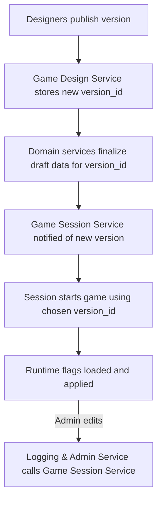

# FireMUD System Architecture: Versioning & Runtime Configuration

This document explains how game data is versioned and activated at runtime. It also shows where runtime feature flags live and how they are edited.

> For service ownership, see the [Service Responsibility Matrix](./service-responsibility-matrix.md). Multi-tenant storage details are covered in [Multi-Tenancy](./system-architecture-multi-tenancy.md).

---

## Game Version Publishing

The **Game Design Service** manages version metadata and publish workflows for game configuration (world layouts, scripts, item templates, etc.). Domain services (World Management, Entity Management, Game Logic, and others) store the actual versioned domain data for each `tenantId`.

1. When a version is ready, creators trigger a **Publish** action in the Game Design Service using the `PublishVersion` gRPC method.
2. The service writes a new `version_id` and associated records to its database, linking the version to each tenant and recording notes and base versions.
3. During authoring, the Game Design Service applies revisions incrementally to **Draft** template rows hosted by the owning domain services via idempotent design APIs keyed by `(tenantId, versionId)`. At publish time, a Saga coordinates all domain services so they validate and finalize their existing Draft data for the given `tenantId` and `version_id`, marking that data as Published and ready for runtime use. No separate design database is copied into the domain services; they already host the versioned graphs for their domains.
   - Publish-time validation must be based on durable digests: every participating domain service must report `GetDraftDesignDigest` for the publish scope (`oneof {versionId, scriptPatchVersion}`) matching the commit being published (`appliedCommitId`, `contentDigest`, and `digestSchemaVersion`), and the Game Design Service must report a control-plane digest for normalized dependency tables (`game_template_*_ref`, `version_asset`, and related publish-critical metadata) for the same commit/version scope. If any required digest is missing or mismatched, publish must fail fast and the version must remain Draft/OUT_OF_SYNC until reconciliation succeeds. See `design/architecture/microservices/game-design-service/world-editing-tools.md`.
   - Participant selection is fixed by publish type (full publish vs script-only patch) using the matrix in `design/architecture/microservices/game-design-service/version-control.md#digest-participants-by-publish-type`; publish workflows must not change digest participants implicitly at runtime.
   - For versions that use procedural generation, publish must also freeze and persist a `generationConfigRevision`/hash identity for `(tenantId, versionId)` derived from the version-scoped generation inputs committed through Game Design workflows. Mutable World Management operational defaults are not valid publish inputs. World creation for that version must use the frozen identity and fail closed if it cannot be resolved.
4. As part of the Saga, the Game Design Service runs an **asset export** step for each `(tenantId, versionId)` that uploads design-time assets to object storage, generates a deterministic `manifest.json` for the version, and updates version metadata with the manifest location. This step is implemented as an idempotent Saga step with compensation as described in [Asset Storage Setup](./microservices/game-design-service/asset-storage.md). If this step or another publish step fails irrecoverably, the Saga marks the version as **Failed** and records the asset artifact as `TOMBSTONED` (quarantined) so it is not eligible for activation.
   - The asset export step must persist a `manifestHash` in version metadata and treat any mismatch between recorded hash and served bytes as drift/corruption, not a legitimate “update” to a Published/Active version.
5. Before the version can transition to `Published`, the Game Design Service must persist a single immutable `published_release_bundle` attestation row for `(tenantId, versionId)` containing at minimum:
   - publish identity (`publishWorkflowId`, target `commitId`, `versionId`, `publishedAt`);
   - the digest attestation returned by each required publish participant (`serviceName`, `contentDigest`, `digestSchemaVersion`, `appliedCommitId`);
   - the frozen `generationConfigRevision`/hash for the version;
   - the exported asset `manifestHash` and manifest schema version;
   - bundle status fields proving the attestation was written only after all publish gates passed.
   Activation, rollback-preflight, repair, and audit workflows must treat this row as the canonical release attestation rather than reconstructing release state from multiple service-local tables.
   - Game Design must expose this attestation through `GetPublishedReleaseBundle(tenantId, versionId)`; runtime/control-plane consumers must not read attestation tables directly.
   - `GetPublishedReleaseBundle` must return deterministic fields at minimum:
     - `tenantId`, `versionId`, `commitId`, `publishWorkflowId`, `publishedAt`
     - `participantDigests[] { serviceName, appliedCommitId, contentDigest, digestSchemaVersion }`
     - `manifestHash`, `manifestSchemaVersion`
     - `generationConfigRevision`
     - `attestationSchemaVersion`
   - Error/caching contract:
     - `NOT_FOUND` means the version is not release-attested and must be treated as non-launchable.
     - `SCHEMA_VERSION_UNSUPPORTED` means the caller cannot safely interpret the attestation and must fail closed.
     - Activation, cutover preflight, and repair workflows must use a fresh attestation read; cached/stale attestation payloads are not sufficient for admission decisions.
6. A notification or message informs the Game Session Service that a new version exists so game instances can be started or patched against it.

Published versions are immutable; further changes require publishing a new `version_id`. Services may keep additional draft or experimental versions internally, but only Published versions are eligible to be activated for live game instances.

### Ownership

Ownership is split between the Game Design Service and domain services:

- The Game Design Service is the canonical store for:
  - Version metadata and lifecycle (`Draft`, `Published`, `Active`, `Retired`, `Failed`).
  - Branches, commits, revisions, and their relationships to domain objects.
  - References from revisions/versions to assets, scripts, and templates via stable identifiers.
- Domain services such as World Management, Entity Management, Game Logic, and others are the canonical stores for:
  - Versioned template graphs keyed by `(tenantId, versionId)` (world topology, entity templates, balance records, etc.).
  - Runtime/instance state keyed by `(tenantId, gameInstanceId)` or equivalent.

Domain services must not persist their own commit histories; they expose only the current and historical template snapshots keyed by `(tenantId, versionId)`. Game Design Service must not maintain a second, divergent copy of world or entity template graphs; it references domain templates via stable IDs and version metadata.

### Version Lifecycle

Game versions go through a simple lifecycle:

- **Draft** – revisions are still being edited; the version cannot be activated.
- **Published** – the Saga has completed successfully (including asset export) and the version is available for use by game instances.
- **Active** – a specific Published version is recorded as the `runtime_version` for one or more entries in the `game_instances` table.
- **Failed** – a version whose publish Saga has failed in a way that leaves data incomplete or unusable. Failed versions are never eligible for activation until a repair/retry step transitions them back to Draft or Published.
- **Retired** (also referred to as “Archived” in some UIs) – the version is no longer eligible to be activated for new instances, and no `game_instances` reference it as `runtime_version`. Only **Retired** versions may have their object-store prefixes or other external assets deleted.

Administrative tooling (for example via the Game Design Service or Logging & Admin Service) should:

- Prevent retiring a version while any `game_instances` still reference it.
- Prevent retiring a version while any activation workflow is in-flight for the same `(tenantId, versionId)` (for example world creation still in `PREPARING` state).
- Prevent retiring a version while any **game templates** still reference it as their underlying world/entity/script version; designers must migrate those templates to a successor version before retirement.
- Ensure the `game_manifest` table and any launch manifests are updated when a version is retired so operators cannot accidentally start new instances against it.

Runbooks that remove published assets from the object store must validate that the corresponding version has already reached the **retired** state.
Asset purge must be initiated through CAS-guarded control-plane operations (`BeginPurgeVersionAssets` and `FinalizePurgeVersionAssets`) so eligibility re-check and artifact-state transitions are atomic; operators must not run purge as a separate check + manual delete sequence.

### Version State Ownership and CAS Authority

`versionState` and `versionStateEpoch` are control-plane metadata owned by the Game Design Service:

- Game Design persists version lifecycle state and epoch in its authoritative version tables.
- Other services may cache this metadata but must not mutate it directly.
- Logging & Admin and Game Session mutate lifecycle state only through Game Design control-plane APIs.

Required control-plane APIs:

- `GetVersionState(tenantId, versionId)` -> `{versionState, versionStateEpoch, updatedAt}`
- `CompareAndSetVersionState(tenantId, versionId, expectedVersionStateEpoch, newState, reason)` -> success/failure with current `{versionState, versionStateEpoch}`

`versionStateEpoch` increments on any lifecycle transition that can affect activation eligibility (for example `Published -> Retired`, `Failed -> Draft`, or admin policy transitions).

Normative CAS call flow for activation and rollback:

1. Game Session calls `GetVersionState` and stores `versionStateEpoch` in workflow state.
2. Pre-activation world setup runs under instance lifecycle fence (`PREPARING` only).
3. Game Session re-calls `GetVersionState` immediately before admission.
4. If state/epoch differs from the stored value, workflow fails closed and does not admit gameplay.
5. Admission can open only when state/epoch still match and world lifecycle transition succeeds.

### Template Mutability Rules

Published versions are immutable from the perspective of domain templates:

- The Game Design Service is the source of truth for version state (`Draft`, `Published`, `Active`, `Failed`, `Retired`).
- Domain services such as World Management and Entity Management expose **design APIs** that create or update template rows only for Draft versions keyed by `(tenantId, versionId)`. Authoring tools call these APIs incrementally as revisions are saved so Draft template graphs in domain services always reflect the latest committed design state for that version.
- Once a version reaches the Published state, template tables in domain services must treat rows for that `(tenantId, versionId)` as read-only. Any attempt to modify templates for a Published, Active, or Failed version should fail fast at the design API boundary and be surfaced as a validation error in the Game Design UI.
- Runtime gameplay flows (ticks, Sagas for world creation, etc.) never mutate template tables. They only read templates for the active `runtime_version` and write to runtime/instance tables keyed by `(tenantId, gameInstanceId)` or equivalent.

At a high level, each `(tenantId, versionId)` template graph in a domain service follows this lifecycle:

- **Absent** – no rows exist for the version.
- **Draft** – design APIs have created or updated rows keyed by `(tenantId, versionId)`; additional revisions may continue to modify these templates.
- **Published** – the publish Saga has validated the Draft data and marked the version Published. Template rows are now immutable.
- **Active** – some game instances reference the version as `runtime_version`, but templates remain immutable.
- **Failed** – publish attempted but left the version in an unusable state; templates, if present, must not be used for new instances until the version is repaired.
- **Retired** – no `game_instances` reference the version and it is no longer eligible for activation; templates may be kept for historical inspection until migrations retire them.

This contract ensures that Published template graphs remain stable inputs for rollback and historical inspection. Structural changes to templates must always occur by creating a new Draft version, applying revisions, and publishing a new `version_id`.

### Script-Only Patch Versions

Minor fixes to NPC behavior or quest logic often only touch automation scripts.
To avoid a full world restart, the Game Design Service can publish a **script-only patch version** using the `PublishScriptPatchVersion` gRPC call.
These records include a `baseVersionId` pointing to the immutable data version
and a `scriptPatchVersion` value such as `v42-script.3`:

```json
{
  "isScriptOnly": true,
  "baseVersionId": "v42",
  "versionId": "v42",
  "scriptPatchVersion": "v42-script.3"
}
```

Script-only versions appear in version history and audit logs but do not trigger
a data copy or world restart.
Runtime services reload the affected scripts in
memory and continue using the underlying `baseVersionId` for all other assets and templates. Script-only patches are **strictly limited to script definitions and related Automation & Scripting metadata**; any change that needs new or modified assets, world layouts, entity templates, or other non-script configuration must be delivered via a full `PublishVersion` flow that produces a new `versionId`.
When a patch is published the Game Design Service calls the
[`NotifyScriptVersionUpdate`](./microservices/automation-scripting-service/README.md#notifyscriptversionupdate)
gRPC endpoint in the Automation & Scripting Service so modified scripts are
reloaded in memory. The Game Session Service records the active
`script_patch_version` with each running game instance for recovery. See
[Scripting & Automation](./system-architecture-scripting.md) for more details.

Patch selection must be explicit and pinned:

- Runtime must never implicitly select “latest READY patch” for an instance. The pinned `scriptPatchVersion` for a running `(tenantId, gameInstanceId)` is the only script patch that may be referenced by gameplay triggers.
- Pin/rollback operations must enforce base-version cohesion: a patch can be pinned only when `patch.baseVersionId` matches the instance `runtime_version`/`runtimeVersionId`; mismatches must fail deterministically rather than auto-switching the instance base version.
- Plugin enablement and active `pluginVersionId` selection must also be explicit per `(tenantId, gameInstanceId)`; automation must not implicitly activate “latest” plugin versions for a running instance.
- Pin/rollback APIs and their required events are specified in `design/architecture/system-architecture-scripting-control-plane-api.md`.
- Trigger Identity required fields (including `gameInstanceId` and when `regionEpoch` is required) are specified in `design/architecture/system-architecture-scripting-normative-contract-tables.md`.

### Cross-Asset Version Cohesion

Several kinds of design-time assets participate in a published game version:

- **Core templates and world data** owned by domain services such as World Management, Entity Management, and Game Logic.
- **Abilities and actions** owned by the Game Logic Service and authored via the Ability & Action tools.
- **Automation scripts and plugins** owned by the Automation & Scripting Service and authored via the scripting DSL and modding framework.

The versioning model treats a published `version_id` as the **cohesive bundle** of these assets for a tenant:

- For a given `(tenantId, versionId)`:
  - Template and ability schemas and identifiers are stable for the lifetime of that version.
  - Scripts and plugins may evolve through **script-only and plugin-only patch versions**, expressed as `scriptPatchVersion` and `pluginVersionId` values, as long as they remain compatible with the underlying templates and ability schemas.
- Script-only and plugin-only patches:
  - Are tied to a `baseVersionId` and do not change core world or ability data.
  - May be hot-reloaded for running game instances without changing the `runtime_version`, following the semantics in the scripting architecture and Automation & Scripting Service docs.
  - Must not introduce dependencies on ability or template changes that require a new `version_id`; such changes should be delivered via a new game version publish.

Rollback behavior follows the same cohesion rules:

- Rolling back `runtime_version` for a game instance reverts templates and abilities to those for the selected `version_id`, and script/plugin patch selection follows the version/pinning rules in the scripting docs.
- Rolling back a script-only or plugin-only patch affects only automation behavior for the current `version_id`; it does not change templates or abilities.

Tooling in the Game Design and Logging & Admin services should surface these relationships so creators and operators can see, for a given game instance, which `version_id`, `scriptPatchVersion`, and plugin versions are in effect. Admin APIs in the Game Design or Logging & Admin services should also support:

- Listing game templates that reference a given `versionId`, so that designers can migrate or delete them before retiring that version.
- Bulk migration operations that rewrite `GameTemplateDto.config` references from an old `versionId` to a successor `versionId` in a controlled, auditable way.
  - These operations must be driven by normalized dependency tables (for example `game_template_version_ref` and related reference rows), not by best-effort parsing of arbitrary JSON blobs.
  - When templates pin defaults such as `scriptPatchVersion`, migration tooling must update both the JSON payload and the normalized `game_template_script_patch_ref` rows atomically so instance creation does not observe mixed dependencies.

Normalized-template dependency checks require explicit phase enforcement:

- Game Design exposes persisted cutover state via `GetTemplateReferencePhase(tenantId)` with values `BACKFILLING`, `VALIDATED`, `ENFORCED`.
- Game Session and retirement tooling must block dependency-sensitive operations unless the tenant phase is `ENFORCED`.
- Once `ENFORCED`, control-plane checks must not fall back to JSON parsing for dependency resolution.

### Replacement-Instance Upgrade Contract

Replacement-instance cutover is not allowed to infer runtime-state behavior. The system must classify persistent state before any version cutover workflow is considered complete:

- **Class S1: account-scoped durable state** – state expected to survive version replacement by default (for example character identity, progression, account ownership, currency balances, stable inventory contents where the referenced templates remain valid).
- **Class S2: version-mapped durable state** – state that may survive only through an explicit upgrade mapping validated against the target version (for example equipment slots tied to item templates, learned abilities tied to ability identifiers, starter-loadout references, housing metadata keyed to world templates).
- **Class S3: instance-scoped ephemeral state** – state that never survives replacement-instance cutover unless a feature-specific migration contract says otherwise (for example room-ground containers, transient ambient world state, temporary dungeon topology, in-flight instanced events, and other data keyed to the source `gameInstanceId`).

Required cutover workflow additions:

- Game Session owns a pre-admission `PrepareVersionUpgrade(tenantId, sourceGameInstanceId, targetVersionId)` compatibility workflow.
- Entity Management must expose an upgrade surface that validates entity-owned S1/S2 runtime entities against the target version and returns deterministic outcomes: `COMPATIBLE`, `REQUIRES_MAPPING`, or `INCOMPATIBLE`.
- World Management must expose an upgrade surface that validates world-owned S2 references and persistent world-bound metadata against the target version using the same outcome vocabulary.
- Any S2 data that survives must do so through explicit versioned remap records owned by the domain service that owns the referenced template identifiers. The system must not infer remaps from names, slugs, or “closest match” heuristics.
- Game Design control-plane metadata is the source of truth for approved version-to-version remap set identities and audit history when a cutover depends on remapped template references across services.
- Remap sets must be persisted explicitly in Game Design control-plane storage (for example `version_template_remap_set` and child mapping rows) and exposed through APIs such as:
  - `CreateTemplateRemapSet(sourceVersionId, targetVersionId, mappings...)`
  - `ApproveTemplateRemapSet(remapSetId, reason)`
  - `GetTemplateRemapSet(remapSetId)`
- `PrepareVersionUpgrade` and `ValidateInstanceCutoverCompatibility` must reference a concrete `remapSetId` whenever cutover depends on remapped S2 state. Ad hoc inferred remaps are not allowed.
- If any surviving runtime row references missing or incompatible target-version templates and no approved remap exists, cutover fails closed before admission-pointer swap.
- S3 state is discarded with the source instance through standard termination workflows. No component may silently copy room-ground containers, room ambient state, or instance topology to the target `gameInstanceId`.

The `ValidateInstanceCutoverCompatibility` contract below is the orchestration surface for these rules; it must report which state classes were checked, which owning domains attested compatibility, and whether any remap set was required.

### Schema Migrations vs Design Data

Published game versions are **design-data bundles** (world templates, entity templates, abilities/actions, scripts/plugins, and asset manifests) keyed by `versionId` and scoped to a `tenantId`. Database schema changes remain the responsibility of each microservice and are applied via Flyway when a service container restarts during a platform deployment. Publishing a new design version therefore does not run Flyway migrations—it finalizes versioned data already stored in domain services, exports version-scoped manifests/assets, and makes the new `versionId` eligible for activation. Runtime instances load data by `runtime_version` and may hot-reload only script/plugin patch layers where explicitly supported. See
[Database Migrations](./system-architecture-database-migrations.md) for the
Flyway workflow.

### Non-Script Content Updates

Non-script content such as world layouts, item templates, and balance curves follow
a stricter lifecycle than scripts:

- Changes to these templates are always delivered via new versions (`version_id`)
  published by the Game Design Service. Domain services never apply in-place edits
  to template rows for Published or Active versions.
- Switching non-script content to a different `runtime_version` is a controlled
  **replacement-instance** operation managed by the Game Session Service.
  Instances do not hot-swap non-script templates mid-session; operators prepare
  a new `gameInstanceId` on the target version, perform an admission-pointer
  swap, then drain/terminate the old instance so all services use consistent
  data for each instance’s pinned version.
- Template identifiers and their semantics are stable within each version; a given
  template ID must not be repurposed to point at a different conceptual entity
  while any non-Retired version references it.
- Destructive changes to template schemas or semantics (for example removing an
  item archetype or reusing a template ID for a different purpose) are only
  allowed after all versions that depend on the previous behavior have entered
  the Retired state and migrations have followed the guidelines in
  [Database Migrations](./system-architecture-database-migrations.md).

For non-script content, there is no cross-version reuse of instance data. A given `gameInstanceId` is always tied to a single `runtime_version`, and all `*_instance` rows for that instance must be derivable from that version’s templates. Migrating a game to a different version is modeled as starting a new game instance with its own `gameInstanceId` (and fresh world creation workflow) rather than reusing existing world instance rows across versions.

Replacement-instance cutover requires an explicit compatibility preflight before admission-pointer swap:

- Game Session Service is the authoritative owner of cutover preflight orchestration and exposes `ValidateInstanceCutoverCompatibility(tenantId, sourceGameInstanceId, targetVersionId)`.
- The API must return deterministic payload fields at minimum: `{result: COMPATIBLE|INCOMPATIBLE|UNAVAILABLE, reasons[], checkedParticipants[], checkedAt}`.
- `UNAVAILABLE` (for participant outage or stale dependency state) is fail-closed for cutover.
- Minimum required checks:
  - S1/S2 runtime-state compatibility passes in every owning domain and all required remap sets are present, versioned, and approved.
  - All template identifiers referenced by the target launch path resolve in owning domain services for `(tenantId, targetVersionId)`.
  - Entity/runtime bootstrap compatibility passes (starter inventory, class/archetype mappings, required item/NPC templates, balance schema compatibility).
  - World/runtime bootstrap compatibility passes (required region/room templates, persistent world-bound metadata mappings, generation config revision resolution, required script patch readiness when pinned).
  - No unresolved `OUT_OF_SYNC` digest state for required publish participants.
  - The target `published_release_bundle` attestation returned by `GetPublishedReleaseBundle` exists and matches the digests, `manifestHash`, and `generationConfigRevision` used during preflight.
- Pointer swap is forbidden until this preflight reports `COMPATIBLE`; no best-effort fallback defaults are allowed at cutover time.

## Version Activation & Rollback

The **Game Session Service** controls which published version is active for each live game instance. See [User Journeys – Publish and Start a Game Instance](./user-journeys-creators.md#4-publish-and-start-a-game-instance) for the high level flow.

- When starting a game, it reads the desired `version_id` from a manifest or launch request and stores this value as `runtime_version` in the `game_instances` table.
- The available versions a tenant can launch are listed in the `game_manifest`
  table managed by the Game Session Service.
- Only one version is active per game instance. If an issue occurs, administrators can instruct the service to roll back by preparing a replacement instance on a previous `version_id`, atomically swapping admission, and terminating the old instance.
- All runtime services read their data using the active `runtime_version`, ensuring consistent rules during play.

Activation and rollback must be guarded by a version-state compare-and-set token (for example `versionStateEpoch`) to avoid races with retirement or state transitions:

- At activation start, Game Session calls `GetVersionState(tenantId, versionId)` and records the returned epoch in the activation workflow.
- Before committing activation (or rollback) and admitting gameplay, Game Session re-validates the same epoch.
- If the epoch changed (for example due to retirement or admin state edits), activation fails with no admission and requires a new explicit operator action.

Activation workflows must also respect per-instance lifecycle fencing in World Management so activation and termination cannot both commit for the same `gameInstanceId`. See [World Creation Workflow](./microservices/world-management-service/world-creation-workflow.md#activation-vs-termination-fencing).

### Instance Termination Handoff

Termination requires ordered handoff across runtime and domain owners:

1. Game Session marks the instance non-admissible/draining and blocks new admissions.
2. World Management acquires the lifecycle fence, transitions to `TERMINATING`, and runs `InstanceTermination` with Entity Management cleanup.
3. World Management commits `TERMINATED` only after Entity Management confirms cleanup.
4. Game Session marks the `game_instances` runtime record terminated/stopped only after step 3.

If any step after step 1 fails, admission remains closed and the same termination workflow identity must retry until convergence.

Before any operation that changes whether a tenant is actively serving gameplay for a given instance (for example, starting a new instance, cutting over admission to a replacement instance with a different `runtime_version`, or rolling back to a previous version), the Game Session Service must consult the runtime entitlement contract:

- Call `GetTenantEntitlements(tenantId)` in the Account Service and enforce that:
  - The tenant is currently **available for gameplay** under its subscription and billing state (for example, not `suspended` or `canceled`).  
  - The requested instance count and configuration remain within plan-derived quotas (for example, maximum concurrent instances for the tenant).
- If entitlements indicate that the tenant is unavailable for gameplay or that quotas would be exceeded, the operation fails with a clear, tenant-scoped error and no instance-level changes are applied.
- Entitlement snapshots used by these admission/control operations must be no older than 15 seconds. If a fresh snapshot cannot be obtained (for example due to event lag or Account Service uncertainty), operations fail closed with canonical error `ENTITLEMENT_UNAVAILABLE` (or protocol-mapped equivalent).
- Entitlement snapshots must include `evaluatedAt`, `entitlementVersion`, and `tenantBillingSequence`; runtime operations must reject stale time/sequence data and reconcile via fresh `GetTenantEntitlements(tenantId)` reads.
- Until a dedicated player-facing instance-selection protocol exists, runtime operations must preserve the single gameplay-admissible instance invariant (`gameInstanceId="primary"`). If operational workflows temporarily create additional running instances, gameplay admission remains blocked for those extra instances and player admission must fail with `MULTIPLE_INSTANCES_NOT_SUPPORTED` (or protocol-mapped equivalent) rather than implicitly choosing among them.

Version cutover contract under the single-admissible-instance invariant:

1. Prepare the replacement instance as non-admissible (`PREPARING`/draining-safe) and run world creation to completion.
2. Run compatibility preflight for source instance -> target version and fail closed on mismatch.
3. Perform one atomic admission-pointer swap so only one `gameInstanceId` is gameplay-admissible at any instant.
4. Keep the old instance non-admissible and drain/terminate it through the standard `InstanceTermination` workflow.
5. If swap fails, keep old instance as sole admissible instance and retry; do not open dual admission.

Admission-pointer contract (required):

- Each tenant has exactly one authoritative admission pointer record (for example `tenant_runtime_admission_pointer`) containing:
  - `tenantId`,
  - `admissibleGameInstanceId`,
  - `pointerVersion` (monotonic CAS version),
  - `updatedAt`,
  - `updatedBy` / change reason for audit.
- Admission (`PLAY`) and runtime control-plane operations must read this pointer as the source of truth for gameplay-admissible instance selection.
- Pointer updates use compare-and-set semantics on `pointerVersion`; failed CAS must not admit or expose dual-admissible state.
- Ownership: Game Session Service is the sole writer and system of record for `tenant_runtime_admission_pointer`; other services consume via API/read models and must not write pointer state directly.
- API surface: Game Session exposes pointer control-plane APIs (`GetAdmissionPointer`, `CompareAndSetAdmissionPointer`) and all cutover workflows must use these APIs rather than direct table writes.
- If pointer state is unavailable or ambiguous, admission fails closed with `ADMISSION_POINTER_UNAVAILABLE` (or protocol-mapped equivalent) until reconciled.

When entitlements transition to hard-cutoff states (`suspended` or `canceled`) after an instance is already running, runtime behavior is deterministic:

- New admissions are blocked immediately.
- Existing player gameplay sessions are revoked immediately.
- Running instances enter a bounded non-admissible drain phase (target: 5 minutes maximum) for cleanup, then stop.

Activation, rollback, and cutover operations remain blocked until `GetTenantEntitlements(tenantId)` returns gameplay-available status again.

Because rollback relies on being able to reactivate previously published `version_id` values, schema migrations must be coordinated with versioned data. See the **Version-Aware Migration Guidelines** in [Database Migrations](./system-architecture-database-migrations.md) for constraints on dropping or reshaping columns that are still used by any published version.

Rollback class boundary for versioning flows:

- Publish/finalization and activation-prep run under **Class A** Saga rollback semantics (compensation allowed before activation).
- Once a version is active and runtime effects are being applied, mutations run under **Class B** runtime semantics (retry/reconcile with stable `EffectId`; no destructive cross-service rollback). See [Transaction Strategies](./system-architecture-transactions.md#rollback-boundaries-by-operation-class).

## Runtime Feature Flags

Runtime feature flags allow limited behavior changes without publishing a new design version.
They are **defined in the Game Design Service** and copied into the **Game Session Service**
when a version is published. The definitions table and copy steps manage this workflow.

- Designers create and maintain the set of flag definitions in the Game Design Service UI.
  Definitions are stored in a `runtime_flag` table for each tenant.
- Administrators toggle flag values through the
  [**Logging & Admin Service**](./microservices/logging-admin-service/README.md) web interface.
- The Logging & Admin Service forwards each change to the Game Session Service,
  calling `ToggleFeatureFlag` via gRPC so running instances update immediately.
- The Game Session Service persists active flag values in its `feature_flag` table.
  Sessions use consistent configuration even after reconnects.
  The Logging & Admin Service may store audit entries.
  It is not the source of truth for runtime behavior.
- During each tick cycle the active flags are applied before executing game logic.
  See [Tick System](./system-architecture-ticks.md) for details.

## Flow Summary



By decoupling published versions from runtime flags, FireMUD can rapidly iterate on new content while still allowing safe toggles for experimental features during live gameplay.

For API versioning conventions see [gRPC Protocol Guidelines](./system-architecture-grpc.md).

## Related Documentation

- [Database Migrations](./system-architecture-database-migrations.md)
- [Game Customization Options](./game-customization-options.md)
- [Game Session Service](./microservices/game-session-service/README.md)
- [Service Responsibility Matrix](./service-responsibility-matrix.md)
- [System Architecture Overview](./system-architecture-overview.md)
- [Testing Strategy](./system-architecture-testing.md)
- [Transaction Strategies](./system-architecture-transactions.md)
