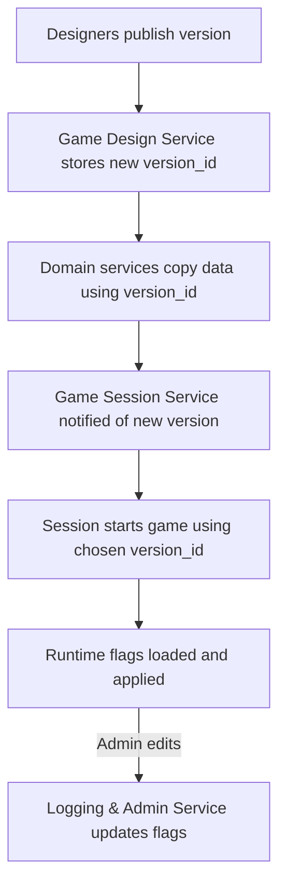

# 📑 FireMUD System Architecture: Versioning & Runtime Configuration

This document explains how game data is versioned and activated at runtime. It also shows where runtime feature flags live and how they are edited.

> For service ownership, see the [Service Responsibility Matrix](./service-responsibility-matrix.md). Multi-tenant storage details are covered in [Multi-Tenancy](./system-architecture-multi-tenancy.md).

---

## 🎮 Game Version Publishing

The **Game Design Service** stores the authoritative game configuration (world layouts, scripts, item templates, etc.). Designers iterate on this data and periodically **publish** a new version.

1. When a version is ready, creators trigger a **Publish** action in the Game Design Service.
2. The service writes a new `version_id` and associated records to its database.
3. Domain services (World Management, Entity Management, etc.) copy the relevant data into their own schemas using this `version_id`. Once copied, that data becomes read-only for the release so runtime services never pull directly from the design database.
4. A notification or message informs the Game Session Service that a new version exists.

Published versions are immutable; further changes require publishing a new `version_id`.

## 🚀 Version Activation & Rollback

The **Game Session Service** controls which published version is active for each live game instance. See the [User Journeys](./user-journeys.md#3-publish-and-start-a-game-instance) document for the high level flow.

- When starting a game, it reads the desired `version_id` from a manifest or launch request.
- Only one version is active per game instance. If an issue occurs, administrators can instruct the service to roll back by selecting a previous `version_id` and restarting the instance.
- All runtime services read their data using the active `version_id`, ensuring consistent rules during play.

## 🔧 Runtime Feature Flags

Runtime feature flags allow limited behavior changes without publishing a new design version. They are **defined in the Game Design Service** and copied into the **Game Session Service** (typically in a configuration table keyed by `tenantId`) when a version is published.

- Designers create and maintain the set of flag definitions in the Game Design Service.
- Administrators edit flag values through the [**Logging & Admin Service**](./microservices/logging-admin-service/README.md), which exposes management APIs and a web UI.
- The Game Session Service loads these flags during initialization and may re-check them periodically or in response to admin updates.
- Flags are separate from design-time configuration but still scoped by `version_id` to avoid mismatched behavior.
- During each tick cycle the active flags are applied before executing game logic; see [Tick System](./system-architecture-ticks.md) for details.

## 🗺️ Flow Summary

By decoupling published versions from runtime flags, FireMUD can rapidly iterate on new content while still allowing safe toggles for experimental features during live gameplay.

For API versioning conventions see [gRPC Protocol Guidelines](./system-architecture-grpc.md).
