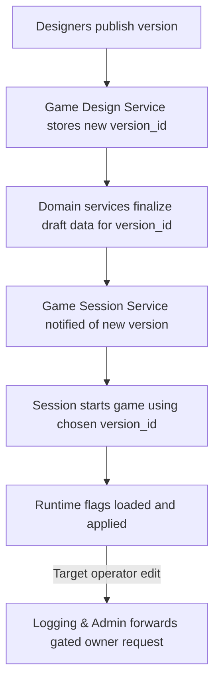

# FireMUD System Architecture: Versioning & Runtime Configuration

This document defines the target-state contract for versioned publishing, immutable release attestation, compatibility-checked activation, bounded replacement cutover, rollback, and runtime configuration. It also records current implementation status separately so target behavior is not mistaken for proof of implementation.

> For service ownership, see the [Service Responsibility Matrix](./service-responsibility-matrix.md). Multi-tenant storage details are covered in [Multi-Tenancy](./system-architecture-multi-tenancy.md).

---

## Normative Target Contract

FireMUD's target state treats versioned publishing, release attestation, runtime activation, replacement cutover, rollback, and runtime configuration as one fail-closed contract. The detailed sections below define the canonical owner boundaries and evidence requirements; the Implementation Status section records current gaps without changing those target rules.

## Implementation Status

The versioned publish and replacement-cutover substrate is partially implemented, including durable cutover preparation and execution records. The current admission-pointer writer performs a read-then-write version check and persists pointer, audit, and prepared-upgrade execution changes through separate repository calls; it does not yet prove the target single-transaction compare-and-set boundary described below. Current cutover implementation drift is also explicit: it clears active bindings rather than preserving them through the target bounded source-drain sequence of a persisted deadline, World Management lifecycle fence with confirmed command rejection, one bounded notice attempt after that fence, unconditional socket closure, and terminal `InstanceTermination` workflow. Notice failure never keeps source sockets open or delays termination. Exact Game Session effective-bundle propagation, tuple propagation, append-only rollout history, and final same-version old-epoch rejection are target-state only. Current Game Session persists a patch pin and exposes convergence reads, but the live handoff carries `scriptPatchVersion` (and publication-link reads may enrich it with `baseVersionId`) rather than an authoritative `{baseVersionId, scriptPatchVersion}` pin binding or `scriptPinEpoch`, so it cannot reject a different-base or same-version older-epoch work item today; append-only request-idempotent Game Session history and direct history reads are also not yet implemented or proved, while Automation's rollout rows/events remain synthetic, non-authoritative projections. The target sections that follow are normative design, not proof that the current runtime already satisfies those effects.

Historical Game Design migration status is also unresolved: `V5__update_version_table.sql` dropped the legacy `version.revision_ids` relationship, and `V17__revision_version_scope.sql` later assigned each tenant's revisions to its latest version. The current lineage therefore cannot prove immutable revision/version history. This is a retained-data deployment blocker: an affected deployment must first record either a verified no-data boundary or an explicit retained-row disposition/mapping, with exact readback and revision/version lineage evidence. No recovery is implied for already-dropped arrays; future migration/proof remediation remains required, and this status does not invent a replacement lineage design.

The runtime feature-flag operator path is also partial: Logging & Admin has no separate live admin UI or forwarding path for this operation. Its `/feature-flags/toggle` ingress fails closed with `503 Service Unavailable`, and its internal toggle entrypoint returns application-level `UNAVAILABLE` without dispatch. Game Session remains the owner of the internal runtime operation; this does not establish supported external operator forwarding.

Asset tombstoning is also partially implemented: live `VersionAssetArtifactServiceImpl` accepts only `FAILED` and `PURGE_FAILED` for `TombstoneVersionAssets`, so the target eligible-retired `PUBLISHED -> TOMBSTONED` transition remains an implementation gap. Current runbooks must fail closed for that path while preserving `PURGE_FAILED` retry/resume semantics.

The failed-candidate purge exception is target-only as well: Game Design must durably record abandonment through the owner-local idempotent `AbandonFailedVersionAssets` operation, bound to the caller tenant, `FAILED` version/artifact epochs, and a stable request identity/digest, before `FAILED -> TOMBSTONED`. The current implementation has no abandonment record or operation and does not enforce that proof.

The destructive asset lifecycle also remains target-only for operation durability: `TombstoneVersionAssets`, `BeginPurgeVersionAssets`, `FinalizePurgeVersionAssets`, and `RepairPublishedVersionAssets` must share the ADR 0048 owner-local operation envelope and result ledger (caller-stable operation/workflow identity, canonical `mutationDigest/v1`, exact replay, and `IDEMPOTENCY_CONFLICT` for changed input). The current first slice has no such shared ledger/digest contract, and `BeginPurgeVersionAssets` still mints a random workflow identity server-side. In addition, both artifact and Version lifecycle saves lack database epoch predicates and affected-row CAS proof, so `expectedVersionStateEpoch` cannot yet establish durable abandonment/retirement invalidation.

The live `CompareAndSetVersionState` path has a separate transition-safety gap: it checks the expected epoch in service memory but accepts any non-null lifecycle enum and saves it without enforcing legal transitions, requiring a committed release bundle/artifact for `DRAFT -> PUBLISHED`, or applying retirement predicates for active instances, templates, and in-flight activation. It must not be treated as an activation- or retirement-safe authority until those guards and focused proof exist.

Post-bundle publish failure is likewise unresolved: target reconciliation must read back whether `published_release_bundle` committed and must never delete Version as compensation. The current catch path still attempts that delete; the bundle's non-cascading foreign key can make it fail after commit. Focused proof must cover committed-bundle, absent-bundle, and ambiguous readback outcomes.

Purge failure status is also not durable in the current implementation: `FinalizePurgeVersionAssets` saves `PURGE_FAILED`/failed-workflow markers and then rethrows from an `@Transactional` method, so rollback can discard those markers after object deletion. The resulting durable row may remain `PURGE_IN_PROGRESS` without resumable evidence. Target recovery requires an independent durable failure/reconciliation boundary (or equivalent non-rollback record) and focused deletion/post-delete-save failure proof.

Asset repair has a separate current ordering gap: `AssetExportServiceImpl` writes the version-prefix objects and manifest before `VersionAssetArtifactServiceImpl` compares the result with the release attestation, so a mismatch may mutate live prefix keys before failing. After process loss, `PUBLISHED`/`ACTIVE` repair fails closed when the process-local selection is unavailable, but a `RETIRED` Version can currently fall through to a fresh tenant-wide selection; that drift is not exact repair proof. Pre-write away-from-published verification and durable version-scoped selection remain target-only.

Capacity admission is also target-state only. Account's `CommitTenantCapacityAdmission` RPC and both caller integrations (Game Session and World Management) are unimplemented, as are the durable Account authority/usage ledger, the exact `capacityDelta` wire contract, the capacity-admission action-family schema and cross-language `mutationDigest/v1` golden vectors, and the reservation create/finalize/release/reconciliation lifecycle. The capacity-admission sections below are normative contracts and must not be read as evidence that these RPC, caller, ledger, schema/vector, or reservation components exist.

The live Account runtime does not yet produce the complete authority evidence required by recovery and capacity-admission consumers. `roles`, `membershipAuthorityGeneration`, `authorityTuple`, and `outboxCheckpoints` remain target-state fields until Account exposes them together from one authoritative snapshot; these flows must not infer or synthesize them from the current partial response. See [Account Runtime and Data](./microservices/account-service/runtime-and-data.md#implementation-status) for the owning implementation status.

---

## Game Version Publishing

The **Game Design Service** manages version metadata and publish workflows for game configuration (world layouts, scripts, item templates, etc.). Domain services (World Management, Entity Management, Game Logic, and others) store the actual versioned domain data for each `tenantId`.

Game Design owns publication coordination, release descriptors, final release attestation, and asset lifecycle decisions. Domain owners retain authority for their participant data and participant digests; Platform Operations owns storage infrastructure and delivery evidence. Runtime architecture owns the resolved tuple and admission predicate. These ownership links implement [ADR 0093](./decisions/adr-0093-game-design-coordinated-digest-attested-content-publication.md) and [ADR 0094](./decisions/adr-0094-explicit-cohesive-runtime-release-tuples.md) without duplicating their rationale in each participant document.

1. When a version is ready, creators trigger a **Publish** action in the Game Design Service using the `PublishVersion` gRPC method.
2. The service writes a new `version_id` and associated records to its database, linking the version to each tenant and recording notes and base versions.
3. During authoring, the Game Design Service applies revisions incrementally to **Draft** template rows hosted by the owning domain services via idempotent design APIs keyed by `(tenantId, versionId)`. At publish time, the durable `publish` workflow coordinates all domain services so they validate and finalize their existing Draft data for the given `tenantId` and `version_id`, returning their required digests and proofs. Participant-local finalized or Published markers do not make the release launchable; no separate design database is copied into the domain services because they already host the versioned graphs for their domains.
   - Publish-time participant selection, digest comparison, control-plane digest semantics, procedural-generation identity, and the WMS owner-local publication freeze are canonical in [Game Design version control](./microservices/game-design-service/version-control.md#design-time-synchronization). This document retains the consumer consequence: missing, mismatched, or unsupported participant or freeze proof fails publication and leaves the version non-launchable.
4. Game Design’s asset candidate construction, actual-byte digesting, content-addressed exposure, and artifact lifecycle are canonical in [Asset Storage Setup](./microservices/game-design-service/asset-storage.md#asset-lifecycle-and-publish-workflow). All required asset proofs must complete before release attestation; failed, private, or unattested candidates cannot be activated or used as runtime fallback. An irrecoverable publish failure marks the version as **Failed** and records the asset artifact as `FAILED`. Moving failed artifact bytes to `TOMBSTONED` remains a separate explicit abandonment/quarantine action rather than an automatic publish-failure transition.
5. After participant digests/proofs and required asset proofs are complete, Game Design durably writes the immutable `published_release_bundle` attestation and only then transitions its version metadata to `Published`. Participant-local finalized or Published state alone is never launchable. Game Design owns the attestation and exposes it through `GetPublishedReleaseBundle(tenantId, versionId)`; the writer, persistence shape, and attestation schema are canonical in [Game Design version control](./microservices/game-design-service/version-control.md#design-time-synchronization) and [Asset Storage Setup](./microservices/game-design-service/asset-storage.md#asset-lifecycle-and-publish-workflow), and runtime/control-plane consumers must not read attestation tables directly.
   - `NOT_FOUND` means the version is not release-attested and must be treated as non-launchable.
   - `SCHEMA_VERSION_UNSUPPORTED` means the caller cannot safely interpret the attestation and must fail closed.
   - A publish workflow that has not yet written `published_release_bundle` is not partially launchable; callers must treat it the same as any other non-attested version.
   - Activation, cutover preflight, and repair workflows must use a fresh attestation read; cached/stale attestation payloads are not sufficient for admission decisions.
   - Ordinary repair tooling must not mutate the attestation payload for a Published/Active release. If exact-bytes repair cannot reproduce the attested bundle, recovery requires a new `versionId` or a separately defined re-attestation workflow with its own audit and approval contract.

   The current Game Design launch and published-release protobuf contracts expose `version_id` as `int64`, so the illustrative `versionId` values below are numeric. UUID-shaped version identifiers are target-state examples only and must not be substituted into current-contract payloads until the transport fields migrate together.

   Illustrative attestation payload:

```json
{
  "tenantId": "11111111-1111-4111-8111-111111111111",
  "versionId": 42,
  "commitId": "c-9001",
  "abilitySchemaDigest": "sha256:aaaaaaaaaaaaaaaaaaaaaaaaaaaaaaaaaaaaaaaaaaaaaaaaaaaaaaaaaaaaaaaa",
  "publishWorkflowId": "pub-42",
  "publishedAt": "2026-03-13T10:00:00Z",
  "participantDigests": [
    {
      "serviceName": "WORLD",
      "appliedCommitId": "c-9001",
      "contentDigest": "sha256:1111111111111111111111111111111111111111111111111111111111111111",
      "digestSchemaVersion": 3
    },
    {
      "serviceName": "ENTITY",
      "appliedCommitId": "c-9001",
      "contentDigest": "sha256:2222222222222222222222222222222222222222222222222222222222222222",
      "digestSchemaVersion": 2
    },
    {
      "serviceName": "GAME_LOGIC",
      "appliedCommitId": "c-9001",
      "contentDigest": "sha256:6666666666666666666666666666666666666666666666666666666666666666",
      "digestSchemaVersion": 1
    }
  ],
  "artifactDigests": [
    {
      "usageKey": "world.navmesh",
      "artifactKind": "NAVMESH",
      "immutableObjectKey": "artifacts/sha256/33/3333333333333333333333333333333333333333333333333333333333333333",
      "contentDigest": "sha256:3333333333333333333333333333333333333333333333333333333333333333",
      "contentType": "application/vnd.firemud.navmesh+binary",
      "artifactSchemaVersion": 1
    },
    {
      "usageKey": "world.pathGraph",
      "artifactKind": "PATH_GRAPH",
      "immutableObjectKey": "artifacts/sha256/44/4444444444444444444444444444444444444444444444444444444444444444",
      "contentDigest": "sha256:4444444444444444444444444444444444444444444444444444444444444444",
      "contentType": "application/vnd.firemud.path-graph+binary",
      "artifactSchemaVersion": 1
    }
  ],
  "manifestHash": "sha256:5555555555555555555555555555555555555555555555555555555555555555",
  "manifestSchemaVersion": 1,
  "requiredManifestAssetKeys": ["world.navmesh", "world.pathGraph"],
  "generationConfigRevision": "genrev-42a1",
  "attestationSchemaVersion": 1
}
```

In the target contract, `published_release_bundle.artifactDigests[] { usageKey, immutableObjectKey, contentDigest, ... }` is authoritative for the mandatory actual-byte digest of every exported binary or derived artifact. `manifestHash` attests the canonical manifest bytes containing the same usage-key, immutable-object-key, and content-digest bindings. `requiredManifestAssetKeys[]` declares requiredness; each listed key must select exactly one matching `artifactDigests[]` entry and exactly one matching manifest entry. Callers should not expect a separate ad hoc top-level artifact-path field outside that canonical bundle shape.

Illustrative attestation payload for a release with no derived world artifacts:

```json
{
  "tenantId": "11111111-1111-4111-8111-111111111111",
  "versionId": 43,
  "commitId": "c-9002",
  "abilitySchemaDigest": "sha256:bbbbbbbbbbbbbbbbbbbbbbbbbbbbbbbbbbbbbbbbbbbbbbbbbbbbbbbbbbbbbbbb",
  "publishWorkflowId": "pub-43",
  "publishedAt": "2026-03-13T11:00:00Z",
  "participantDigests": [
    {
      "serviceName": "WORLD",
      "appliedCommitId": "c-9002",
      "contentDigest": "sha256:6666666666666666666666666666666666666666666666666666666666666666",
      "digestSchemaVersion": 3
    },
    {
      "serviceName": "GAME_LOGIC",
      "appliedCommitId": "c-9002",
      "contentDigest": "sha256:8888888888888888888888888888888888888888888888888888888888888888",
      "digestSchemaVersion": 1
    }
  ],
  "artifactDigests": [],
  "manifestHash": "sha256:7777777777777777777777777777777777777777777777777777777777777777",
  "manifestSchemaVersion": 1,
  "requiredManifestAssetKeys": [],
  "generationConfigRevision": "genrev-43b2",
  "attestationSchemaVersion": 1
}
```

1. A notification or message informs the Game Session Service that a new version exists so game instances can be started or patched against it.

Published versions are immutable; further changes require publishing a new `version_id`. Services may keep additional draft or experimental versions internally, but only Published versions are eligible to be activated for live game instances.

### Ownership

Ownership is split between the Game Design Service and domain services:

- The Game Design Service is the canonical store for:
  - Version metadata and lifecycle (`Draft`, `Published`, `Active`, `Retired`, `Failed`).
  - Branches, commits, revisions, and their relationships to domain objects.
  - References from revisions/versions to assets, scripts, and templates via stable identifiers.
- Domain services such as World Management, Entity Management, Game Logic, and others are the canonical stores for:
  - Versioned template/config graphs and snapshots read by `(tenantId, versionId)` for the selected runtime version (world topology, entity templates, balance records, etc.).
  - Durable playable state keyed by `(tenantId, playableStateNamespaceId)` plus the applicable owning-domain object identity, and explicit S3 instance-scoped runtime state keyed by `(tenantId, gameInstanceId)`, as defined by [ADR 0122](./decisions/adr-0122-stable-playable-state-namespaces-for-runtime-replacement.md). `playableStateScope` remains immutable server-derived policy/routing/authorization evidence carried and validated with the namespace and active instance; it is not a durable-key or uniqueness dimension.

Domain services must not persist their own commit histories; they expose only the current and historical template snapshots keyed by `(tenantId, versionId)`. Game Design Service must not maintain a second, divergent copy of world or entity template graphs; it references domain templates via stable IDs and version metadata.

### Version Lifecycle

Game versions go through a simple lifecycle:

- **Draft** – revisions are still being edited; the version cannot be activated.
- **Published** – the durable `publish` workflow has completed successfully (including asset export) and the version is available for use by game instances.
- **Active** – a specific Published version is recorded as the `runtime_version` for one or more entries in the `game_instances` table.
- **Failed** – a version whose durable `publish` workflow has failed in a way that leaves data incomplete or unusable. Failed versions are never eligible for activation until a repair/retry step transitions them back to Draft or Published.
- **Retired** (also referred to as “Archived” in some UIs) – the version is no longer eligible to be activated for new instances, and no `game_instances` reference it as `runtime_version`. For a published/release asset artifact, retirement is necessary but not sufficient for deletion: purge also requires Game Design reachability proof and CAS-guarded purge APIs. An explicitly abandoned failed candidate follows the separate failed-candidate eligibility path owned by [Asset Storage](./microservices/game-design-service/asset-storage.md#deletion-eligibility-authority), with caller-tenant `FAILED` authority and durable abandonment proof; it is not converted to `RETIRED` merely to enable purge.

Administrative tooling (for example via the Game Design Service or Logging & Admin Service) should:

- Prevent retiring a version while any `game_instances` still reference it.
- Prevent retiring a version while any activation workflow is in-flight for the same `(tenantId, versionId)` (for example world creation still in `PREPARING` state).
- Prevent retiring a version while any **game templates** still reference it as their underlying world/entity/script version; designers must migrate those templates to a successor version before retirement.
- Ensure the `game_manifest` table and any launch manifests are updated when a version is retired so operators cannot accidentally start new instances against it.

Runbooks that remove published assets from the object store must validate that the corresponding version has already reached the **retired** state. Abandoned failed candidates use the separate failed-candidate eligibility path: Game Design first records the durable proof through `AbandonFailedVersionAssets(...)`, then requires caller-tenant `FAILED` authority and no release reachability; they must not be converted to `RETIRED` merely to enable purge. **Asset purge must be initiated through CAS-guarded control-plane operations** in one ordered authority flow: pre-tombstone `TombstoneVersionAssets(...)` performs the authority, abandonment, frozen-proof, and reachability checks and CAS transition; only after that transition, post-tombstone `CanDeleteVersionAssets(tenantId, versionId)` performs a read-only fail-closed recheck; `BeginPurgeVersionAssets(..., purgeWorkflowId)` performs the final atomic recheck and transitions `TOMBSTONED -> PURGE_IN_PROGRESS`; `FinalizePurgeVersionAssets` records retained terminal metadata after deletion. The current implementation is fail-closed on call ordering but incomplete in state coverage: `CanDeleteVersionAssets` rejects a call while the artifact remains pre-tombstone (including `FAILED`/`PUBLISHED`), whereas `TombstoneVersionAssets` accepts only `FAILED`/`PURGE_FAILED`, lacks the target authority checks, and cannot perform the eligible retired `PUBLISHED -> TOMBSTONED` transition. Each mutation uses the shared ADR 0048 operation envelope and caller-supplied workflow identity; operators must not run purge as a separate check plus manual delete sequence.

### Version State Ownership and CAS Authority

`versionState` and `versionStateEpoch` are control-plane metadata owned by the Game Design Service:

- Game Design persists version lifecycle state and epoch in its authoritative version tables.
- Other services may cache this metadata but must not mutate it directly.
- Logging & Admin and Game Session mutate lifecycle state only through Game Design control-plane APIs.

Required control-plane APIs:

- `GetVersionState(tenantId, versionId)` -> `{versionState, versionStateEpoch, updatedAt}`
- `CompareAndSetVersionState(tenantId, versionId, expectedVersionStateEpoch, newState, reason)` -> success/failure with current `{versionState, versionStateEpoch}`

`versionStateEpoch` increments on any lifecycle transition that can affect activation eligibility (for example `Published -> Retired`, `Failed -> Draft`, or admin policy transitions).

The target `CompareAndSetVersionState` contract requires a database epoch predicate and affected-row/lock proof, not only a service-memory comparison. The current `VersionService` checks the loaded epoch and then performs an unconditional row-ID save, so concurrent state writers can overwrite one another; this is an implementation gap that blocks treating `expectedVersionStateEpoch` as abandonment or purge invalidation evidence.

Normative CAS call flow for activation and rollback:

1. Game Session calls `GetVersionState` and stores `versionStateEpoch` in workflow state.
2. Pre-activation world setup runs under instance lifecycle fence (`PREPARING` only).
3. Game Session re-calls `GetVersionState` immediately before admission.
4. If state/epoch differs from the stored value, workflow fails closed and does not admit gameplay.
5. Admission can open only when state/epoch still match and world lifecycle transition succeeds.

### Template Mutability Rules

Published versions are immutable from the perspective of domain templates:

- The Game Design Service is the source of truth for version state (`Draft`, `Published`, `Active`, `Failed`, `Retired`).
- Domain services such as World Management and Entity Management expose **design APIs** that create or update template rows only for Draft versions keyed by `(tenantId, versionId)`. Authoring tools call these APIs incrementally as revisions are saved so Draft template graphs in domain services always reflect the latest committed design state for that version.
- Once a version reaches the Published state, template tables in domain services must treat rows for that `(tenantId, versionId)` as read-only. Any attempt to modify templates for a Published, Active, or Failed version should fail fast at the design API boundary and be surfaced as a validation error in the Game Design UI.
- Runtime gameplay flows (ticks, world-lifecycle workflows, etc.) never mutate template tables. They only read templates for the active `runtime_version`; writes use `(tenantId, playableStateNamespaceId)` plus the applicable owning-domain object identity for durable playable state, with `playableStateScope` carried and validated as server-derived policy/routing/authorization evidence, and `(tenantId, gameInstanceId)` only for explicitly instance-scoped runtime state.

At a high level, each `(tenantId, versionId)` template graph in a domain service follows this lifecycle:

- **Absent** – no rows exist for the version.
- **Draft** – design APIs have created or updated rows keyed by `(tenantId, versionId)`; additional revisions may continue to modify these templates.
- **Published** – the durable `publish` workflow has validated the Draft data and marked the version Published. Template rows are now immutable.
- **Active** – some game instances reference the version as `runtime_version`, but templates remain immutable.
- **Failed** – publish attempted but left the version in an unusable state; templates, if present, must not be used for new instances until the version is repaired.
- **Retired** – no `game_instances` reference the version and it is no longer eligible for activation; templates may be kept for historical inspection until migrations retire them.

This contract ensures that Published template graphs remain stable inputs for rollback and historical inspection. Structural changes to templates must always occur by creating a new Draft version, applying revisions, and publishing a new `version_id`.

### Script-Only Patch Versions

Minor fixes to NPC behavior or quest logic often only touch automation scripts.
To avoid a full world restart, the Game Design Service can publish a **script-only patch version** using the `PublishScriptPatchVersion` gRPC call.
These records include a `baseVersionId` pointing to the immutable data version
and a `scriptPatchVersion` value such as `v42-script.3`. Together they identify the effective published script artifact and its base-cohesion/cache context. This is Game Design publication metadata, not the instance runtime pin tuple; in the target state, Game Session pins the exact `scriptPatchVersion` and allocates `scriptPinEpoch` later when an instance pins the published patch, while validating the patch's `baseVersionId` against the instance runtime version:

```json
{
  "isScriptOnly": true,
  "baseVersionId": 42,
  "versionId": 43,
  "scriptPatchVersion": "v42-script.3"
}
```

Script-only versions appear in version history and audit logs but do not trigger a data copy or world restart.
Runtime services may reload the affected scripts in memory only as part of the explicit READY, compatibility, and pin rollout for a newly recorded immutable runtime pin tuple `{scriptPatchVersion, scriptPinEpoch}`; the separately validated `{baseVersionId, scriptPatchVersion}` artifact binding must match the instance runtime version, and services continue using the underlying `baseVersionId` for all other assets and templates. Any artifact or in-process cache used by that rollout must carry or be keyed by `{baseVersionId, scriptPatchVersion}` and must fail closed on a base-version mismatch. Script-only patches are **strictly limited to script definitions and related Automation & Scripting metadata**; any change that needs new or modified assets, world layouts, entity templates, or other non-script configuration must be delivered via a full `PublishVersion` flow that produces a new `versionId`.
When a patch is published the Game Design Service calls the [`NotifyScriptVersionUpdate`](./microservices/automation-scripting-service/README.md#notifyscriptversionupdate) gRPC endpoint in the Automation & Scripting Service so modified scripts can be reloaded in memory only as part of an explicit READY, compatibility, and pin rollout that records a new immutable runtime pin tuple for each affected instance. The running descriptor is not mutated and no latest patch or plugin alias is followed. **Target-state ownership:** Game Session owns the durable exact `{scriptPatchVersion, scriptPinEpoch}` for each running game instance and its append-only rollout history; `baseVersionId` remains separately validated artifact/base-cohesion context and is not an additional pin or Trigger Identity field. Automation is projection-only for that pin/history authority, while retaining durable ownership of compiled artifacts, version-scoped bindings, schedules, due state, firing claims, work items, handler/handoff records and evidence, and non-authoritative projections. **Current implementation:** Game Session persists a patch pin and exposes convergence reads, but the live pin/handoff does not durably carry the validated base-version binding or `scriptPinEpoch` end to end, and Game-Session-owned append-only history/direct history reads are not yet implemented or proved; Automation's rollout rows/events are synthetic, non-authoritative projections. Game Session owns command acceptance, execution lifecycle, `executionOutcome`, and `gameplayResult`. See [Scripting & Automation](./system-architecture-scripting.md) and [Scripting Contracts](./system-architecture-scripting-contracts.md) for the canonical details.

Patch selection must be explicit and pinned:

- **Target-state exact tuple enforcement:** Runtime must never implicitly select “latest READY patch” for an instance. The pinned exact `{scriptPatchVersion, scriptPinEpoch}` for a running `(tenantId, gameInstanceId)` is the only script identity that may be referenced by gameplay triggers; `baseVersionId` is separately validated as artifact/base-version cohesion context, and version-only, patch-only, different-base, or stale/local projections are not admission authority. The current handoff gap is recorded in Implementation Status above.
- Pin/rollback operations must enforce base-version cohesion: a patch can be pinned only when `patch.baseVersionId` matches the instance `runtime_version`/`runtimeVersionId`; mismatches must fail deterministically rather than auto-switching the instance base version.
- Plugin enablement and active `pluginVersionId` selection must also be explicit per `(tenantId, gameInstanceId)`; automation must not implicitly activate “latest” plugin versions for a running instance.
- Pin/rollback APIs are specified in `design/architecture/system-architecture-scripting-control-plane-api.md`, and their required control-plane events are specified in `design/architecture/system-architecture-scripting-control-plane-events.md`.
- Trigger Identity required fields (including `gameInstanceId` and when `regionEpoch` is required) are specified in `design/architecture/system-architecture-scripting-normative-contract-tables.md`.

### Cross-Asset Version Cohesion

Several kinds of design-time assets participate in a published game version:

- **Core templates and world data** owned by domain services such as World Management, Entity Management, and Game Logic.
- **Abilities and actions** owned by the Game Logic Service and authored via the Ability & Action tools.
- **Automation scripts and plugins** owned by the Automation & Scripting Service and authored via the scripting DSL and modding framework.

The versioning model treats a published `version_id` as the **cohesive bundle** of these assets for a tenant:

- For a given `(tenantId, versionId)`:
  - Template and ability schemas and identifiers are stable for the lifetime of that version.
  - Scripts and plugins may evolve through **script-only and plugin-only patch versions**, expressed as `scriptPatchVersion` and `pluginVersionId` values, as long as they remain compatible with the underlying templates and ability schemas.
- Script-only and plugin-only patches:
  - Are tied to a `baseVersionId` and do not change core world or ability data.
  - May be hot-reloaded for running game instances without changing the `runtime_version` only after the changed patch/plugin member is recorded in a new immutable runtime tuple and passes explicit READY, compatibility, and pin rollout gates. A running descriptor must not be mutated and runtime must not follow a latest patch or plugin alias.
  - Must not introduce dependencies on ability or template changes that require a new `version_id`; such changes should be delivered via a new game version publish.

Rollback behavior follows the same cohesion rules:

- Rolling back `runtime_version` for a game instance reverts templates and abilities to those for the selected `version_id`, and script/plugin patch selection follows the version/pinning rules in the scripting docs.
- Rolling back a script-only patch affects only automation behavior for the current `version_id`; it does not change templates or abilities. Game Session explicitly repins the exact target `{scriptPatchVersion, scriptPinEpoch}` after validating the target patch's `{baseVersionId, scriptPatchVersion}` artifact/base-version cohesion, and advances `scriptPinEpoch`; routine epoch-fenced rollback keeps ordinary gameplay ticks running while Automation admission is fenced. Rolling back a plugin-only version preserves the unchanged current Game Session `{scriptPatchVersion, scriptPinEpoch}` tuple and uses exact plugin provenance identity `(pluginId, pluginVersionId, bindingId)` plus the separate Automation-owned monotonic `(pluginActivationEpoch, lifecycleRevision)` execution-fence evidence for the affected instance; `lifecycleRevision` is a lifecycle cursor beside, not an extension of, plugin identity. Staged and replayed plugin effects must carry the plugin identity and captured activation-epoch/lifecycle-revision fences through final effect/replay, and displaced work must be rejected. Focused proof must show that plugin-only rollback commits exactly one next `pluginActivationEpoch` and corresponding `lifecycleRevision`, leaves `scriptPinEpoch` unchanged, propagates exact plugin provenance and captured epoch/revision through staged/final-effect and replay evidence, and rejects prior-epoch work at replay and final-effect fences; plugin-only rollback does not advance `scriptPinEpoch` unless the script pin changes in the same operation and does not create a Game Session-owned plugin epoch.

Tooling in the Game Design and Logging & Admin services should surface these relationships so creators and operators can see, for a given game instance, which `version_id`, `scriptPatchVersion`, and plugin versions are in effect. Admin APIs in the Game Design or Logging & Admin services should also support:

- Listing game templates that reference a given `versionId`, so that designers can migrate or delete them before retiring that version.
- Bulk migration operations that rewrite `GameTemplateDto.config` references from an old `versionId` to a successor `versionId` in a controlled, auditable way.
  - These operations must be driven by normalized dependency tables (for example `game_template_version_ref` and related reference rows), not by best-effort parsing of arbitrary JSON blobs.
  - When templates pin defaults such as `scriptPatchVersion`, migration tooling must update both the JSON payload and the normalized `game_template_script_patch_ref` rows atomically so instance creation does not observe mixed dependencies.

### Launch Descriptor Version-Resolution Rules

- A launchable game template resolves to exactly one base `versionId`.
- The resolved descriptor pins one complete legal runtime tuple: the base version, immutable published release bundle and manifest, selected `scriptPatchVersion` (if any), and each deterministically ordered enabled `(pluginId, pluginVersionId)` selection. A tuple is launchable only after the selected script patch proves compatibility and tenant readiness, each plugin proves immutable publication and compatibility, and the release attestation, required artifact set, and remap proof pass. Plugin runtime readiness, binding resolution, and current signer, component, and capability policy remain Automation activation/resume gates rather than launch-descriptor predicates. Post-launch `bindingId` is exact plugin provenance and contributes to the canonical stable handler-order identity used before `handlerSequence` assignment; it is retained in the full handler Trigger Identity and audit, but is not itself runtime ordering, deduplication, or replay authority. Assigned `handlerSequence` controls fan-out order, while the complete Command-Handoff Identity controls child deduplication and replay. It remains neither launch-descriptor identity nor execution-fence evidence. Automation-owned `pluginActivationEpoch` and captured `lifecycleRevision` are the separate post-launch runtime fences and are likewise not launch-descriptor identity. See the [Game Templates resolved launch descriptor](./microservices/game-design-service/game-templates.md#resolved-launch-descriptor) owner contract.
- `game_template_version_ref` is the canonical source for that base version; other normalized template references must agree with it.
- Mixed-version template bundles are invalid for launch and must be rejected during template validation and launch-descriptor resolution rather than interpreted heuristically at runtime.
- `scriptPatchVersion` is the only supported per-launch patch override and must reference the same `baseVersionId` as the resolved `versionId`.
- Friendly channels such as `production` and `preview` may resolve only at a new launch or rollout. The resolved concrete tuple is recorded before instance identity/admission; later alias movement cannot change an existing descriptor, restart, recovery, or rollback target. Changing any tuple member creates a new tuple.
- `ResolveLaunchDescriptor` is idempotent per `controlPlaneRequestId`: a retry with the same `(tenantId, gameTemplateId, controlPlaneRequestId)` and the same input fields must return the same descriptor values, and it must not re-resolve to a newer attestation, patch, or runtime default.
- A fresh launch attempt with a new `controlPlaneRequestId` may resolve against newer valid published state if the underlying template, attestation, or patch data has advanced.
- A retry that already failed with a deterministic business outcome (for example invalid template wiring, missing attestation, stale version-state epoch, or patch override conflict) must return the same failure result for that `controlPlaneRequestId`; callers must not expect retries on the same launch-attempt identity to “pick up” newer control-plane state.
- Caller-supplied runtime overrides are only honored when the template leaves the corresponding field unset. If the template already supplies a default, any caller-supplied value for that field is a deterministic launch-descriptor failure instead of being merged heuristically.
- The launch orchestrator must treat `versionStateEpoch` as part of preflight proof, not informational metadata. If attestation verification or downstream activation sees a different epoch before instance creation, launch fails closed before any persistent instance row or `PREPARING` world state is created. If epoch or release proof drifts after `PREPARING` exists but before admission, the workflow fails closed, invokes fenced `FailPreparedWorldInstance`, records terminal `FAILED_PRE_ACTIVATION`, and runs the canonical World Management Class A compensation/cleanup described in [World Creation Workflow](./microservices/world-management-service/world-creation-workflow.md). A fresh launch after that terminal outcome requires a new `controlPlaneRequestId` and new `gameInstanceId`; replaying the old `controlPlaneRequestId` retains its deterministic result and original instance mapping.
- World Management and Game Session may cache launch-descriptor values only as execution inputs for the current `controlPlaneRequestId`; they must not persist or reuse a descriptor as a rolling "latest launch defaults" record for later requests.
- `GetPublishedReleaseBundle(tenantId, versionId)` is the canonical release-attestation surface for launch, cutover, and repair. **Target contract:** it must expose:
  - `commitId`
  - `participantDigests[] { serviceName, appliedCommitId, contentDigest, digestSchemaVersion }`; every required participant must report the schema version used to canonicalize its digest
  - `abilitySchemaDigest` from the immutable Game Logic-owned ability-schema snapshot for this release; no aggregate participant `contentDigest` substitutes for it
  - `artifactDigests[] { usageKey, immutableObjectKey, contentDigest, ... }` for every exported binary or derived artifact
  - `manifestHash`
  - `manifestSchemaVersion`
  - `requiredManifestAssetKeys[]` for stable manifest usage keys that are mandatory for launch/cutover validation of that release
  - `generationConfigRevision`
- The current release-bundle schema omits the dedicated `abilitySchemaDigest`, target `commitId`, `manifestSchemaVersion`, and complete `artifactDigests[]`; plugin compatibility paths also incorrectly reuse the Automation & Scripting participant digest. Those current paths are implementation drift and do not prove the target release or ability-schema attestation.
- `artifactDigests[]` is authoritative for mandatory actual-byte object digests. `requiredManifestAssetKeys[]` is complementary: every required usage key must select exactly one bundle artifact digest and exactly one manifest entry whose `usageKey`, `immutableObjectKey`, and `contentDigest` are byte-for-byte equal.
- `manifestHash` attests the canonical manifest bytes containing those usage-key/object-key/digest bindings; it does not replace per-object byte verification.
- The contract intentionally does not introduce a separate top-level artifact-path reference field outside this attested bundle shape. Runtime consumers still discover artifact locations through the attested `manifest.json`, not through ad hoc object-store path reconstruction.

Compact normative proof fixture:

```json
{
  "bundleArtifactDigest": {
    "usageKey": "world.navmesh",
    "immutableObjectKey": "artifacts/sha256/33/3333333333333333333333333333333333333333333333333333333333333333",
    "contentDigest": "sha256:3333333333333333333333333333333333333333333333333333333333333333"
  },
  "manifestEntry": {
    "usageKey": "world.navmesh",
    "immutableObjectKey": "artifacts/sha256/33/3333333333333333333333333333333333333333333333333333333333333333",
    "contentDigest": "sha256:3333333333333333333333333333333333333333333333333333333333333333"
  },
  "deliveredBytesDigest": "sha256:3333333333333333333333333333333333333333333333333333333333333333",
  "manifestHash": "sha256:5555555555555555555555555555555555555555555555555555555555555555"
}
```

Game Design accepts this tuple at publication only when the canonical manifest bytes hash to `manifestHash`, the bundle and manifest key/object/digest bindings are equal, and the delivered or staged bytes hash to `contentDigest`. Runtime launch validates the same tuple again from the attested bundle, fetched canonical manifest, and delivered bytes; this fixture is a normative documentation example, not implementation proof.

Launch and cutover preflight use one fail-closed predicate for a full-version release:

- `GetVersionState(tenantId, versionId)` must return `Published` or `Active`, and its `versionStateEpoch` must match the epoch frozen into the resolved launch descriptor or prepared cutover proof.
- `GetPublishedReleaseBundle(tenantId, versionId)` must return a supported attestation for the same release identity, generation config revision, and complete per-participant digests `{serviceName, appliedCommitId, contentDigest, digestSchemaVersion}`, together with the `manifestHash` and authoritative `artifactDigests[]` used by the launch/cutover proof. The resolved launch descriptor and prepared cutover proof preserve those participant commit/digest/schema-version tuples; missing or unsupported participant schema evidence fails closed rather than being compared as an untyped hash.
- The release attestation must carry the dedicated Game Logic-owned `abilitySchemaDigest` and its participant `digestSchemaVersion`. Resolved launch descriptors and prepared cutover proofs must carry that same value; preflight and activation must compare it exactly with the Game Logic ability-schema evidence for the target commit. Missing, unsupported, stale, or mismatched ability-schema evidence fails closed; a participant `contentDigest` is never a substitute.
- `GetVersionAssetArtifactState(tenantId, versionId)` must return `artifactState=PUBLISHED`, the same `manifestHash` attested by the release bundle, and exported manifest asset keys containing every `requiredManifestAssetKeys[]` entry. Current first-slice `exportedVersionNumber` or version-prefix fields may remain available as diagnostic/audit metadata, but they are not release or launch authority.
- Preflight must verify the fetched canonical manifest bytes against `manifestHash`; for every required usage key, it must find exactly one bundle artifact digest and one manifest entry with equal `usageKey`, `immutableObjectKey`, and `contentDigest`, then hash the delivered object's actual bytes and require equality with that `contentDigest`.
- A full-version release is launchable only when `GetVersionState` returns `versionState=Published` or `versionState=Active` and `GetVersionAssetArtifactState` returns `artifactState=PUBLISHED`, with a supported attestation and matching release identity, state epoch, manifest/schema digest, dedicated ability-schema digest, attested immutable object/digest set, manifest bindings, required keys, and delivered-byte verification. Private `STAGED`, `EXPORTED_UNATTESTED`, `FAILED`, quarantined, purge, stale, missing, or mismatched candidates never become fallback content and never advance admission.
- If any proof is missing, unsupported, stale, or mismatched, launch/cutover fails before gameplay admission or admission-pointer swap. Callers must not fall back to reconstructing release truth from object-store paths, local template tables, cached descriptors, or partial publish workflow state.

Illustrative launch-descriptor examples:

- Fresh launch:
  - `ResolveLaunchDescriptor(tenantId=11111111-1111-4111-8111-111111111111, gameTemplateId=gt-default, controlPlaneRequestId=ld-req-1001)` resolves to exactly one numeric `versionId` (for example `42`) plus any explicit patch/defaults pinned to that same base version.
  - Repeating the same launch attempt with the same `controlPlaneRequestId` returns the same numeric `versionId`, `scriptPatchVersion`, and release attestation identity.
- Replacement-instance upgrade:
  - `ResolveLaunchDescriptor(tenantId=11111111-1111-4111-8111-111111111111, gameTemplateId=gt-default, controlPlaneRequestId=ld-req-2001, sourceVersionId=42, targetVersionId=43)` resolves to `versionId=43` only when template references, release attestation, and any required `remapSetId` all validate against the target version.
  - If `targetVersionId` would cause mixed-version dependencies or requires an unapproved remap, descriptor resolution fails before any instance rows are created.
- Mixed-version rejection:
  - If `game_template_world_ref` resolves to `versionId=42` while `game_template_entity_ref` resolves to `versionId=43`, `ResolveLaunchDescriptor` must fail validation instead of choosing one version heuristically.

Required preflight failure outcomes:

- `TEMPLATE_REFERENCE_PHASE_NOT_ENFORCED`
- `INVALID_TEMPLATE_CONFIGURATION`
- `SCRIPT_PATCH_OVERRIDE_CONFLICT`
- `SCRIPT_PATCH_NOT_READY`
- `RELEASE_BUNDLE_NOT_FOUND`
- `RELEASE_ATTESTATION_MISMATCH`
- `VERSION_STATE_EPOCH_STALE`
- `LAUNCH_REMAP_REQUIRED`

These are deterministic expected application outcomes. Launch preflight returns them as typed domain outcomes over a successful `OK` response. A request-level failure, including envelope/input-shape validation, authorization, a missing precondition, resource exhaustion, dependency unavailability, deadline/cancellation, or internal failure, uses canonical non-`OK` gRPC status only when it prevents launch preflight from producing its declared deterministic domain result. When preflight can produce one, the condition remains a typed expected application outcome over `OK`, including `RELEASE_BUNDLE_NOT_FOUND` and `SCRIPT_PATCH_NOT_READY`. The shared [gRPC outcome and transport classification](./system-architecture-grpc.md#outcome-and-transport-classification) owns that split; this document does not assign an individual transport mapping to each listed code.

Normalized-template dependency checks require explicit phase enforcement:

- Game Design exposes persisted cutover state via `GetTemplateReferencePhase(tenantId)` with values `BACKFILLING`, `VALIDATED`, `ENFORCED`.
- Game Session and retirement tooling must block dependency-sensitive operations unless the tenant phase is `ENFORCED`.
- Once `ENFORCED`, control-plane checks must not fall back to JSON parsing for dependency resolution.

### Replacement-Instance Upgrade Contract

Replacement-instance cutover is governed by [ADR 0122](./decisions/adr-0122-stable-playable-state-namespaces-for-runtime-replacement.md). That ADR owns the stable `playableStateNamespaceId`, exhaustive S1/S2/S3 classification, unknown-state fail-closed behavior, owner-validated mapping application, durable freshness-bound preflight, and fenced pointer swap. This document records only versioning-local consequences and orchestration:

- Game Session owns the pre-admission `PrepareVersionUpgrade` and `ValidateInstanceCutoverCompatibility` orchestration and the admission-pointer CAS; it does not become the state-family or mapping authority.
- Every durable instance-data owner registered by World Management's canonical owner registry publishes its owner-local family inventory and participant attestation through the lifecycle/replacement APIs; World Management coordinates the registry, while each registered service retains authority for its own persistence, classification, mapping application, and cleanup acknowledgement.
- A replacement receives a new `gameInstanceId` and keeps the realm's resolved `playableStateNamespaceId`; an intentional new isolated playable-state lifecycle (for example a new playtest or fork) receives a new namespace. The pointer, launch descriptor, source/target versions, namespace, approved mapping identity, participant results, and freshness evidence must agree at cutover.
- At target, preparation captures the exact World `PREPARING` state/epoch as the activation precondition. World alone performs the `PREPARING -> ACTIVE` lifecycle CAS; after that proof, World acquires one durable one-shot `cutoverHoldId`/`cutoverHoldFence` bound to the exact source/target lifecycle proofs and expected pointer version. The durable cutover execution/result records the exact resulting `ACTIVE` proof and hold identity, and the final admission-pointer CAS requires fresh World reads matching both. World finalizes the hold only after Game Session's authoritative post-swap readback proves the hold-bound local transaction.
- Current preparation and execution seams are partial: the first World validation slice reports only its initial explicit `S3` families and does not prove complete namespace, unknown-state, mapping-application, freshness, or lifecycle-proof obligations. The implementation tracker and owner docs retain those caveats.

### Schema Migrations vs Design Data

Published game versions are **design-data bundles** (world templates, entity templates, abilities/actions, scripts/plugins, and asset manifests) keyed by `versionId` and scoped to a `tenantId`. Database schema changes remain the responsibility of each microservice and are applied via Flyway when a service container restarts during a platform deployment. Publishing a new design version therefore does not run Flyway migrations—it finalizes versioned data already stored in domain services, exports version-scoped manifests/assets, and makes the new `versionId` eligible for activation. Script/plugin-only changes may avoid republishing unaffected design data and assets, but a running instance changes only through an explicit rollout to a new complete READY, compatibility-checked, pinned runtime tuple; the running descriptor must not be hot-reloaded or mutated, and runtime must not follow a latest alias. See
[Database Migrations](./system-architecture-database-migrations.md) for the
Flyway workflow.

### Non-Script Content Updates

Non-script content such as world layouts, item templates, and balance curves follow
a stricter lifecycle than scripts:

- Changes to these templates are always delivered via new versions (`version_id`)
  published by the Game Design Service. Domain services never apply in-place edits
  to template rows for Published or Active versions.
- Switching non-script content to a different `runtime_version` is a controlled
  **replacement-instance** operation managed by the Game Session Service.
  Instances do not hot-swap non-script templates mid-session; operators prepare
  a new `gameInstanceId` on the target version, perform an admission-pointer
  swap, then drain/terminate the old instance so all services use consistent
  data for each instance’s pinned version.
- Template identifiers and their semantics are stable within each version; a given
  template ID must not be repurposed to point at a different conceptual entity
  while any non-Retired version references it.
- Destructive changes to template schemas or semantics (for example removing an
  item archetype or reusing a template ID for a different purpose) are only
  allowed after all versions that depend on the previous behavior have entered
  the Retired state and migrations have followed the guidelines in
  [Database Migrations](./system-architecture-database-migrations.md).

For non-script content, there is no cross-version reuse of instance data. A given `gameInstanceId` is always tied to a single `runtime_version`, and all `*_instance` rows for that instance must be derivable from that version’s templates. Migrating a game to a different version is modeled as starting a new game instance with its own `gameInstanceId` (and fresh world creation workflow) rather than reusing existing world instance rows across versions.

Replacement-instance cutover requires the namespace-bound durable preflight and final revalidation defined by [ADR 0122](./decisions/adr-0122-stable-playable-state-namespaces-for-runtime-replacement.md). Game Session owns only the orchestration and pointer CAS. The durable prepared artifact, each final participant read, the pointer CAS/commit, and retries must bind the tenant, `playableStateNamespaceId`, exact source and target `gameInstanceId`/version pairs, every owner family with its classification, count, and unknown evidence, the exact state-family/owner-registry revision or complete owner-scoped catalog epochs used to enumerate those families, owner-validated and applied mapping state, and participant freshness epochs; that revision/epoch evidence must match at every revalidation boundary. Missing, stale, unavailable, unknown, or contradictory evidence is fail-closed; a prior compatible summary is not sufficient after source writes are fenced. The current `ValidateInstanceCutoverCompatibility`/`PrepareVersionUpgrade` slice remains partial and must not be read as proof of this complete contract.

## Version Activation & Rollback

The **Game Session Service** controls which published version is active for each live game instance. See [User Journeys – Publish and Start a Game Instance](../product/user-journeys/creators.md#4-publish-and-start-a-game-instance) for the high level flow.

- When starting a game, it reads the desired `version_id` from a manifest or launch request and stores this value as `runtime_version` in the `game_instances` table.
- The available versions a tenant can launch are listed in the `game_manifest`
  table managed by the Game Session Service.
- Only one version is active per game instance. If an issue occurs, administrators can instruct the service to roll back by preparing a replacement instance on a previous `version_id`, atomically swapping admission, and terminating the old instance.
- All runtime services read their data using the active `runtime_version`, ensuring consistent rules during play.

Activation and rollback must be guarded by a version-state compare-and-set token (for example `versionStateEpoch`) to avoid races with retirement or state transitions:

- At activation start, Game Session calls `GetVersionState(tenantId, versionId)` and records the returned epoch in the activation workflow.
- Before committing activation (or rollback) and admitting gameplay, Game Session re-validates the same epoch.
- If the epoch changed (for example due to retirement or admin state edits), activation fails with no admission and requires a new explicit operator action.

Activation workflows must also respect per-instance lifecycle fencing in World Management so activation and termination cannot both commit for the same `gameInstanceId`. See [World Creation Workflow](./microservices/world-management-service/world-creation-workflow.md#activation-vs-termination-fencing).

### Instance Termination Handoff

Termination requires ordered handoff across runtime and domain owners:

1. Game Session marks the instance non-admissible/draining and blocks new admissions.
2. At the persisted source-drain deadline, Game Session requests that World Management acquire the source lifecycle fence, transition the source to `TERMINATING`, and confirm that new commands or other source work are rejected.
3. After World Management confirms that fence/rejection, Game Session makes one bounded notice attempt to affected source clients.
4. Game Session unconditionally closes the affected source sockets after that bounded notice attempt; notice failure or unavailability never keeps sockets open or extends the deadline.
5. Before invoking cleanup, World Management freezes the durable instance-data owner set for the cleanup attempt at its ownership-registry revision, then runs `InstanceTermination` against that snapshot with each participant performing its owner-local cleanup; Entity Management performs its own cleanup as one participant.
6. World Management commits `TERMINATED` only after every owner in that frozen snapshot confirms cleanup; Entity Management is one required owner, not the complete registry. See [ADR 0123](./decisions/adr-0123-database-authoritative-temporal-coordinated-world-lifecycle.md).
7. Game Session marks the `game_instances` runtime record terminated/stopped only after step 6.

If any step after step 1 fails, admission remains closed and the same termination workflow identity must retry until convergence.

### Tenant-Owned Runtime Lifecycle Authority

The canonical lifecycle authority is the authenticated `tenantAdmin` for the exact tenant. It covers launch and failed-launch cleanup, opening or closing admission, bounded drain, stop/restart, playtest creation/reset/expiry/retirement, script-patch pinning, replacement preparation/cutover, rollback, and ordinary realm or instance retirement. External operator lifecycle ingress must use the Logging & Admin Service's authenticated, durable-intent, audit, and digest-bound forwarding path. A separately accepted, route-registered bypass-safe allowlist could authorize another ingress only with an explicit security and replay contract; no implicit direct operator bypass exists. The lifecycle request carries the authenticated actor, exact tenant and target, reason when required, stable `requestId`, and owner workflow/state transition. `designer` publication does not grant runtime authority, and no role may infer tenant scope from a realm or instance identifier.

`platformAdmin` is a distinct audited break-glass path under [ADR 0139 (LIFE-01)](./decisions/adr-0139-tenant-owned-runtime-lifecycle-with-audited-break-glass.md) for force-close, suspension, drain, stop, cleanup, rollback, or other explicitly supported recovery. It requires a platform actor, exact target, bounded action, reason, audit record, and the same idempotent owner workflow; it is not tenant impersonation, membership, gameplay access, or a way to bypass integrity or readiness. Break-glass launch/cutover still uses the canonical preflight and cannot override a failed gate. Fine-grained delegated lifecycle roles are deferred; this contract does not add them. Internal owner APIs remain internal workload surfaces; they are not an alternative external operator ingress.

Capacity-creating operations fail closed unless the selected release and required patch/plugin/manifest/assets are published and attested, entitlement and billing authorize the exact operation, quota permits the requested capacity, the frozen version/source tuple passes compatibility and migration/remap checks, and every required runtime owner proves readiness under the same attempt. The same gates apply to `tenantAdmin` and break-glass. Closure, bounded drain, cleanup, billing-safe repair, and authorized audit remain reachable when a start or expansion gate fails; those operations reduce exposure or converge state and do not reopen gameplay or create capacity. Marketplace publication and public discovery are separate policy gates and neither grants lifecycle authority nor blocks an authorized private/playtest lifecycle by implication.

The current external tenant-admin lifecycle surfaces, complete gate composition, and break-glass audit proof are not implemented or end-to-end proved. Existing internal launch, stop, cutover, and termination hooks remain partial evidence only; this target contract does not change their status.

### Serving Entitlement And Shutdown Gates

The serving-entitlement gate is scoped only to capacity-creating activation/cutover and eligible non-expanding serving rollback/recovery. Game Session classifies the operation before any entitlement read. Non-serving closure and termination do not enter this gate and use the separate Account-authorized shutdown predicate below.

Account's membership and entitlement response, freshness, sequence, authority-bundle, and continuity semantics are canonical in [Account Runtime and Data](./microservices/account-service/runtime-and-data.md#membership-and-entitlement-authority). This document does not redefine those fields or freshness windows; it retains only the cutover consequences of consuming that authority.

The serving operation is classified before the read:

- **Capacity-creating activation/cutover** includes starting or creating an additional instance, scale-out, paid-feature activation, creating a playtest fork, or a replacement cutover that adds net capacity. It requires a fresh Account entitlement result that authorizes the operation and supplies enough plan-derived quota; general gameplay availability during `grace` is not sufficient.
- **Eligible non-expanding rollback/recovery** includes entitlement-preserving one-for-one replacement cutover and may use only the authoritative Account result and commitment for the same target, with either the exact previously accepted capacity shape or Account validation that every changed shape field has a non-expanding effective resource delta, plus positive proof that the current attempt does not expand usage. A numeric `capacityDelta=0` alone is never proof of non-expansion. Missing, unavailable, stale, regressed, future-dated, contradictory, or gapped Account evidence fails closed, and a new binding or realm target is strict new admission.
- **Non-serving planned closure/termination** is outside the serving-entitlement gate. It uses the separate Account-authorized `shutdownAllowed` predicate and the ordered Game Session/World Management termination handoff; it cannot reopen a realm, admit gameplay, create capacity, or bypass owner shutdown workflow.

### Capacity Delta Wire and Digest Contract

The target `CommitTenantCapacityAdmission` protobuf request declares `capacity_delta` as `optional int64`; its canonical JSON/proto-JSON spelling is `capacityDelta`, represented as a base-10 decimal string. Explicit protobuf presence is mandatory: generated `hasCapacityDelta()`/presence checks must be used, and a missing field, JSON `null`, wrapper message, or implicit scalar default is not the value zero. There is no accepted alternate field or numeric type. The signed wire type is intentional: negative values are representable for diagnostic rejection but are never valid capacity mutations. This is a target-state contract because the current Account proto does not expose this RPC.

The logical range is the non-negative signed-`int64` range `0 <= capacityDelta <= 9223372036854775807`, but presence and operation class are separate mandatory checks. An absent `capacityDelta` is always invalid; it must be rejected by Game Session and World Management before calling Account and again by Account before any commitment, reservation, usage mutation, or owner activation CAS. A present zero is valid only after the operation has been classified as eligible entitlement-preserving non-expanding recovery or one-for-one replacement and the complete Account evidence proves that classification; it reserves and changes no usage. A present positive value is valid only for a capacity-creating activation/cutover and must also be no greater than the operation's net requested capacity, available Account quota, and remaining plan entitlement. Account, Game Session, and World Management must apply these same absent/zero/positive rules, rather than relying on a generated getter, a local re-read, or the other caller's validation. Negative values, values outside the signed `int64` wire range, malformed decimal JSON spellings, and any parse or checked-arithmetic overflow are rejected before an Account commitment, reservation, usage mutation, or owner activation CAS. Account must perform checked addition and comparison for usage and quota; it must reject rather than wrap, saturate, narrow, or coerce through a floating-point type.

For the capacity action-family schema, `capacityDelta` is a declared member of the fixed-order `mutation` object in `capacity-admission/v1`. The protobuf varint is not hashed directly. Account, Game Session, and World Management decode the same `int64` value and feed the ADR 0047 `mutationDigest/v1` grammar the canonical ASCII decimal payload: `0` or `[1-9][0-9]*`, with no sign, leading zero, whitespace, decimal point, exponent, or alternate numeric type. In that grammar, an absent member is exactly `segment(utf8("capacityDelta")) + segment(utf8("absent")) + ascii("0") + segment(empty)`, while a present zero is `segment(utf8("capacityDelta")) + segment(utf8("number")) + ascii("1") + segment(utf8("0"))`; present positive values use the same `number`/`1` form with their canonical decimal payload. The field remains in its declared object position in every preimage; it is never omitted, reordered, defaulted, or represented as `null`.

The absent encoding exists only to produce a deterministic rejected digest vector; an absent request can never commit.

The capacity vector fixture is normative proof work for Account, Game Session, and World Management. It fixes every non-`capacityDelta` field in the published `capacity-admission/v1` schema, including the complete capacity shape used for non-expanding comparison, and publishes canonical preimage bytes plus the expected lowercase SHA-256 digest for `absent`, `present(0)`, a representative valid positive value such as `17`, and the boundary `present(9223372036854775807)`. It also publishes request candidates for `9223372036854775808`, signed negatives, malformed decimal spellings, signed-`int64`/JSON overflow, changed capacity-shape fields, and checked usage/quota addition overflow, with the expected rejection before commitment and no accepted mutation digest. Every implementation in Account and both callers must consume the same vectors and produce the same accepted/rejected result; until that schema/vector corpus and focused proof exist, capacity admission remains unsupported target state. Use the shared [validation and runtime-proof workflow](../developer-workflows/validation-and-runtime-proof.md) to select the focused proof and record fixture execution results in PR/CI or implementation-tracking evidence; it supplements these owner-local requirements and does not create an execution ledger.

The changed-capacity-shape candidates in this fixture represent expanding or unvalidated changes and therefore must reject before commitment. A changed shape with Account-authenticated proof of a non-expanding effective resource delta is covered by the eligible replacement rule and is not an unconditional rejection case.

#### Focused Capacity-Attempt Proof Obligations

- **Initial attempt:** prove that the first admission attempt for a stable outer `(tenantId, requestId, admissionId)` is allowed without a prior rearm CAS, while Account binds its fresh `admissionAttemptId`, exact complete payload, current `capacityRearmFence`, and `mutationDigest` in the initial commitment. An exact retry of those same bound fields must replay the stored result.
- **Authorized rearm/new attempt:** prove that only the permitted terminal `OWNER_EXECUTION/NOT_EXECUTED_AFTER_AUTHORIZATION` result and durable no-commit evidence can authorize one atomic rearm CAS that advances the fence and binds the fresh `admissionAttemptId`, exact payload, fence, and `mutationDigest`; the subsequent changed attempt must match all four values and preserve the existing reservation/usage identity.
- **Changed attempt without rearm:** prove that every subsequent attempt changing any bound field, including `admissionAttemptId`, payload, fence, or `mutationDigest`, is rejected as `IDEMPOTENCY_CONFLICT` before reservation, usage, activation, or routing mutation when no matching committed rearm exists. A local re-read, conditional read, or recheck is not sufficient authorization.

Immediately before the owner-specific final state commit, exactly one caller-policy alternative invokes the Account-owned `CommitTenantCapacityAdmission` contract: Game Session presents its own exact Game Session caller workload mTLS identity to Account with typed `PlayerExecutionContext` for player admission/pointer activation, or World Management presents its own exact World Management caller workload mTLS identity to Account with tenant/operation-bound instance-lifecycle context for instance-lifecycle activation and its owner lifecycle CAS. Account remains the receiving authority, and these alternatives do not share caller context or transfer activation ownership. In either case, the request carries stable outer `(tenantId, requestId, admissionId)`, a fresh per-attempt `admissionAttemptId`, the reservation's current monotonic `capacityRearmFence`, the exact complete Account-authenticated evidence bundle returned by evaluation, the operation's bounded `capacityDelta`, and a versioned `mutationDigest` over that attempt identity, fence, and complete payload. This digest uses exactly [ADR 0047's `mutationDigest/v1` byte grammar](./decisions/adr-0047-logging-admin-as-external-operator-write-ingress.md#canonical-external-ingress): SHA-256 over the published capacity-admission action-family schema pair and its fixed-order typed fields, with explicit absent/null encoding, canonical decimal and Unicode rules, bounded raw and normalized inputs, and shared cross-language golden vectors. The planned wire schema gives `capacityDelta` explicit presence; `CommitTenantCapacityAdmission` must reject an absent `capacityDelta` before commitment or usage mutation. Capacity-creating activation requires an explicitly present positive bounded delta, while non-expanding recovery requires an explicitly present zero delta; a digest-valid request with no bound capacity change is still invalid. `present(value=0)` is distinct from an absent field and must never be defaulted into the other. Both the present-zero and absent encodings require cross-language golden vectors. The capacity schema maps the complete outer `(tenantId, requestId, admissionId)` identity, per-attempt `admissionAttemptId`, current `capacityRearmFence`, Account evidence bundle, and `capacityDelta` into the grammar's scope, target, expected-version, mutation, and audit-reason positions. The bundle includes its version, exact snapshot identity, exact evaluation identity, all entitlement fields, the complete applicable `authorityTuple`, exact applicable `tenantBillingCutoff`, and complete `outboxCheckpoints[]`; the cutoff stream and sequence must equal its covered checkpoint, and no flat `tenantBillingSequence` tuple member is invented. Each accepted commitment binds that exact evidence identity and payload to the stable outer request tuple, per-attempt identity, rearm fence, and digest; a cached bundle from another snapshot or evaluation, or a recomputed digest over changed evidence, is not equivalent. Capacity-creating activation uses its positive bounded delta and may reserve/increment usage only after the final Account fence succeeds. Non-expanding recovery must call the same contract with `capacityDelta=0`; planned non-serving closure/termination never calls this capacity commitment and instead follows its separate Account-authorized ordered shutdown predicate. An exact retry with the same outer tuple, `admissionAttemptId`, rearm fence, complete evidence/payload, and `mutationDigest` replays the stored result; a changed field is an `IDEMPOTENCY_CONFLICT` before usage mutation. A new attempt is valid only when its fresh `admissionAttemptId`, exact payload, rearm fence, and digest are bound by a matching committed rearm CAS. Game Session binds the Account fence and evidence identity into its fenced player-admission or pointer-activation CAS; World Management binds the same Account fence and evidence identity into its owner lifecycle activation CAS. A local re-read, conditional read, or recheck is not a strict capacity guarantee. A stale, replaced, or concurrently invalidated Account commitment cannot authorize the state change. This Account commitment and final owner CAS are in addition to version-state, release-attestation, compatibility, lifecycle-fence, and routing-pointer proof; last-known-good never substitutes for those proofs. Same-binding player resumption additionally requires Account to validate current lifecycle, security, membership, and revocation authority and commit the ADR 0030 resume lease. If any required evidence is unavailable or unsafe, the realm remains closed or the previous pointer remains the sole admissible target.

When ADR 0048 permits a fresh-owner retry, it starts a new `admissionAttemptId` only from the original terminal `OWNER_EXECUTION/NOT_EXECUTED_AFTER_AUTHORIZATION` result and durable no-commit proof. `FENCE_REJECTED`, `ACCOUNT_AUTHORIZATION/AUTHORIZATION_PENDING`, `OWNER_EXECUTION/OWNER_EXECUTION_PENDING`, `COMMITTED`, `FAILED`, or any ambiguous result is not a rearm prerequisite; it remains read-only and non-replayable. Account performs the rearm as one atomic CAS over the existing outer request record and reservation: it compares the stable `(tenantId, requestId, admissionId)`, prior attempt identity and terminal evidence, current reservation state, current `capacityRearmFence`, exact authority tuple, and prior digest; then it advances `capacityRearmFence` monotonically, binds a fresh `admissionAttemptId`, fresh attempt payload and `mutationDigest`, and the current owner/fencing evidence in the same commit. The reservation identity, bounded capacity hold, and usage accounting remain unchanged; no second reservation, replacement hold, usage increment, or old-attempt replay is created. A stale recovery worker or owner cannot perform this CAS. The stable outer tuple remains the logical request and idempotency key, while the new attempt identity, rearm fence, exact payload, and digest are included in the Account commitment. Any new attempt ID not matching that committed rearm's fresh identity and exact payload/fence/digest is an `IDEMPOTENCY_CONFLICT`.

For a positive `capacityDelta`, the durable Account result includes the exact reservation identity, expiry, state, and payload digest. Runtime components may only collect and durably return read-only activation/routing CAS outcome and effect evidence against that reservation; evidence collection is not a reservation transition and cannot finalize, release, advance a fence, rearm an attempt, reopen admission, or mutate usage. The final selected-owner CAS must compare the reservation identity and current reservation fence and reject an expired, released, or fenced reservation, including any stale reservation claim fence, before changing state: Game Session performs this check for player admission/routing activation, while World Management performs it for instance-lifecycle activation. The selected owner must provide exact authoritative readback of its CAS result, owner fence, and resulting activation/routing or lifecycle state; missing, stale, contradictory, or ambiguous readback fails closed. A timeout, response loss, takeover, or ambiguous CAS result triggers bounded read-only evidence collection using the original outer `requestId`/`admissionId`, attempt identity, exact payload, and prior reservation fence; it never creates a replacement reservation. Only the Account-owned reservation-recovery worker, under its durable claim and current fence, may consume that evidence and perform a reservation finalization, release, monotonic fence advance, or rearm CAS. If positive runtime-commit evidence exists, that worker finalizes the existing reservation and usage exactly once. If durable no-commit evidence exists and the terminal `OWNER_EXECUTION/NOT_EXECUTED_AFTER_AUTHORIZATION` prerequisite is present, that worker must atomically advance the reservation's monotonic fence, bind the fresh attempt identity and digest from the rearm CAS above, and preserve the existing reservation identity and capacity hold for the current owner; it must not release the reservation before that rearm commit. For an Account-accepted commitment, `RELEASED` is permitted only after the durable terminal `OWNER_EXECUTION/NOT_EXECUTED_AFTER_AUTHORIZATION` result and durable no-accept/no-runtime-mutation proof are bound to the original outer tuple, attempt identity, exact payload, digest, reservation identity, and current fence. That proof must show that owner execution did not accept the attempt and that the selected owner (Game Session activation/routing or World Management lifecycle activation) did not mutate its authoritative state, with exact readback of that non-commit. Account acceptance is established by the matching durable commitment; it must not be contradicted or replaced by Account-no-accept evidence. For a request rejected before Account accepted a commitment, release additionally requires durable Account no-accept evidence. In either case, the Account worker must durably advance the reservation's monotonic fence before releasing it; the release CAS and `RELEASED` state must be rejected for an expired or superseded fence. If evidence remains ambiguous, recovery leaves admission closed and the reservation fenced, records only the bounded retry/deadline, and does not release, finalize, rearm, or start another attempt. Account commitments therefore cannot remain reserved indefinitely or diverge silently from the runtime pointer. Identical retries of the same attempt replay the stored reservation, finalization, release, or rearm result; a changed authority tuple, `capacityDelta`, mutation digest, attempt identity, target, or other bound payload field is an `IDEMPOTENCY_CONFLICT` before usage or reservation mutation. A stale owner, stale reservation fence, or superseded recovery worker returns `FENCE_REJECTED` only with the same durable no-accept/no-runtime-mutation proof and cannot rearm. A `capacityDelta=0` commitment uses the same outer identity, attempt, expiry, reconciliation, rearm, and replay rules but reserves or releases no usage.

For the target recovery contract, a stale owner or fence returns canonical `FENCE_REJECTED` with reason `STALE_OWNER` or `STALE_FENCE`, carrying the original outer request identity, attempt identity, exact digest, observed owner/fence, and durable no-accept/no-runtime-mutation proof that owner execution did not accept the request and the selected owner (Game Session activation/routing or World Management lifecycle activation) did not mutate its authoritative state, with exact readback proving that non-commit. For an attempt rejected before Account accepted the capacity commitment, that proof must also include durable Account no-accept evidence. `FENCE_REJECTED` is non-rearmable and permits only read-only evidence collection. If Account accepted the capacity commitment before the selected owner or fence became stale, the operation remains `OWNER_EXECUTION/OWNER_EXECUTION_PENDING` and indeterminate under its original outer request tuple, attempt identity, exact payload, reservation identity, and digest; it cannot be released or rewritten as `FENCE_REJECTED` while pending, and ownership loss cannot allocate a replacement reservation. Read-only reconciliation may return positive runtime-commit proof or durable no-commit proof, but it cannot finalize the commitment, release the reservation, advance the fence, or rearm. Only the Account-owned reservation-recovery worker may durably transition the original operation to terminal `OWNER_EXECUTION/NOT_EXECUTED_AFTER_AUTHORIZATION`, finalize it from positive commit evidence, and then release the existing reservation through its idempotent fenced reconciliation CAS. Retry against the current owner with the same external request tuple is allowed only after that Account worker durably transitions the original operation to terminal `OWNER_EXECUTION/NOT_EXECUTED_AFTER_AUTHORIZATION`, atomically advances the existing reservation fence, and binds a fresh owner attempt identity and digest under ADR 0048. That retry creates a new Account commitment attempt bound to the fresh attempt identity and digest, preserves the existing reservation, and never replays the old terminal result or allocates a duplicate reservation. Exact retries of the same attempt replay the stored result. A fresh attempt identity is accepted only when it matches the committed rearm's exact payload, reservation fence, and digest; without that matching committed rearm, any changed outer identity, authority tuple, reservation identity, payload, attempt identity, or digest returns `IDEMPOTENCY_CONFLICT`. A stale owner, stale reservation fence, or superseded worker returns `FENCE_REJECTED` only with the durable no-accept/no-runtime-mutation proof and cannot rearm. Timeouts, missing or inconsistent evidence, response loss after acceptance, and all other outcomes are ambiguous and require read-only evidence collection of the original request before any replay. A `capacityDelta=0` retry still preserves the outer request tuple and existing reservation semantics and must use the fresh attempt identity and matching attempt digest.

The owner-execution state transition is strict: once Account accepts a capacity commitment, the durable result remains `OWNER_EXECUTION/OWNER_EXECUTION_PENDING` until positive runtime-commit evidence produces `COMMITTED` or durable no-commit evidence produces `NOT_EXECUTED_AFTER_AUTHORIZATION`. An accepted commitment cannot become `FENCE_REJECTED`, be released, or be rearmed while it remains pending; ambiguous, missing, or inconsistent evidence keeps admission closed and the reservation fenced.

Runtime operations must enforce the realm-routing contract exposed to players: each player-addressable realm is `OPEN` on exactly one gameplay-admissible instance or explicitly `CLOSED`, and control-plane workflows must not create ambiguity about which instance is admissible for a given realm.

For capacity admission, an entitlement-preserving one-for-one replacement cutover uses `capacityDelta=0`; a positive `capacityDelta` is reserved only for net capacity creation. The zero value is valid only when the complete capacity shape is exactly equal to the prior accepted capacity-creating proof or Account has validated every changed shape field's effective resource delta as non-expanding. The initial admission attempt does not require a rearm. After that initial attempt, a changed `admissionAttemptId` is accepted only when it is the fresh identity bound by a matching committed rearm; every other changed attempt identity is an `IDEMPOTENCY_CONFLICT`.

When the bounded reconciliation deadline expires without durable positive runtime-commit evidence or durable no-accept/no-runtime-mutation evidence, the Account-owned reservation-recovery worker must durably escalate the original outer request within the same Account-owned recovery workflow, preserving a durable claim, retry budget, evidence history, and final-outcome record. Admission remains closed, the current reservation fence remains authoritative, and timeout, process death, local absence, or operator assertion cannot release the reservation, finalize an uncommitted attempt, advance `capacityRearmFence`, start a fresh/replacement attempt, or reopen the target. Account owns the escalation and reconciliation record; lock expiry does not transfer that authority. The Account-owned recovery continuation continues read-only evidence collection and records one durable authoritative outcome only when its proof permits it: `COMMITTED` from positive runtime-commit evidence, `RELEASED` from durable owner no-accept/no-runtime-mutation evidence (and, only for a request rejected before commitment, Account no-accept evidence), or terminal `QUARANTINED_REQUIRES_AUTHORITY_REMEDIATION` when neither fact can be established after the bounded recovery policy. `QUARANTINED_REQUIRES_AUTHORITY_REMEDIATION` is a durable reservation state, not an absence: the original reservation identity, complete capacity hold, outer tuple, attempt identity, payload digest, and current fence remain represented, and the hold remains excluded from available quota until resolution. No replacement reservation, owner retry, automatic expiry, or unilateral operator release is permitted. Only an audited Account-owned remediation transition fenced to that original tuple, attempt, digest, reservation identity, and current fence may resolve quarantine. It may transition only to `COMMITTED` when independent positive runtime-commit evidence is recorded, or to `RELEASED` when durable owner no-accept/no-runtime-mutation proof establishes that the owner did not accept the Account commitment or mutate authoritative runtime state; if Account did not accept the commitment, Account no-accept evidence is also required. Any missing, conflicting, or unavailable evidence leaves the reservation quarantined. The transition updates usage and available quota exactly once according to the selected terminal outcome and retains the evidence linking the resolution to the original reservation. Release, finalization of an uncommitted reservation, rearm, or replacement still requires the durable no-accept/no-runtime-mutation proof bound to the original tuple, attempt, digest, reservation, and current fence. A positively committed runtime may only finalize the original accepted workflow from its independent positive commit evidence; it is not a deadline-expiry cleanup or rearm proof.

### Realm Routing Contract For Player-Addressable Realms

Version cutover contract for a player-addressable realm:

1. Prepare the replacement instance as non-admissible (`PREPARING`/draining-safe) and run world creation to completion.
2. Run compatibility preflight for source instance -> target version, capture the target’s exact World `PREPARING` state/epoch, and fail closed on mismatch.
3. Persist a durable `PrepareVersionUpgrade` artifact for that cutover attempt, including the `PREPARING` activation precondition.
4. Re-run the final version and compatibility gates, then ask World to CAS the exact prepared `PREPARING` state/epoch to `ACTIVE`; persist World’s resulting exact `ACTIVE` state/epoch in the durable cutover execution/result.
5. After the target `ACTIVE` proof, have World acquire one durable one-shot `cutoverHoldId`/`cutoverHoldFence`, bound to the exact prepared request/digest, realm/namespace, source/target instance/version pairs, source/target `ACTIVE` epochs, and expected pointer version. World locks both lifecycle rows in stable order and rejects any conflicting nonterminal hold; termination CAS remains blocked while this hold is unresolved.
6. Reread World authority and require that same `ACTIVE` state/epoch and hold identity/fence, then perform one atomic `OPEN(source)` -> `OPEN(target)` realm-route swap with the hold, idempotent source-cleanup registration, prepared execution/result, audit, and drain fence in one Game Session owner-local transaction so the selected realm has exactly one target for new or renewed bindings at any instant. World’s hold/lifecycle CAS is separate authoritative World-owned state, sequenced and confirmed by exact readback; this is not a cross-service transaction. World finalizes the hold only after authoritative post-swap Game Session readback proves that transaction committed.
7. **Target-only bounded source drain:** in the same cutover commit, persist the source instance, a unique `sourceDrainId`, a deadline-armed source command-fence identity with `effectiveAt=sourceDrainDeadlineAt`, and absolute `sourceDrainDeadlineAt` resolved from `firemud.game-session.cutover-drain.duration-ms`. Keep the old instance closed to new/reconnected bindings while already connected source sessions may issue commands before that deadline. At or after the deadline, command handling rejects source commands from the persisted fence using the authoritative clock even if reconciliation lags; for zero duration, `effectiveAt` is the cutover commit and rejection is effective at commit. The drain reconciler records and reads back fence-activation and lifecycle effects, then World Management acquires the lifecycle fence and confirms that rejection before Game Session unconditionally makes one bounded update-notice attempt and closes the remaining source sockets before the standard `InstanceTermination` workflow. The notice attempt cannot hold sockets open indefinitely.
8. If swap fails, keep the previously routed instance as the sole admissible target for that realm and retry; do not open dual admission for the same realm. If hold or pointer evidence is lost, reconcile by the exact hold identity; abort is valid only with proof that the pointer transaction did not commit and the prior pointer remains authoritative, otherwise keep the hold `RECONCILIATION_REQUIRED` and termination-blocking. Hold expiry is diagnostic/repair input and never an automatic release.

Realm pointer schema and authority are canonical in [Multi-Tenancy](./system-architecture-multi-tenancy.md#realm-catalog-and-admission-pointer-contract). Versioning and runtime retains only the cutover lifecycle and its local consequences below. Game Session remains the sole routing owner; versioning workflows consume its API rather than direct table writes.

- A pointer swap to a different `gameInstanceId` is a cutover operation, not a generic edit. It must use the canonical `ExecutePreparedVersionCutover` operation, one durable `prepared_version_upgrade` record, and one World-owned one-shot cutover hold; `SetAdmissionPointer` is not an independent replacement commit path. The `COMPATIBLE` preparation binds the exact World `PREPARING` activation precondition plus the catalog-derived `{playableStateNamespaceId, playableStateScope}`, source and target instances/versions, frozen launch proof, exhaustive participant summary, owner-validated/applied mapping evidence, and freshness epochs required by [ADR 0122](./decisions/adr-0122-stable-playable-state-namespaces-for-runtime-replacement.md). That namespace/scope tuple is carried unchanged through the prepared artifact, participant evidence, hold, pointer CAS/readback, and exact retry result; any catalog or tuple mismatch fails closed. World’s activation CAS produces the exact target `ACTIVE` proof; subsequent stable-order hold acquisition rereads and validates the exact source and target `ACTIVE` proofs, then produces its `cutoverHoldId`/`cutoverHoldFence`, which are stored with the durable execution/result. The Game Session owner-local pointer transaction validates both lifecycle proofs, the hold identity/fence, and expected pointer version. Final pointer CAS/readback and exact retries require all of those proofs rather than accepting a later lifecycle epoch or minting another hold.
- Pointer-audit history must preserve that same preparation identity. A successful cutover write records the `preparedVersionUpgradeId` on the resulting admission-pointer audit event so operators can prove which durable preparation authorized a given swap.
- For private/playtest transitions, the applicable `playtestLifecycleId` is also part of the normalized `ExecutePreparedVersionCutover` request/digest and is carried unchanged through the prepared artifact, participant evidence/hold, pointer CAS/readback, durable execution/result, and exact replay; public-production transitions omit it. Any applicable lifecycle-ID mismatch fails closed.
- Stopping a realm without a replacement uses the owner-defined `CLOSED` state before the old instance drains; the owner-defined unavailable and realm-unavailable outcomes remain distinct.
- **Target-only bounded source-drain behavior:** pointer state controls new or renewed gameplay bindings. Existing connected source sessions do not re-read it per action and remain on the source only before the persisted drain deadline; fresh `PLAY` and reconnect use the current target.
- **Same-character target takeover:** fresh `PLAY` or reconnect for a character still bound on the source first uses the existing namespace/scope/character binding-generation CAS to fence further commands for that source binding and reconcile every already-admitted source effect to durable terminal or authoritative readback state. Only then may Game Session CAS-switch that character binding to the target and admit target commands. Other source characters may continue under the ordinary bounded drain; if exact reconciliation or CAS proof is unavailable, the target waits or fails closed. This is a local session-binding consequence and does not introduce another lease or change the ADR 0027 drain deadline.
- In the target-only drain contract, `firemud.game-session.cutover-drain.duration-ms` is an integer millisecond duration in the closed range `0..300000`, with a five-minute platform default and hard maximum. Tenant/game overrides may shorten it or set it to zero but cannot extend it. Negative, non-finite, fractional, or non-representable values fail closed before preparation or cutover commit. The cutover audit and prepared-upgrade execution record preserve the effective value, policy version, `sourceDrainId`, and `sourceDrainDeadlineAt` so retries and operators observe one deadline.
- In that target contract, Game Session may complete a drain early after the source session index is empty. Deadline-based command rejection follows the persisted fence and authoritative clock independently of reconciliation. The durable reconciliation contract below records and reads back the fence/lifecycle effects; in particular, World Management's lifecycle fence and command-rejection readback precede the bounded notice and unconditional source-socket close.
- **Local target consequence:** the source instance remains closed to new or reconnected bindings while existing sessions may continue only through `sourceDrainDeadlineAt`; after the deadline, terminal source cleanup follows the standard `InstanceTermination` workflow.

#### Bounded Source-Drain Reconciliation

Game Session owns the retryable reconciler and startup-recovery path for each durable source-drain item. A worker claims the item with a compare-and-set lease carrying a monotonically increasing `drainClaimFence`, bound to the exact `sourceDrainId` and source `gameInstanceId`. Only the current claim fence may persist effect state or completion. Lease expiry permits another worker to claim the item with a higher fence; a stale worker cannot commit after that handoff.

Each external effect uses a durable replay identity derived from `{sourceDrainId, sourceGameInstanceId, effectType}`. The effect types are cutover-hold finalization/readback, source command-fence deadline activation/readback, lifecycle fencing/readback, bounded notice delivery, socket closure, and `InstanceTermination`. The cutover transaction persists the source command-fence identity deadline-armed with `effectiveAt=sourceDrainDeadlineAt`; command handling evaluates that fence against the authoritative clock and rejects source commands at or after `effectiveAt`, immediately at commit when the drain duration is zero. The reconciler records and reads back the hold-finalization, fence-activation, and lifecycle effects, but its timely execution is not required for command rejection correctness. Game Session persists each effect's pending, applied, and confirmed/read-back state. A crash after an external effect but before local acknowledgement therefore retries with the same identity and reconciles authoritative readback rather than emitting an untracked duplicate.

At or after `sourceDrainDeadlineAt`, the current claimant performs the ordered sequence below:

1. Claim or renew the fenced drain item.
2. Record/read back the deadline activation of the persisted source command-fence identity, obtain authoritative post-swap Game Session readback proving the hold-bound local pointer transaction committed, request World Management's idempotent hold finalization and read it back authoritatively, then request World Management to acquire the source lifecycle fence and transition the source to `TERMINATING`; command handling already rejects source commands at or after the deadline from the fence and authoritative clock, and hold-finalization, lifecycle, and command-rejection readback must complete before notice.
3. Unconditionally attempt one bounded update notice using the notice replay identity and its own bounded timeout/reconciliation path.
4. Unconditionally close remaining source sockets after that bounded attempt completes, regardless of whether notice delivery succeeded, failed, or was unavailable; notice failure or unavailability cannot hold source sockets open indefinitely.
5. Reconcile the idempotent World Management `InstanceTermination` workflow until the standard [instance termination handoff](#instance-termination-handoff) confirms the source terminal.

The drain item remains durable until every required effect is confirmed and the persisted source lifecycle is terminal. A committed pointer, drain record, deadline-armed command fence, effect request, or expired lease is not by itself evidence that lifecycle, notice, socket-close, or termination effects occurred; command rejection is instead determined directly from the persisted fence and authoritative clock.

### Fork-Snapshot Boundary For Playtest Realms

ADR 0137 (TENANT-03) remains the complete playtest-state decision and contract. This section, together with [Multi-Tenancy's namespace/catalog contract](./system-architecture-multi-tenancy.md#realm-catalog-and-admission-pointer-contract) and the [Game Session pointer/orchestration contract](./microservices/game-session-service/api-contracts.md#world-lifecycle-and-admission-boundary), records only the versioning/runtime and linked service-local consequences; [ADR 0122](./decisions/adr-0122-stable-playable-state-namespaces-for-runtime-replacement.md) remains supporting decision rationale. A fork remains a tenant-owned, player-addressable realm whose `REALMS`/`CHARS` pre-selection lifecycle/namespace context is `{tenantId, worldSlug, realmSlug, playtestLifecycleId, playtestStateGeneration, playableStateNamespaceId, playableStateScope}` for private/playtest targets, with the lifecycle ID and generation omitted for public production; this context is not a complete admission proof. After Entity validates the selected account-to-character association, Game Session selection adds `characterId` for actor/controller binding. Complete runtime/admission evidence also retains `gameInstanceId`, `catalogRevision`, and `pointerVersion` as separate runtime/admission fences; `gameInstanceId` is the concrete runtime target and active-instance fence, while `playtestStateGeneration` remains distinct from `pointerVersion`. It does not create a tenant or account.

- Durable fork-local playable state is keyed by `(tenantId, playableStateNamespaceId)` plus the owning domain identity. Server-derived `playableStateScope` remains immutable policy/routing evidence evaluated with the active `gameInstanceId`, runtime version, and routing/admission context; it is not a durable-key or uniqueness dimension.
- Replacing the runtime within one playtest lifecycle retains its `playtestLifecycleId`, namespace, and positive `playtestStateGeneration`. A reset within that lifecycle retains the lifecycle ID but receives a fresh namespace and advances the generation; a new playtest lifecycle receives a fresh lifecycle ID, namespace, and initial positive generation. No reset or replacement may destructively reuse the old namespace, and the generation is never substituted for `pointerVersion`.
- The ADR 0137 contract defines the playtest-state boundary: Game Session owns preparation, admission, and reset orchestration, while each registered owner owns its local manifest, classification, and state consequences. A lifecycle explicitly selects exactly one initialization mode: `fresh` (empty isolated namespace plus only minimum build-required state), `seeded` (an explicit versioned seed/sample definition), or `snapshot` (an explicit source realm and scope). Snapshot scope is exactly `whole-realm` or `selected-roster`; selected-roster copies the complete dependency closure required for the selected accounts/characters, not only character rows. Owner-manifest schema, lifecycle-ID/generation propagation, selected-roster inclusion/redaction classification, one shared source snapshot fence, the exact common state-family/owner-registry revision or complete owner-scoped catalog epochs, mode-specific provenance, reset's owner-local old-generation write fencing, and aggregate `RECONCILIATION_REQUIRED` outcome are governed by ADR 0137; this section and those linked owner contracts record their versioning/runtime and service-local consequences. Preparation fails closed on missing, wrong-source/build, duplicate, stale, unclassified, changed-registry, or disagreeing evidence and remains non-admissible until all owners and target materialization converge.
- At this runtime boundary, a selected-roster owner manifest must classify each data family as necessary or not necessary, authorized or unauthorized for the selected scope, and `unredacted`, `redacted`, or `excluded`. Snapshot manifests all bind to one shared point-in-time `sourceSnapshotFence`; fresh manifests carry no fabricated source realm/instance/namespace identity, seeded manifests carry versioned seed provenance, and snapshot manifests carry source realm/instance/namespace/scope identity. These are required admission facts, not optional diagnostic fields.
- Reset is generation replacement: it retains the `playtestLifecycleId`, prepares a fresh namespace using the selected mode/scope, advances the positive `playtestStateGeneration`, validates the same owner-manifest and isolation rules, and performs owner-local write fencing, flush/drain, and durable outcome readback before Game Session performs the admission-pointer CAS. The pointer/readback, reset digest, owner fences, and final decision carry the exact lifecycle ID, generation, namespace, pointer fence/version, and exact common state-family/owner-registry revision or complete owner-scoped catalog epochs used for enumeration. Owner outcomes aggregate to `APPLIED`, `NOT_APPLIED`, or unknown; only an all-`APPLIED` aggregate permits the pointer move, while mixed, unknown, contradictory, or changed-registry evidence is `RECONCILIATION_REQUIRED` with admission closed. Each owner rejects writes carrying stale generation, owner-registry revision/epoch, or pointer-fence evidence throughout the transition; this is not a cross-owner atomic move. A pointer CAS failure after any `APPLIED` outcome requires authoritative namespace/cutover reconciliation under the linked Multi-Tenancy and Game Session contracts before the old generation can reopen. Failure before pointer movement leaves the old generation authoritative only when every required owner has a known, non-contradictory `NOT_APPLIED` outcome under the same registry revision/epochs; otherwise reconciliation keeps admission closed. Old-generation work is retired through the bounded lifecycle/retention workflow. Production credentials, sessions, token replay state, billing/entitlement authority, source moderation/audit history, and source incident records are never cloned as playtest authority. External effects are suppressed or redirected to explicit test sinks.
- Ordinary private/playtest version replacement keeps the applicable positive `playtestStateGeneration` unchanged and distinct from `pointerVersion`, and requires an exact match across `PrepareVersionUpgrade`, the prepared artifact and owner evidence, `ExecutePreparedVersionCutover`, pointer CAS/readback and the durable execution result, and exact retry/replay. Public-production replacement omits and rejects `playtestLifecycleId` and `playtestStateGeneration`; missing, changed, or mismatched private/playtest generation fails closed.
- Playtest runtime writes never merge automatically into production or another playtest. Promotion uses normal authored publication and production launch/cutover; no copied currency, items, progression, or world mutations are imported. A future narrow diagnostic export would be separately typed and non-authoritative.
- The complete playtest coordinator, owner-manifest protocol, reset, expiry automation, and end-to-end proof are not implemented. Existing namespace/routing and ordinary lifecycle seams are supporting boundaries only and do not prove any initialization mode, scope, completeness, reset, isolation, or no-merge invariant.

When entitlements transition to hard-cutoff states (`suspended` or `canceled`) after an instance is already running, runtime behavior is deterministic:

- New admissions are blocked immediately.
- Existing player gameplay sessions are revoked immediately.
- Running instances enter a bounded non-admissible drain phase (target: 5 minutes maximum) for cleanup, then stop.

After a hard entitlement cutoff, the complete operation-specific predicate is false for both capacity-creating activation/cutover and non-expanding rollback/recovery because hard denial, revocation, or unsafe billing-sequence evidence cannot pass the gate. Cleanup and bounded non-admissible drain may continue under the separate non-serving planned closure/termination class; it must remain Account-authorized and shutdown-contract bound, and does not wait for serving entitlement to become positive. No activation, cutover, rollback, recovery, or new admission may commit until a fresh safe Account result and the final precommit predicate succeed.

Because rollback relies on being able to reactivate previously published `version_id` values, schema migrations must be coordinated with versioned data. See the **Version-Aware Migration Guidelines** in [Database Migrations](./system-architecture-database-migrations.md) for constraints on dropping or reshaping columns that are still used by any published version.

Rollback class boundary for versioning flows:

- Publish/finalization and activation-prep run under **Class A** Saga rollback semantics (compensation allowed before activation).
- Once a version is active and runtime effects are being applied, mutations run under **Class B** runtime semantics (retry/reconcile with stable `EffectId`; no destructive cross-service rollback). See [Transaction Strategies](./system-architecture-transactions.md#rollback-boundaries-by-operation-class).

## Runtime Feature Flags

Runtime feature flags allow limited behavior changes without publishing a new design version. They are **defined in the Game Design Service** and copied into the **Game Session Service** when a version is published. The definitions table and copy steps manage this workflow.

- Designers create and maintain the set of flag definitions in the Game Design Service UI. Definitions are stored in a `runtime_flag` table for each tenant.
- **Target state:** Administrators toggle flag values through the target [**Logging & Admin Service**](./microservices/logging-admin-service/README.md) operator surface, which forwards a gated owner request to Game Session.
- The Game Session Service persists active flag values in its `feature_flag` table. Sessions use consistent configuration even after reconnects. In the target operator workflow, the Logging & Admin Service may store audit entries, but it is not the source of truth for runtime behavior.
- During each tick cycle the active flags are applied before executing game logic. See [Tick System](./system-architecture-ticks.md) for details.

## Flow Summary



By decoupling published versions from runtime flags, FireMUD can rapidly iterate on new content while still allowing safe toggles for experimental features during live gameplay.

For API versioning conventions see [gRPC Protocol Guidelines](./system-architecture-grpc.md).

## Related Documentation

- [Database Migrations](./system-architecture-database-migrations.md)
- [Game Customization](./system-architecture-game-customization.md)
- [Game Session Service](./microservices/game-session-service/README.md)
- [Service Responsibility Matrix](./service-responsibility-matrix.md)
- [System Architecture Overview](./system-architecture-overview.md)
- [Testing Strategy](./system-architecture-testing.md)
- [Transaction Strategies](./system-architecture-transactions.md)
