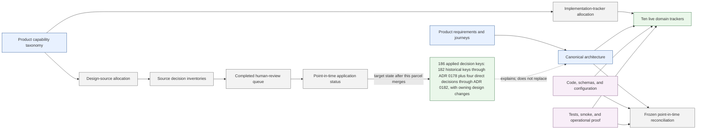

# Design Decision and Implementation Alignment

This workstream establishes a complete, reviewable chain from FireMUD product capabilities through canonical design decisions to implementation tracking and proof. Product documents define requirements and observable product behavior; architecture documents define technical contracts; ADRs explain consequential decisions; trackers record implementation and proof. This workstream remains non-normative.

## Status

Completed phases: capability allocation, implementation/proof reconciliation, cross-domain convergence, structural enforcement, independent validation of prior parcel states, human-led adversarial review of all `183` historical queue/navigation rows in the remotely backed review archive, selective import of all `182` historical decision keys, and integration of four direct post-archive human decisions with family-local contract consolidation. Packets 3-4 apply ADRs 0051-0130 plus the no-ADR TICK-05 outcome. Packet 5 applies all `21` reviewed outcomes through ADRs 0131-0150, including the superseded `SOCIAL-01` provenance. Packet 6 and Packet 7 complete the historical imports through ADRs 0151-0178. Direct decisions `COMMERCE-02`, `HOSTED-TERMS-01`, `HOSTED-TERMS-02`, and `OPS-07` apply through ADRs 0179-0182 without changing Packet 1-7 totals. The separately tracked service-scan `MS-AA-TOKEN-REVOCATION` row remains the only excluded navigation alias. The canonical registry contains `181` ADR records; `172` carry completed review metadata and `11` are pre-formal, with overlap where accepted legacy pre-formal records now carry exact provenance. ADR 0183 is a separately preserved pending proposal and is not counted as a reviewed or applied decision. Source-archive identifiers remain archive-local evidence and may collide numerically with canonical ADRs, so each integration preserves canonical repository numbering rather than importing source numbers.

| Phase | Status | Output |
| --- | --- | --- |
| Product capability taxonomy | Complete | [`capability-taxonomy.md`](../../product/capability-taxonomy.md) |
| Canonical design allocation | Complete and independently coverage-audited | [`design-capability-allocation.md`](./design-capability-allocation.md) |
| Consequential-decision inventory | Complete and independently coverage/fidelity-audited | [`consequential-decision-inventory.md`](./consequential-decision-inventory.md) |
| Implementation tracker reshaping | Complete | [Capability allocation](../implementation-tracking/capability-allocation.md) and ten permanent domain trackers |
| Code and proof reconciliation | Complete and independently validated | Per-capability implementation/verification states and evidence anchors in the domain trackers |
| Cross-domain convergence | Complete and independently validated as a point-in-time baseline | [Frozen capability implementation reconciliation](./capability-implementation-reconciliation.md) |
| Human-led adversarial decision review | Complete in the `design/adversarial-decision-review` source archive | Human-owned dispositions for all `183` queue/navigation rows |
| Accepted-decision application | Complete | All `182` historical decision keys plus the four direct post-archive decisions have checked applied provenance; the excluded `MS-AA-TOKEN-REVOCATION` navigation alias is not a distinct decision |
| Contract-authority consolidation | Baseline pass complete for ADRs 0001-0050 and major adjacent non-ADR families; Packets 3-7 are selectively applied through ADR 0178 and the direct post-archive decisions are integrated through ADR 0182; perform the planned whole-corpus authority review before declaring post-ADR design alignment complete | [Architecture contract authority map](../../architecture/README.md#contract-authority-map) and owner-link-plus-local-consequence conversions |

### Corpus section programme status

This is the sole live corpus section-status index. The [whole-corpus authority review plan](./whole-corpus-authority-review-plan.md) defines the section boundaries and implementation-first method; this subsection records current status, main PRs, and concise evidence or routed work. Earlier reviews and merged PRs remain historical alignment evidence. **Provisional** means the final section gate remains open because required pre-v1 work, essential proof, or a convincing whole-section review is still missing. A published draft, review taper, or discovery stop does not by itself establish corpus completion.

The preserved 5B implementation work was rebuilt into #2826 Schema, the dependent #2827 Automation lifecycle/fence successor, #2828 Publication, and #2829 Retention. The superseded #2808, #2678, #2804, and #2679 PRs were closed only after hunk-level no-loss verification; their branches and private ledgers remain historical evidence rather than live section ownership. The replacement stack is based on the independently reviewed non-5B prerequisites #2824 and #2818. The three 5B subunits and cross-subunit synthesis retain their earlier alignment evidence, but final completion follows the implementation-first gate in the plan; there is no separate overall 5B status row.

5B historical synthesis: Overseer accepted discovery closure at cumulative #2829 head `dce1d8246e3ff2bf9c3bfcb9649ae0e5c4181e6b`; no fourth historical closure cycle is required. Paired whole-5B Cycle 1 was dry, Cycle 2 was productive, and corrected-state Cycle 3 was dry. Cycle 2's two independent reviewers produced three accepted obligation families after deduplication. The corrected stack enforces coordinated `Recreate`, roll-forward-only deployment for the incompatible Automation V3 and Game Design V26 migration boundaries; quarantines only V13-marked unattested legacy full versions while preserving bundled and script-only rows; and classifies the two Automation plugin-history retention families without inventing a cleanup TTL. Cycle 3's two independent reviewers returned 18 and 19 raw observations with zero new accepted obligations. Remaining accepted required implementation and essential proof keep the 5B subunits provisional under the current completion rule.

| Section | Original scope | Status | Main PR | Evidence / routed work |
| --- | --- | --- | --- | --- |
| 1A | Identity, entitlement, and hosted terms | Provisional; earlier broad discovery closed by judgment, required implementation and proof open | [#2840](https://github.com/benhook1013/FireMUD/pull/2840) | The refreshed 29-source unit had no taper finding; #2846–#2848 are stacked correction drafts, not merge or activation proof. #2848 contains Account gRPC/provider fail-closed boundaries, atomic recovery-token claims, disabled deletion/legacy export, and bounded evidence-only JOIN reconciliation. The [Player Access tracker](../implementation-tracking/player-access-and-session.md#unit-1a-section-exit-dispositions) names each current correction, pre-v1 Account successor, Unit 1B consumer, and activation gate. PostgreSQL concurrency/lost-acknowledgement, composed cross-service/certificate CI, direct text-to-Logging delivery, retained-data disposition, and billing/hosted-terms authority remain open; locally skipped tests do not close them. |
| 1B | Admission, session continuity, and reconnect | Provisional; earlier two-cycle report boundary completed, required implementation and proof open | [#2857](https://github.com/benhook1013/FireMUD/pull/2857), [#2861](https://github.com/benhook1013/FireMUD/pull/2861) | #2857 corrects bounded Game Session admission/reconnect behavior; #2861 prepares ADR 0144's non-mutating email-link GET landing and explicit POST, not a deployed mail journey. Cycle 1 found misleading current `PLAY`/`CHARS` and post-logout claims plus routed issuer, Entity roster, and signed-context gaps. Cycle 2 found stale successful-admission claims in Reconnection, TCP, Account runtime and Realm Routing; these now distinguish Account REST token issuance from fail-closed Game Session gRPC reads. The repeated issuer, signed-context and durable-reconnect observations remain named activation successors. Account runtime reads still deny new text `PLAY` before data access. Exact-current-head CI, PostgreSQL/cross-service proof, Account and Entity target authority, signed-context handoff, HTTPS/mail/abuse controls, and live browser proof remain open. The prior code-head CI run `36006632988` cleared 27 WebSocket and 39 Game Session cross-service cases but was red overall; local Docker skips are not runtime proof. |
| 1C | Commands, output, and frontend presentation | Queued | — | — |
| 1D | Social, communication, and moderation-facing UX | Queued | — | — |
| 2A | Tick scheduling and region authority | Queued | — | — |
| 2B | Mutation and spatial authority | Queued | — | — |
| 2C | Gameplay entities, effects, and economy | Queued | — | — |
| 3A | Authored content and extension packaging | Queued | — | — |
| 3B | Settings, policy, and effective configuration | Queued | — | — |
| 3C | Release lifecycle and activation | Queued | — | — |
| 4A | Script ingress, sandbox, and runtime execution | Queued | — | — |
| 4B | Scheduling, quotas, reload, and operational fairness | Queued | — | — |
| 5A | API, message, identifier, tenant, time, and authorization primitives | Provisional; earlier alignment review complete, required implementation open | [#2813](https://github.com/benhook1013/FireMUD/pull/2813) | Three fresh whole-section passes each covered 17/17 substantive allocated sources: 8, 15, and 12 raw observations. The corrected-state third pass confirmed 12 useful already-owned handoffs, no new unowned root, and taper. The shared-library Redis status claim and conflicting operator incident/revocation guidance were corrected. gRPC outcomes, Account runtime-read exposure, numeric IDs, gameplay attestation, JWT/workload identity, Gateway connect-carrier and route inventory, and script-fence gaps remain with their service/shared-runtime owners; Redis role clients and descriptor foundation belong to 5C, and operator binding enforcement/readback plus terminal-reissuance design belong to 6D. This status does not claim those capabilities are implemented. |
| 5B-Schema | SQL/Flyway/jOOQ, schema and identifier migration | Provisional; earlier discovery closed, implementation and proof pending | [#2826](https://github.com/benhook1013/FireMUD/pull/2826) | Six fresh whole-unit cycles reached two corrected-state dry cycles after the accepted Schema fixes. Retained-row adjudication, mixed-binary deployment evidence, and Docker-backed PostgreSQL proof remain explicit limits. Dependent #2827 carries the separately reviewed Automation lifecycle/fence successor and is not additional Schema scope. |
| 5B-Publication | Durable version/publication/readiness state | Provisional; earlier discovery closed, implementation and proof pending | [#2828](https://github.com/benhook1013/FireMUD/pull/2828) | Cycles 1–4 were productive and corrected the accepted findings through V27; corrected-state Cycles 5 and 6 were dry. Whole-5B closure Cycle 2 subsequently added the V28 legacy full-version quarantine and made V26's incompatible participant-scope migration operationally stop-before-start and roll-forward-only. PostgreSQL retained-row execution, live mounted-certificate/Temporal owner calls, version-scoped Automation content, exact Game Design template/asset mapping, readiness notification, and dedicated ability-schema attestation remain open. |
| 5B-Retention | Retention classes, cleanup, horizons, contraction | Provisional; earlier discovery closed, implementation and proof pending | [#2829](https://github.com/benhook1013/FireMUD/pull/2829) | Cycle 1 fixed incomplete handoff-child cleanup; corrected-state Cycles 2 and 3 were dry. Whole-5B closure Cycle 2 then classified `plugin_runtime_request_history` as retry/idempotency receipt evidence and `plugin_runtime_events` as recovery/reconciliation plus lifecycle-audit evidence. Both remain ineligible for automatic deletion until measured horizons, holds, safe watermarks, bounded sweeps, and metrics exist. Recovery-aware dead-letter cleanup, cross-owner inequalities, and Docker-backed PostgreSQL proof remain open. |
| 5C | Redis roles and cache/rate-limit semantics | Provisional; earlier review tapered, required implementation and proof open | [#2839](https://github.com/benhook1013/FireMUD/pull/2839) | Fifteen corrected-state combined 5C/5D cycles ended with consecutive dry Cycles 14–15. The preserved #2661 content remains in #2839. Role-specific clients, Coordination memory bounds, reset/recovery controllers, and live Redis proof remain ordered owner work or activation gates; corpus taper is not runtime readiness. |
| 5D | Idempotency, outbox, replay, saga, and workflow patterns | Provisional; earlier review tapered, required implementation and proof open | [#2839](https://github.com/benhook1013/FireMUD/pull/2839) | The same fifteen cycles preserve replay, effect identity, scheduler, tick, saga, workflow, and recovery obligations. Exact-head #2839 CI remains red on inherited Automation and Game Session integration fixtures; Entity replay and World terminal identity have separate owner corrections in preparation. Pending ADR 0183 is not implementation authority. |
| 6A | Gateway routes, traffic planes, sharding, and close taxonomy | Queued | — | — |
| 6B | WebSocket, Telnet, protocol bridge, and session transport | Queued | — | — |
| 6C | Logging & Admin/operator ingress and action authorization | Queued | — | — |
| 6D | Environments, deployment, assets, backup, and delivery | Queued | — | — |
| 7A | Logs, metrics, tracing, SLOs, and degraded operation | Queued | — | — |
| 7B | Verification boundaries, recovery evidence, and compliance | Queued | — | — |
| 7C | Incident and operational proof surfaces | Queued | — | — |

## Implementation Status

`Complete` in the phase table means that the allocation, inventory, reconciliation, or human review work is complete; it does not mean every reviewed decision is merged or every product capability is implemented and proven. The ten [domain implementation trackers](../implementation-tracking/README.md) are the live implementation and verification authority. [Capability Implementation Reconciliation](./capability-implementation-reconciliation.md) is a frozen point-in-time baseline.

## Documentation And Evidence Flow

Product and architecture documents are normative within their stated boundaries. ADRs explain accepted consequential choices. Allocation, inventory, application-status, tracker, and reconciliation artifacts are non-normative. Code and proof are implementation evidence. A human-reviewed decision becomes canonical only after any required ADR and its owning design changes merge to `develop`.

## Decision Application Status

This table describes the repository target state, not merely completed human review. The completed review archive remains source evidence; all `182` historical outcomes and the four direct post-archive decisions are integrated. Decision integration is complete; the remaining work is the planned whole-corpus authority review.

| Decision parcel | Human review | Applied to `develop` | Contract consolidation | Implementation and proof |
| --- | --- | --- | --- | --- |
| Existing ADR baseline, ADRs 0001-0011 | Complete in the review archive | ADR records and accepted design are present; record presence alone is not applied-review provenance | Baseline owner-and-secondary consolidation complete through #2593 and #2594 | Live gaps remain in the domain trackers |
| Applied review packet 1, 9 active decision keys | Complete | Checked provenance merged through ADRs 0012-0019 by #2527, with recovery and CI follow-through in #2537 | Baseline owner-and-secondary consolidation complete through #2593 and #2594 | Live gaps remain in the domain trackers |
| Applied review packet 2, 31 active decision keys | Complete | Checked provenance merged through ADRs 0020-0050 across #2528, #2574, #2583, #2581, and #2529 | Baseline owner-and-secondary consolidation complete through #2593 and #2594 | Live gaps remain in the domain trackers |
| Selective Packet 3, ADRs 0051-0092 plus TICK-05 | Complete | Selectively applied with checked provenance for all 43 reviewed outcomes | Family-local owner-link and local-consequence consolidation; the ADRs explain the choices but do not replace their owning contracts | Live gaps remain in the domain trackers |
| Selective Packet 4, all 36 reviewed publishing, settings, authored-behavior, lifecycle, and authoring outcomes | Complete in the review archive | All four Packet 4 parcels are applied with checked provenance, including ADRs 0093-0103 and 0106-0130, the deferred portability boundary in ADR 0125, and the formal superseded equipment-history ADR 0130; the separately tracked service-scan `MS-AA-TOKEN-REVOCATION` alias remains the only excluded navigation alias | Family-local owner-link and local-consequence consolidation is complete for Packet 4; later parcels continue the same process before the whole-corpus authority review | Reconcile owning trackers only where accepted target state changes implementation/proof gaps |
| Selective Packet 5 connection/output lane, six reviewed outcomes | Complete in the review archive | Checked provenance applied for `EDGE-05`, `SESSION-02`, `SESSION-03`, `CMD-04`, `CMD-03`, and `CMD-05` through ADRs 0131-0136 | Family-local owner-link and local-consequence consolidation for Gateway close taxonomy, session control/reconnect, durable context, output, and localization | Reconcile owning trackers only where accepted target state changes implementation/proof gaps |
| Selective Packet 5 playtest/lifecycle/player-entry lane, four reviewed outcomes | Complete in the review archive | Checked provenance applied for `TENANT-03`, `PLAYTEST-01`, `LIFE-01`, and `PLAYER-01` through ADRs 0137-0140 | Family-local owner-link and local-consequence consolidation for playtest namespaces/grants, tenant-owned lifecycle, and realm-authored actor entry | Reconcile owning trackers only where accepted target state changes implementation/proof gaps |
| Selective Packet 5 moderation/commerce/frontend/protocol lane, five reviewed outcomes | Complete in the review archive | Checked provenance applied for `SAFETY-01`, `MS-PO-MODERATION-APPEALS`, `COMMERCE-01`, `FRONT-01`, and `MCP-01` through ADRs 0141-0145 | Family-local owner-link and local-consequence consolidation for safety categories/appeals, Stripe hosting billing, the stateless frontend boundary, and plain-text gameplay with deferred classic-client extensions | Reconcile owning trackers only where accepted target state changes implementation/proof gaps |
| Selective Packet 5 communication/moderation/social lane, six reviewed outcomes | Complete in the review archive | Checked provenance applied for `MOD-01`, `MS-GR-COMMUNICATION-ORCHESTRATION`, `MS-SOCIAL-RELATIONSHIP-AUTHORITY`, `MS-SOCIAL-HISTORY-DURABILITY`, and `MS-SOCIAL-OBSERVER-SHOUT-POLICY` through ADRs 0146-0150; `SOCIAL-01` is checked as superseded provenance by ADRs 0147, 0149, and 0150 | Family-local owner-link and local-consequence consolidation for owner-local moderation, communication classes/delivery, social relationship/value authority, type-specific history, and closed observer/profile-scoped shout behavior | Reconcile owning trackers only where accepted target state changes implementation/proof gaps |
| Selective Packet 6 P0 operations/delivery lane, ten reviewed outcomes | Complete in the review archive | Checked provenance applied for the ten Packet 6 P0 outcomes through ADRs 0151-0159; `PREFLIGHT-01` and `PREFLIGHT-02` share ADR 0152 | Family-local owner-link and local-consequence consolidation for compliance, phased preflight/bindings, backup/recovery proof, rollout, health, and observability | Reconcile owning trackers only where accepted target state changes implementation/proof gaps |
| Final Packet 6 P1-P3 and Packet 7 import, 32 reviewed outcomes | Complete in the review archive | Checked provenance applied for all previously remaining decision keys through ADRs 0160-0178; thirteen reviewed outcomes strengthen existing ADR or canonical-design authority without a new ADR | Family-local owner-link and local-consequence consolidation for observability, capacity, verification, control availability, scripting, tracing, identity, edge/session routing, Redis, protobuf, commands, shared libraries, promotion, production apply, and preview proof | Implementation, calibration, and focused proof gaps remain explicit in the domain trackers; proceed to the planned whole-corpus authority review |
| Direct post-archive human decisions | Human-approved: `COMMERCE-02` on 2026-08-23; `HOSTED-TERMS-01` and `HOSTED-TERMS-02` on 2026-08-24; shared refinement through 2026-08-25; `OPS-07` on 2026-09-06 | `COMMERCE-02`, `HOSTED-TERMS-01`, `HOSTED-TERMS-02`, and `OPS-07` are applied through ADRs 0179-0182 without changing historical Packet 1-7 counts | Family-local consolidation for licensing lanes, hosted-terms authority, Game Design mutation gating, changed-terms continuity, and separated hosted runtime/identity lifecycles; hosted controller rollout and hosted certificate proof remain open | Obtain NZ legal review before operative use and implement/prove only the selected official-hosting boundaries; marketplace, organization, signer, settlement, and live hosted identity machinery remain gated |

## Contract Authority Consolidation Scope

Contract-authority consolidation applies to repeated normative product and architecture contracts whether or not an ADR records their rationale. ADRs organize the selective application process, but they are not the boundary of the deduplication work. PRs #2593 and #2594 complete the baseline pass for ADRs 0001-0050 and the major adjacent non-ADR contract families encountered across those design areas. Packets 3-7 (ADRs 0051-0178 plus TICK-05) and the direct decisions in ADRs 0179-0182 are now integrated with family-local consolidation without redefining that baseline.

Consolidation names one canonical owner for a target contract and reduces competing secondary definitions to owner links plus local API, persistence, transport, operational, user-visible, implementation-drift, or proof consequences. It is not editorial deduplication: useful examples, runbooks, evidence schemas, local constraints, and explanatory context remain where they serve their owning document.

The completed decision-family imports consolidated related normative duplication in each affected design area. The [whole-corpus programme](./whole-corpus-authority-review-plan.md#implementation-and-review-method) now pairs authority review with required pre-v1 implementation. Document first reconciles known required work and its dependencies, then implements and reviews each semantic section; the sole live status table above distinguishes provisional sections from completed ones. This work retains one canonical normative owner and useful local consequences. It does not reopen accepted human decisions. PR-wide CodeRabbit review and merge readiness follow the separate [PR lifecycle](../../developer-workflows/pr-lifecycle.md#review-completion-criteria).

### Domain review operating model

Document owns required pre-v1 corrections in their canonical domain unless another active worker owns the slice. Coherent cross-service work is appropriate when one invariant spans those services. Focused investigations can prepare a difficult area, but a completion attempt uses two fresh independent unguided whole-section reviewers in parallel, including unchanged sources, implementation, proof claims, and secondary handoffs. Their observations are deduplicated and adjudicated as one paired round. Material findings are corrected and reviewed again on the corrected state; isolated documentation or fixture corrections use focused proof and explicit closeout judgment. A section stays provisional while required work, essential proof, or convincing whole-section review is missing. Independent side findings move to their owning section without being silently discarded. After the first traversal, Document revisits all provisional sections as dependencies clear, repeating the sweep when necessary. The [plan](./whole-corpus-authority-review-plan.md#implementation-and-review-method) owns the full method; this index records current status rather than a separate review ledger.

## Authority Boundaries

- Product documents define product requirements and observable product behavior; the [product requirements overview](../../product/requirements.md) is the canonical product scope summary.
- The product capability taxonomy defines stable navigation and ownership categories, not technical runtime behavior.
- Canonical architecture documents define target-state technical contracts.
- Architecture decision records explain consequential accepted choices and their tradeoffs; they do not replace the current product or technical contract.
- This directory contains allocation, inventory, review, and status artifacts. It is deliberately non-normative.
- Implementation trackers report implementation and proof against accepted design. They do not define design.
- Automated inventory work may identify evidence, conflicts, alternatives, and review questions, but it must not conduct or resolve a future adversarial decision review. The completed review archive records the human-owned dispositions used by the selective import process.

## Coverage Rules

- Every canonical Markdown source under `design/product/**` and `design/architecture/**`, plus every separately normative mixed-document section, must have exactly one primary capability allocation.
- Cross-domain effects are recorded as secondary handoffs rather than duplicate primary ownership.
- Every consequential explicit or implicit decision must map to at least one capability and its canonical source.
- An inventory entry is not an accepted decision merely because current design or code implies it.
- Human product or architecture decisions remain unresolved until explicitly discussed and accepted.
- Routine local implementation choices do not require ADRs. ADR candidates are cross-cutting, expensive to reverse, authority-setting, security-sensitive, or supported by credible competing target states.

## Current Work Sequence

1. Preserve the earlier section reviews, PRs, fixes, and accepted findings; reclassify any section with required pre-v1 implementation or essential proof still open as provisional.
2. Reconcile known findings and live implementation trackers with current code. Decide and dependency-order required pre-v1 work, deliberate later work, and already-resolved rows; bring consequential scope choices to Overseer with a recommendation.
3. Implement required behavior and its producer/consumer prerequisites in coherent owner PRs. Prepare each section with a short design-authority check, then use the paired whole-section assessment defined by the [plan](./whole-corpus-authority-review-plan.md#implementation-and-review-method) when its implementation state can support closure.
4. Revisit every provisional section as dependencies advance, repeating the return sweep until the final section gates are satisfied. Then reconcile owner/secondary/tracker consistency and validate the complete corpus.
5. Keep the completed taxonomy, allocation, inventory, point-in-time reconciliation, human-led decision review, and selective ADR import as historical prerequisites rather than phases to rerun.

## Automated Gates

Focused validation on 2026-09-09 Pacific/Auckland passed for the then-current `355` discovered sources (`352` allocated, `3` explicit exemptions) and `180` ADR records, with `172` carrying completed review metadata and `11` pre-formal records; those categories overlap for accepted legacy pre-formal records carrying exact provenance. The current allocation has `356` discovered sources (`353` allocated, `3` explicit exemptions), including pending, unaccepted ADR 0183; this is a source inventory, not a new accepted decision. Prior parcel validation remains historical evidence only. On 2026-08-28 Pacific/Auckland, the integrated local gates passed against the then-current `354` discovered sources (`351` allocated, `3` explicit exemptions) and `179` ADR records, with `171` carrying completed review metadata and `11` pre-formal records: implementation tracking covered `79` leaves across `10` trackers, the authorization-route matrix passed, the full architecture-document contract suite passed, `linkCheck` checked `6,537` links (`6,489` OK, `0` errors, `48` excluded), `lintMarkdown` checked `535` files (`0` issues), and `git diff --check` was clean. These listed gates are local documentation/structure checks only. The current port also includes controller, Kubernetes, workflow, and deployment-tooling implementation with focused local proof; its owning domain tracker remains authoritative for implementation and proof status. Live hosted-environment proof remains unavailable, and neither the target contracts nor local checks should be read as commit, PR, CI, or live-hosted proof.

- `python3 dev-tools/validation/check-design-capability-allocation.py` derives the product and architecture source sets, parses each allocation ledger, and reconciles the declared current coverage summary (`356` discovered sources, `353` allocated sources, and the canonical `2` governance/template exemptions plus `1` registry exemption).
- all intended FireMUD user, creator, operator, runtime, authoring, automation, platform, and commercial concerns have a capability home;
- every Markdown source under `design/product/**` and `design/architecture/**` is present and classified in the allocation ledger, including generated/index material, unless it is one of the two explicit governance/template exemptions or the decision-registry exemption;
- mixed canonical documents have heading-level allocations where file-level allocation would hide a real ownership split;
- every capability has been inspected for consequential explicit and implicit decisions;
- existing ADRs are mapped, including superseded and withdrawn records;
- conflicts, unsupported assumptions, missing rationale, and human-review questions are visible rather than silently normalized; and
- an independent exhaustive review finds no unallocated canonical design or unexplained decision-bearing claim.

The canonical non-allocatable taxonomy is exactly `2` governance/template sources plus `1` registry exemption; these are classifications, not additional capabilities or decision owners.

The capability implementation reconciliation additionally requires:

- `python3 dev-tools/validation/check-implementation-capability-tracking.py` derives the capability and per-tracker totals from the allocation table before accepting its Coverage Summary;
- every taxonomy leaf appears exactly once in the primary-tracker allocation and exactly once in a tracker status table;
- implementation and verification are represented independently with approved states;
- each capability names canonical design, production evidence, focused proof, handoffs, and its remaining gap or decision;
- cross-domain ownership and terminology are consistent with canonical design rather than inferred from implementation convenience;
- direct canonical contradictions are resolved before status is claimed; and
- the structural contract and independent evidence-quality review both pass before this automated phase is called complete.
