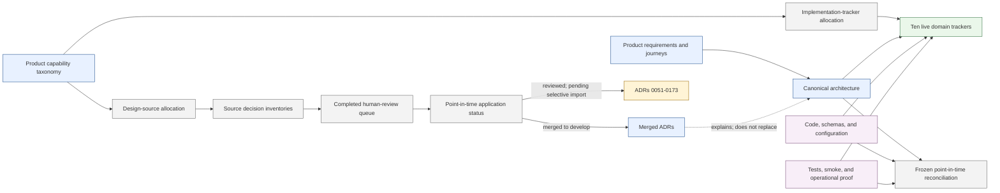

# Design Decision and Implementation Alignment

This workstream establishes a complete, reviewable chain from FireMUD product capabilities through canonical design decisions to implementation tracking and proof. Product documents define requirements and observable product behavior; architecture documents define technical contracts; ADRs explain consequential decisions; trackers record implementation and proof. This workstream remains non-normative.

## Status

Current phase: capability allocation, implementation/proof reconciliation, cross-domain convergence, structural enforcement, and independent validation are complete. Human-led adversarial review is complete for all `183` queue/navigation rows in the remotely backed review archive. On `develop`, the accepted ADR and canonical-design changes are applied through ADR 0050; reviewed decisions represented by ADRs 0051-0173 remain pending import and are not yet canonical repository state.

| Phase | Status | Output |
| --- | --- | --- |
| Product capability taxonomy | Complete | [`capability-taxonomy.md`](../../product/capability-taxonomy.md) |
| Canonical design allocation | Complete and independently coverage-audited | [`design-capability-allocation.md`](./design-capability-allocation.md) |
| Consequential-decision inventory | Complete and independently coverage/fidelity-audited | [`consequential-decision-inventory.md`](./consequential-decision-inventory.md) |
| Implementation tracker reshaping | Complete | [Capability allocation](../implementation-tracking/capability-allocation.md) and ten permanent domain trackers |
| Code and proof reconciliation | Complete and independently validated | Per-capability implementation/verification states and evidence anchors in the domain trackers |
| Cross-domain convergence | Complete and independently validated as a point-in-time baseline | [Frozen capability implementation reconciliation](./capability-implementation-reconciliation.md) |
| Human-led adversarial decision review | Complete in the `design/adversarial-decision-review` source archive | Human-owned dispositions for all `183` queue/navigation rows |
| Accepted-decision application | In progress | ADRs 0001-0050 and their canonical-design changes are merged; ADRs 0051-0173 remain pending import |
| Merged contract-authority consolidation | Complete through ADR 0050 | [Architecture contract authority map](../../architecture/README.md#contract-authority-map) and link-plus-local-consequence secondary documents |

## Implementation Status

`Complete` in the phase table means that the allocation, inventory, reconciliation, or human review work is complete; it does not mean every reviewed decision is merged or every product capability is implemented and proven. The ten [domain implementation trackers](../implementation-tracking/README.md) are the live implementation and verification authority. [Capability Implementation Reconciliation](./capability-implementation-reconciliation.md) is a frozen point-in-time baseline.

## Documentation And Evidence Flow

Product and architecture documents are normative within their stated boundaries. ADRs explain accepted consequential choices. Allocation, inventory, application-status, tracker, and reconciliation artifacts are non-normative. Code and proof are implementation evidence. A human-reviewed decision becomes canonical only after its ADR and owning design changes merge to `develop`.

## Decision Application Status

This table describes merged repository state, not merely completed human review. The completed review archive remains source evidence; each remaining import must start from current `develop` and selectively apply its reviewed outcome rather than wholesale rebasing the archive.

| Decision parcel | Human review | Applied to `develop` | Contract consolidation | Implementation and proof |
| --- | --- | --- | --- | --- |
| Pre-formal ADRs 0001-0011 | Complete in the review archive | ADRs and accepted design already present | Complete at the current merged boundary | Live gaps remain in the domain trackers |
| Foundational parcel, ADRs 0012-0019 | Complete | Merged by [PR 2527](https://github.com/benhook1013/FireMUD/pull/2527), with recovery and CI follow-through in [PR 2537](https://github.com/benhook1013/FireMUD/pull/2537) | Complete at the current merged boundary | Live gaps remain in the domain trackers |
| Identity and admission parcel, ADRs 0020-0035 | Complete | Merged by [PR 2528](https://github.com/benhook1013/FireMUD/pull/2528) | Complete at the current merged boundary | Live gaps remain in the domain trackers |
| Authority, security, and account parcel, ADRs 0036-0050 | Complete | Merged across [PR 2574](https://github.com/benhook1013/FireMUD/pull/2574), [PR 2583](https://github.com/benhook1013/FireMUD/pull/2583), [PR 2581](https://github.com/benhook1013/FireMUD/pull/2581), and [PR 2529](https://github.com/benhook1013/FireMUD/pull/2529) | Complete at the current merged boundary | Live gaps remain in the domain trackers |
| Remaining reviewed outcomes, ADRs 0051-0173 | Complete in the review archive | Pending selective import; not canonical on `develop` | Not started; consolidate after each accepted family lands | Reconcile owning trackers as each family lands |

## Authority Boundaries

- Product documents define product requirements and observable product behavior; the [product requirements overview](../../product/requirements.md) is the canonical product scope summary.
- The product capability taxonomy defines stable navigation and ownership categories, not technical runtime behavior.
- Canonical architecture documents define target-state technical contracts.
- Architecture decision records explain consequential accepted choices and their tradeoffs; they do not replace the current product or technical contract.
- This directory contains allocation, inventory, review, and status artifacts. It is deliberately non-normative.
- Implementation trackers report implementation and proof against accepted design. They do not define design.
- Automated inventory work may identify evidence, conflicts, alternatives, and review questions, but it must not conduct or resolve a future adversarial decision review. The completed review archive records the human-owned dispositions used by the selective import process.

## Coverage Rules

- Every canonical Markdown source under `design/product/**` and `design/architecture/**`, plus every separately normative mixed-document section, must have exactly one primary capability allocation.
- Cross-domain effects are recorded as secondary handoffs rather than duplicate primary ownership.
- Every consequential explicit or implicit decision must map to at least one capability and its canonical source.
- An inventory entry is not an accepted decision merely because current design or code implies it.
- Human product or architecture decisions remain unresolved until explicitly discussed and accepted.
- Routine local implementation choices do not require ADRs. ADR candidates are cross-cutting, expensive to reverse, authority-setting, security-sensitive, or supported by credible competing target states.

## Work Sequence

1. Finalize the complete product capability taxonomy.
2. Allocate every canonical design source to a primary capability and explicit secondary handoffs.
3. Inventory consequential explicit and implicit decisions against that allocation.
4. Resolve only direct canonical contradictions that block trustworthy implementation classification.
5. Allocate every leaf capability to one primary implementation tracker and explicit secondary handoffs.
6. Reconcile code, contracts, schemas, configuration, tests, and operational proof against every capability, then validate cross-domain authority and gaps.
7. The human decision owner manually runs adversarial review against the completed register and chooses whether to accept, revise, defer, withdraw, or supersede each consequential decision.
8. Apply human-accepted decisions to canonical design and create, amend, or supersede ADRs where warranted.

## Automated Gates

The design-allocation and decision-inventory phases were completed against these gates:

- `python3 dev-tools/validation/check-design-capability-allocation.py` derives the product and architecture source sets, parses each allocation ledger, and reconciles the declared `225`-source coverage summary (`222` capability allocations plus the canonical `2` governance/template exemptions and `1` registry exemption).
- all intended FireMUD user, creator, operator, runtime, authoring, automation, platform, and commercial concerns have a capability home;
- every Markdown source under `design/product/**` and `design/architecture/**` is present and classified in the allocation ledger, including generated/index material, unless it is one of the two explicit governance/template exemptions or the decision-registry exemption;
- mixed canonical documents have heading-level allocations where file-level allocation would hide a real ownership split;
- every capability has been inspected for consequential explicit and implicit decisions;
- existing ADRs are mapped, including superseded and withdrawn records;
- conflicts, unsupported assumptions, missing rationale, and human-review questions are visible rather than silently normalized; and
- an independent exhaustive review finds no unallocated canonical design or unexplained decision-bearing claim.

The canonical non-allocatable taxonomy is exactly `2` governance/template sources plus `1` registry exemption; these are classifications, not additional capabilities or decision owners.

The capability implementation reconciliation additionally requires:

- `python3 dev-tools/validation/check-implementation-capability-tracking.py` derives the capability and per-tracker totals from the allocation table before accepting its Coverage Summary;
- every taxonomy leaf appears exactly once in the primary-tracker allocation and exactly once in a tracker status table;
- implementation and verification are represented independently with approved states;
- each capability names canonical design, production evidence, focused proof, handoffs, and its remaining gap or decision;
- cross-domain ownership and terminology are consistent with canonical design rather than inferred from implementation convenience;
- direct canonical contradictions are resolved before status is claimed; and
- the structural contract and independent evidence-quality review both pass before this automated phase is called complete.
